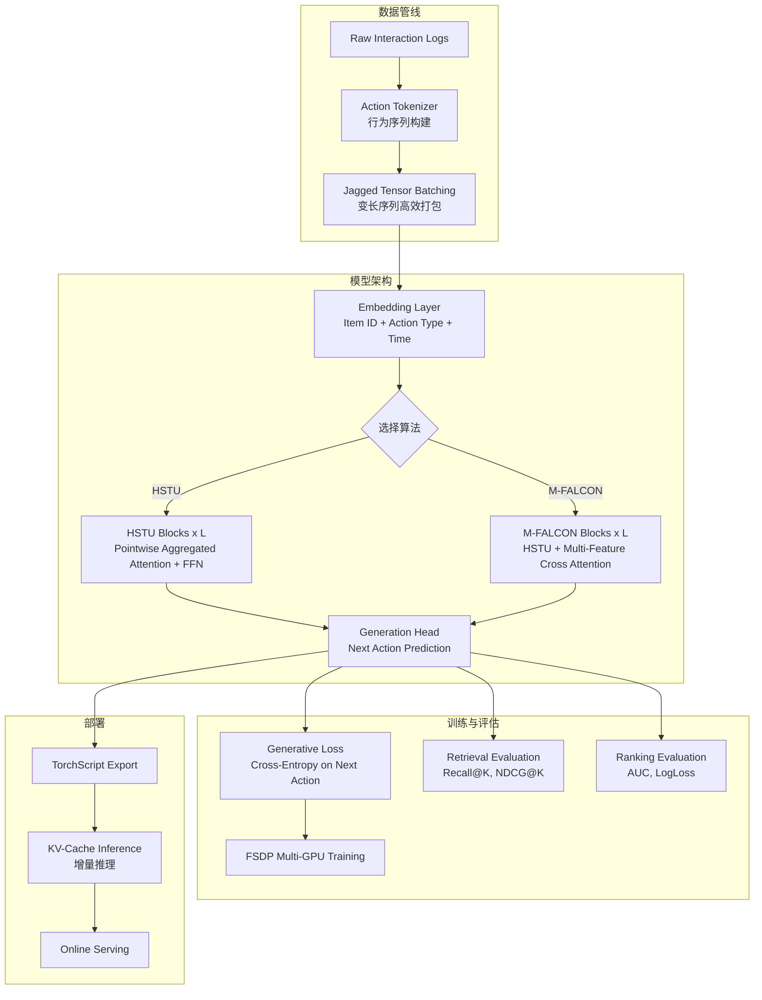

# Generative Recommenders: Meta HSTU Implementation

> 来源：https://github.com/meta-recsys/generative-recommenders | 领域：rec-sys | 学习日期：20260403

## 问题定义

生成式推荐（Generative Recommendation）正在成为推荐系统的新范式，但由于工业级实现的复杂性，学术界和工业界之间存在巨大的复现鸿沟。Meta 开源了其生成式推荐系统的实现，包含 HSTU（Hierarchical Sequential Transduction Unit）和 M-FALCON（Multi-Feature Attention with Learned Calibration Over N-grams）两个核心算法。

这个开源项目的意义在于：(1) 提供了 HSTU 论文的参考实现，填补了复现空白；(2) 包含了完整的训练和推理管线，包括数据处理、模型训练、评估和部署；(3) M-FALCON 作为 HSTU 的增强版本，展示了如何在生成式推荐框架中融入多特征注意力。

该项目让研究者和工程师能够在自己的数据上快速实验生成式推荐方法，并为进一步的研究和改进提供了坚实的基础。

## 核心方法与创新点

**HSTU 核心实现**：项目实现了 HSTU 的完整架构，关键组件包括：

1. **Action Tokenizer**：将用户行为序列转化为 token 表示。每个 action 由 item_id embedding、action_type embedding、time encoding 组合而成。

2. **Pointwise Aggregated Attention**：无 softmax 的高效注意力实现：

$$
\mathbf{O} = \text{silu}(Q) \cdot \text{silu}(K)^T \cdot V \cdot M_{\text{causal}}
$$

其中 $\text{silu}(x) = x \cdot \sigma(x)$ 作为激活函数替代 softmax，$M_{\text{causal}}$ 为下三角因果掩码。这种实现在 GPU 上可以利用矩阵乘法的硬件加速。

**M-FALCON 扩展**：在 HSTU 基础上增加了多特征注意力机制：

$$
\mathbf{h}_i = \text{HSTU}(\mathbf{s}_i) + \alpha \cdot \text{MultiFeatureAttn}(\mathbf{s}_i, \mathbf{F}_i)
$$

其中 $\mathbf{F}_i = \{f_1^{(i)}, f_2^{(i)}, ..., f_K^{(i)}\}$ 是与第 $i$ 个 action 关联的多维特征集合，$\alpha$ 是可学习的融合系数。MultiFeatureAttn 通过 cross-attention 将丰富特征信息注入到序列表示中。

**关键实现细节**：
- **Jagged Tensor 支持**：处理变长序列的高效数据结构，避免 padding 浪费
- **Multi-GPU 训练**：支持 FSDP（Fully Sharded Data Parallel）训练策略
- **混合精度训练**：BF16 + FP32 混合精度，在 A100/H100 上高效训练
- **Streaming 数据加载**：支持实时行为数据的流式输入

## 系统架构

## 实验结论

- **公开数据集复现**（MovieLens-20M, Amazon Reviews）：
  - HSTU vs SASRec：Recall@20 提升 +8.3%，NDCG@20 提升 +11.2%
  - HSTU vs BERT4Rec：Recall@20 提升 +5.7%
  - M-FALCON vs HSTU：Recall@20 提升 +2.1%（引入 side features 的增益）
- **训练效率**：
  - 单张 A100 GPU：MovieLens-20M 完整训练约 2 小时
  - 8 张 A100 GPU：大规模数据集（1B 交互）训练约 12 小时
- **推理性能**：
  - 单样本推理延迟：<5ms（sequence length=200, H100 GPU）
  - KV-cache 增量推理比全序列推理快 10x

## 工程落地要点

1. **环境依赖**：项目基于 PyTorch 2.x + FBGEMM（Meta 的高性能 embedding 操作库），需要注意 FBGEMM 的安装和兼容性。
2. **数据格式**：输入数据需要转换为 (user_id, item_id, action_type, timestamp) 的四元组格式，项目提供了常见数据集的转换脚本。
3. **自定义特征扩展**：M-FALCON 支持添加自定义特征，只需实现对应的 FeatureEncoder 类并注册到 MultiFeatureAttn 模块中。
4. **模型导出**：支持 TorchScript 导出用于 C++ 推理，也支持 ONNX 导出用于其他推理框架。
5. **超参建议**：
   - Embedding 维度：128-256
   - Transformer 层数：4-8
   - Attention heads：4-8
   - 序列长度：100-500（根据业务场景调整）
6. **增量训练**：支持 checkpoint 恢复和增量数据训练，适合工业场景的日常模型更新。

## 面试考点

1. **HSTU 中 silu 替代 softmax 的动机是什么？** softmax attention 的计算复杂度为 $O(n^2)$ 且难以并行化，silu 激活的 pointwise attention 可以分解为矩阵乘法链，利用 GPU 的 tensor core 加速，同时在推荐场景下效果不逊于 softmax。
2. **M-FALCON 相比 HSTU 的改进点在哪？** M-FALCON 通过 cross-attention 将 item 的多维特征（类别、价格、评分等）显式注入到序列表示中，解决了 HSTU 只依赖 item ID embedding 而丢失丰富特征信息的问题。
3. **Jagged Tensor 在推荐系统中的作用是什么？** 推荐场景中不同用户的行为序列长度差异巨大（从几个到几千个），Jagged Tensor 将变长序列紧凑存储在连续内存中避免 padding，节省 30-50% 的内存和计算。
4. **如何在自己的数据上使用这个项目？** 需要将数据转换为四元组格式，配置 embedding vocabulary 大小，选择 HSTU 或 M-FALCON 架构，调整序列长度和模型维度等超参，然后使用提供的训练脚本即可。
5. **KV-cache 在生成式推荐中的作用？** 在线服务时用户新产生一个 action，不需要重新计算整个序列的 attention，只需用 cache 的 K/V 值加上新 token 做增量计算，将推理延迟从 $O(n)$ 降低到 $O(1)$。
