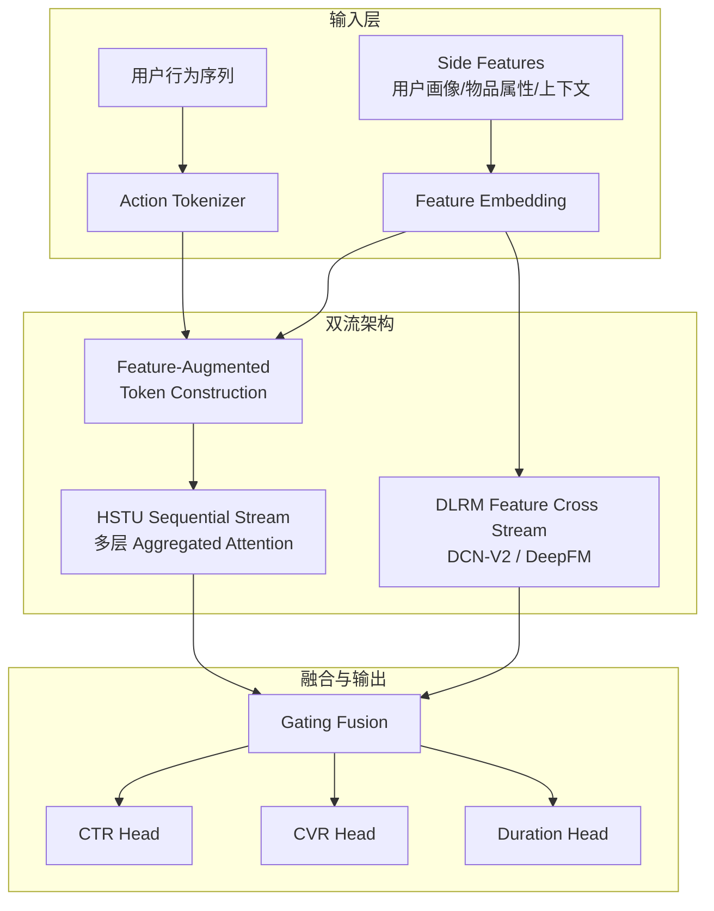

# MTGR: Industrial-Scale Generative Recommendation Framework

> 来源：https://arxiv.org/abs/2505.16752 | 领域：rec-sys | 学习日期：20260403

## 问题定义

Meta 的 HSTU 开创了生成式推荐的先河，但在工业落地中存在明显局限：HSTU 将所有信息压缩到行为序列 token 中，丢失了传统 DLRM 中丰富的 side features（如用户画像、物品属性、上下文特征等）。这导致在特征丰富的业务场景中，HSTU 的表现不如预期。

美团提出 MTGR（Meituan Generative Recommender），核心思路是融合 DLRM 的特征丰富性与 HSTU 的序列生成能力。MTGR 在美团外卖、到店等核心业务中部署，GAUC 相比原有模型提升 2.88 个百分点，具有重大业务价值。

该工作的关键洞察在于：生成式推荐和传统特征交叉并非互斥，而是互补的。用户的短期兴趣可以通过序列建模捕捉，而长期偏好和上下文信息则更适合通过显式特征交叉来表达。

## 核心方法与创新点

MTGR 的核心创新是 **Hybrid Architecture**，将 DLRM 的特征交叉模块与 HSTU 的序列生成模块有机结合。

**Feature-Augmented Token Representation**：不同于 HSTU 只用 action 信息构造 token，MTGR 将丰富的 side features 注入到每个行为 token 中：

$$
\mathbf{t}_i = \text{FFN}\left(\left[\mathbf{e}_{\text{item}}^{(i)}; \mathbf{e}_{\text{action}}^{(i)}; \mathbf{e}_{\text{context}}^{(i)}; \mathbf{e}_{\text{side}}^{(i)}\right]\right)
$$

其中 $[\cdot;\cdot]$ 表示拼接操作，$\mathbf{e}_{\text{side}}^{(i)}$ 包含了物品类别、商家评分、价格区间等业务特征。

**Dual-Stream Fusion**：MTGR 采用双流架构，一路是 HSTU 风格的序列建模流，另一路是 DLRM 风格的特征交叉流，最终通过 gating mechanism 融合：

$$
\mathbf{h}_{\text{final}} = \sigma(\mathbf{W}_g [\mathbf{h}_{\text{seq}}; \mathbf{h}_{\text{feat}}]) \odot \mathbf{h}_{\text{seq}} + (1 - \sigma(\mathbf{W}_g [\mathbf{h}_{\text{seq}}; \mathbf{h}_{\text{feat}}])) \odot \mathbf{h}_{\text{feat}}
$$

其中 $\mathbf{h}_{\text{seq}}$ 为序列流输出，$\mathbf{h}_{\text{feat}}$ 为特征交叉流输出，$\sigma$ 为 sigmoid 函数。Gate 自适应地决定每个用户请求更依赖序列信息还是特征信息。

**关键设计点**：
- **渐进式训练**：先预训练序列流，再联合训练双流，避免两个流的学习节奏不匹配
- **特征选择机制**：自动学习哪些 side features 对序列建模有增益，避免特征冗余
- **多任务头**：支持 CTR、CVR、停留时长等多任务联合优化

## 系统架构

## 实验结论

- **离线指标**：在美团内部数据集上，MTGR 相比纯 HSTU 模型 GAUC 提升 +1.52pp，相比纯 DLRM 模型 GAUC 提升 +2.88pp。
- **消融实验**：
  - 去掉 side features 注入：GAUC 下降 0.93pp，验证了特征丰富性的重要性
  - 去掉序列流（退化为 DLRM）：GAUC 下降 2.88pp，验证了序列建模的价值
  - 去掉 gating fusion（改为简单 concat）：GAUC 下降 0.41pp
- **在线 A/B 测试**：在美团外卖场景中，单均价 +1.2%，订单量 +0.8%，GMV +2.1%。
- **推理延迟**：相比纯 HSTU 模型增加约 15% 延迟，但仍满足在线服务要求（P99 < 20ms）。

## 工程落地要点

1. **特征实时性**：美团场景中商家状态（营业/打烊、配送时间）变化快，需要实时特征更新管线配合。
2. **序列长度与特征维度的平衡**：序列越长模型效果越好，但加上 side features 后每个 token 的维度增大，需要在序列长度和特征丰富度之间 trade-off。
3. **渐进式上线策略**：美团采用了先灰度 5% 流量验证，再逐步放量的策略，同时监控业务指标和系统指标。
4. **模型压缩**：线上版本使用了 INT8 量化 + 知识蒸馏，将模型大小压缩到原来的 1/4。
5. **特征工程复用**：MTGR 的特征交叉流可以复用已有的 DLRM 特征工程，降低迁移成本。

## 面试考点

1. **MTGR 相比 HSTU 的核心改进是什么？** MTGR 通过双流架构将 DLRM 的丰富特征交叉能力与 HSTU 的序列生成能力融合，用 gating mechanism 自适应平衡两路信息，解决了 HSTU 丢失 side features 的问题。
2. **为什么需要渐进式训练？** 序列流和特征交叉流的学习动态不同——序列流需要更多数据才能收敛，如果从头联合训练，特征交叉流会主导梯度导致序列流欠拟合。
3. **Gating Fusion 相比简单 concat 的优势？** Gate 可以针对不同用户和不同请求自适应地调整两路信息的权重——冷启动用户更依赖特征流，活跃用户更依赖序列流，这种动态平衡是 concat 做不到的。
4. **MTGR 在美团的哪些业务场景收益最大？** 在特征丰富且用户行为序列较长的场景（如外卖推荐）收益最大，因为这类场景同时需要序列建模（用户饮食习惯的时序模式）和特征交叉（商家距离、配送时间等上下文信息）。
5. **如何处理双流架构的推理延迟问题？** 两路可以并行计算，gating fusion 开销极小；同时对特征交叉流做特征选择减少冗余计算，对序列流用 KV-cache 做增量推理，最终延迟增幅控制在 15% 以内。
