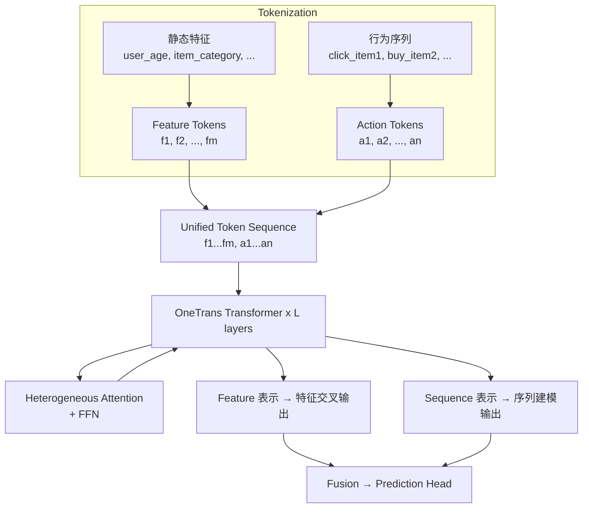

# OneTrans: Unified Feature Interaction and Sequence Modeling

> 来源：https://arxiv.org/abs/2510.26104 | 领域：rec-sys | 学习日期：20260403

## 问题定义

当前工业推荐系统中，特征交叉（feature interaction）和用户行为序列建模（sequence modeling）通常由独立的模块完成：特征交叉使用 DCN、DeepFM 等模块处理静态特征，序列建模使用 DIN、SIM、HSTU 等模块处理行为序列。这种分离式设计存在两个核心问题：(1) 两个模块独立编码信息，难以捕捉特征与序列之间的交互关系（如用户当前地理位置与历史浏览序列的关联）；(2) 两套独立模块增加了系统复杂度和维护成本。

字节跳动提出 OneTrans，用统一的 Transformer 架构同时完成特征交叉和序列建模。核心思路是将静态特征和行为序列中的每个元素都表示为 token，送入同一个 Transformer 中，通过 attention 机制自然地实现特征间的交叉和序列中的依赖建模。

该方法的优势在于架构统一带来的简洁性和特征-序列交互的显式建模能力。

## 核心方法与创新点

OneTrans 的核心在于 **Unified Tokenization + Heterogeneous Attention**。

**Unified Tokenization**：将所有输入信息统一为 token 序列。静态特征（用户画像、物品属性、上下文）每个 field 生成一个 token，行为序列中每个 action 生成一个 token，最终形成混合 token 序列 $\mathcal{S} = [f_1, f_2, ..., f_m, a_1, a_2, ..., a_n]$。

**Heterogeneous Attention Mask**：不同类型的 token 之间的注意力关系不同，OneTrans 设计了异构注意力掩码：

$$
\text{Attn}(Q, K, V) = \text{softmax}\left(\frac{QK^T}{\sqrt{d}} + \mathbf{M}_{\text{hetero}}\right)V
$$

其中 $\mathbf{M}_{\text{hetero}} \in \mathbb{R}^{(m+n) \times (m+n)}$ 是异构掩码矩阵，定义了四种注意力模式：
- Feature-to-Feature：全连接，对应传统的特征交叉
- Feature-to-Action：全连接，实现 target-aware 的序列聚合（类似 DIN）
- Action-to-Action：因果掩码，对应传统的序列建模
- Action-to-Feature：全连接，让序列中的每个 action 都能感知到当前请求的上下文

**Position Encoding 设计**：对于行为序列 token 使用时间感知的相对位置编码，对于特征 token 使用可学习的 field position embedding：

$$
\text{PE}(a_i) = \text{RoPE}(\Delta t_i), \quad \text{PE}(f_j) = \mathbf{p}_j^{\text{field}}
$$

其中 $\Delta t_i$ 是 action $i$ 距当前时间的间隔，RoPE 是旋转位置编码。这种设计让模型能够感知行为的时序关系同时区分不同 feature field 的语义。

**Efficient Implementation**：
- 利用 FlashAttention 的 block-sparse 特性高效实现异构掩码
- Feature token 数量固定且较少（通常 <50），不显著增加序列长度
- 多头注意力中不同 head 可以学到不同的 feature-action 交互模式

## 系统架构

## 实验结论

- **离线实验**（字节内部数据集 + 公开数据集 Amazon/MovieLens）：
  - 相比 DCN-V2 + DIN（分离式）：AUC +0.38%，显著提升
  - 相比 AutoInt + SASRec（分离式）：AUC +0.52%
  - 相比 HSTU（纯序列式）：AUC +0.61%（因为 HSTU 缺少显式特征交叉）
- **在线 A/B 测试**（字节某核心推荐产品）：CTR +1.2%，人均时长 +0.8%
- **效率对比**：相比分离式架构（DCN-V2 + SIM），OneTrans 参数量减少 35%，推理延迟降低 20%（因为只需一次 Transformer forward）
- **消融实验**：去掉异构掩码（改为全连接 attention）导致 AUC 下降 0.15%，说明不同类型 token 的注意力模式应该不同

## 工程落地要点

1. **Feature Token 数量控制**：每个 feature field 一个 token，field 数量通常 30-50 个，不会显著增加序列长度。但如果 field 过多，可以先做 field grouping 降维。
2. **序列长度兼容**：OneTrans 支持变长序列，通过 padding + attention mask 实现。在线推理时使用 KV-cache 对行为序列部分做增量计算。
3. **从分离式迁移**：可以用已有的 DCN 和 DIN 模型的参数初始化 OneTrans 的对应部分，加速收敛。
4. **多任务扩展**：OneTrans 的 unified representation 可以直接接多任务 tower，与 MTL 框架（如 PLE、SMES）兼容。
5. **FlashAttention 依赖**：异构掩码的高效实现依赖 FlashAttention 的 block-sparse 模式，需要 GPU 支持（A100/H100）。

## 面试考点

1. **OneTrans 如何同时实现特征交叉和序列建模？** 将静态特征和行为序列统一为 token 序列，送入同一个 Transformer；Feature-to-Feature attention 等价于特征交叉，Action-to-Action 因果 attention 等价于序列建模，Feature-to-Action attention 实现 target-aware 聚合。
2. **异构注意力掩码为什么重要？** 不同类型 token 之间的交互关系不同——行为序列需要因果掩码防止信息泄露，而特征 token 之间应该全连接以充分交叉；不加区分的全连接 attention 会引入错误的信息流。
3. **OneTrans 相比 HSTU 的优势？** HSTU 只建模行为序列，静态特征被压缩到 token embedding 中难以充分交叉；OneTrans 显式保留特征 token，通过 attention 实现特征间和特征-序列间的充分交互。
4. **统一架构在延迟上是否有劣势？** 恰恰相反，统一架构只需一次 Transformer forward pass，而分离式需要分别运行特征交叉模块和序列模块再融合，总延迟更高；OneTrans 通过架构统一反而降低了延迟。
5. **如何处理特征 token 和行为 token 的位置编码差异？** 行为 token 使用基于时间间隔的 RoPE 编码捕捉时序关系，特征 token 使用可学习的 field position embedding 表示 field 语义，两种编码方式在同一注意力机制中共存互不干扰。
