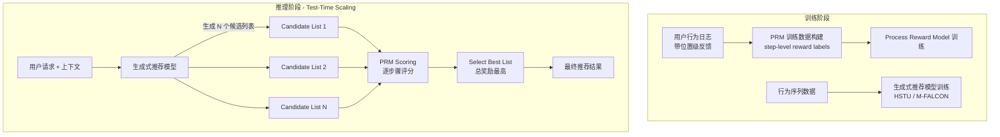

# PROMISE: Process Reward Models Unlock Test-Time Scaling Laws in Generative Recommendations

> 来源：https://arxiv.org/abs/2601.04674 | 领域：rec-sys | 学习日期：20260403

## 问题定义

大语言模型（LLM）领域已经证实了 test-time compute scaling 的巨大潜力——如 OpenAI 的 o1 模型通过在推理时投入更多计算资源（如 chain-of-thought、beam search、self-verification）来提升输出质量。然而，推荐系统领域尚未有系统性地利用 test-time scaling 的工作。

PROMISE（Process Reward Models for Inference-time Scaling in Recommendations）将 test-time scaling 的思想引入生成式推荐系统。核心思路是：在推理阶段，生成式推荐模型可以生成多个候选推荐列表，然后用一个过程奖励模型（Process Reward Model, PRM）评估每个生成步骤的质量，选择最优的推荐结果。

这一工作的意义在于揭示了推荐系统中一个新的性能提升维度——不是通过增大模型参数来提升效果，而是通过在推理时投入更多计算来获得更好的推荐质量。

## 核心方法与创新点

**Process Reward Model (PRM)**：与传统的 outcome reward model（只评估最终推荐列表的质量）不同，PRM 评估生成过程中每一步的质量。对于生成式推荐中的第 $t$ 步推荐（从序列中生成第 $t$ 个 item），PRM 给出一个过程奖励：

$$r_t = \text{PRM}(s_{<t}, a_t, c) = \sigma\left(\mathbf{w}^T \text{TransformerBlock}\left([\mathbf{h}_{s_{<t}}; \mathbf{e}_{a_t}; \mathbf{e}_c]\right)\right)$$

其中 $s_{<t}$ 是已生成的部分序列，$a_t$ 是第 $t$ 步的候选 item，$c$ 是用户上下文，$\sigma$ 是 sigmoid。PRM 的训练数据来自用户的实际反馈——如果用户对某个位置的推荐产生了正向行为（点击、购买），该步骤获得正奖励。

**Test-Time Scaling via Best-of-N**：在推理时，生成式推荐模型独立生成 $N$ 个候选推荐列表，PRM 对每个列表的各步骤奖励求和，选择总奖励最高的列表作为最终输出：

$$\hat{y} = \arg\max_{y^{(i)}, i \in [N]} \sum_{t=1}^{T} r_t^{(i)}, \quad r_t^{(i)} = \text{PRM}(y_{<t}^{(i)}, y_t^{(i)}, c)$$

当 $N$ 增大时（即投入更多 test-time compute），推荐质量持续提升，呈现 log-linear 的 scaling 关系。

**Tree Search 进阶策略**：
- **Beam Search with PRM**：在每个生成步骤保留 PRM 评分最高的 K 个 partial sequence，逐步扩展
- **Monte Carlo Tree Search (MCTS)**：用 PRM 指导搜索树的探索和利用
- Beam Search 比 Best-of-N 更计算高效，在相同 compute budget 下效果更好

## 系统架构

## 实验结论

- **Test-Time Scaling Law**：
  - Best-of-4：Recall@10 提升 +3.2%（相比 greedy decoding）
  - Best-of-16：Recall@10 提升 +6.8%
  - Best-of-64：Recall@10 提升 +9.1%
  - 性能提升随 $\log(N)$ 线性增长，呈现清晰的 scaling law
- **PRM vs ORM**：使用 PRM 做 scoring 比使用 ORM（只看最终结果的 reward model）效果好 +2.3%，说明过程级评估对推荐列表质量至关重要。
- **搜索策略对比**：
  - Beam Search (K=8) 相当于 Best-of-64 的效果，但计算量只有 1/4
  - MCTS 在更大 compute budget 下优势更明显
- **数据集**：在 Amazon Reviews、ML-20M、以及大规模工业数据集上均验证了 scaling law 的存在。

## 工程落地要点

1. **延迟 vs 质量 Trade-off**：Test-time scaling 必然增加推理延迟，Best-of-N 的延迟约为 N 倍（可通过 batch 并行降低到约 2-3 倍）。在延迟敏感的场景中，建议 N 取 4-8。
2. **PRM 训练数据**：需要位置级的用户反馈数据——不仅要知道用户是否点击了推荐列表，还要知道点击了哪个位置的哪个 item。大多数推荐系统已经记录了这些信息。
3. **计算资源规划**：Test-time scaling 将推理成本增加 N 倍，需要相应增加 GPU 资源。建议在高价值场景（如首页推荐、付费会员推荐）使用较大的 N，低价值场景使用小 N 或不使用。
4. **PRM 更新频率**：PRM 需要随用户行为分布的变化而更新，建议与推荐模型同步训练更新。
5. **AB 测试设计**：Test-time scaling 的效果与 compute budget 相关，AB 测试时需要控制不同 N 值下的对比实验。

## 面试考点

1. **什么是 test-time scaling，在推荐中如何实现？** Test-time scaling 指在推理阶段投入更多计算资源以获得更好的输出质量。在推荐中，通过生成多个候选推荐列表并用 PRM 选择最优列表来实现，推荐质量随推理计算量呈 log-linear 增长。
2. **Process Reward Model 和 Outcome Reward Model 的区别？** ORM 只评估最终推荐列表的整体质量，PRM 评估生成过程中每一步的质量；PRM 提供更细粒度的信号，能更准确地区分好的推荐路径和坏的推荐路径，实验证明 PRM 效果更好。
3. **Beam Search 为什么比 Best-of-N 更高效？** Best-of-N 独立生成 N 个完整列表再选最优，存在大量冗余计算；Beam Search 在每一步只保留 PRM 评分最高的 K 个前缀，提前剪枝，用更少计算达到同等效果。
4. **Test-time scaling 适用于推荐系统的哪些场景？** 适用于对推荐质量要求高且延迟容忍度较高的场景，如首页推荐、新用户引导、高价值用户推荐；不适用于延迟极敏感的场景如搜索广告竞价。
5. **PROMISE 和 LLM 中的 o1-style reasoning 有什么类比关系？** 两者都是通过在推理时投入更多计算来提升输出质量——o1 通过 chain-of-thought 做多步推理，PROMISE 通过多次生成 + PRM 评估做多次探索；核心原理都是 test-time compute scaling law。
