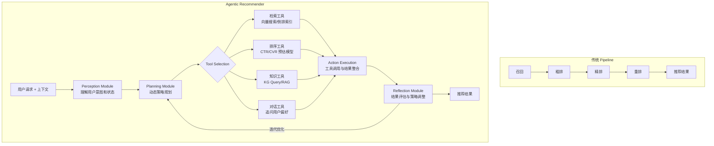

# Rethinking Recommendation Paradigms: From Pipelines to Agentic Recommender Systems

> 来源：https://arxiv.org/abs/2603.26100 | 领域：rec-sys | 学习日期：20260403

## 问题定义

传统推荐系统采用固定的 pipeline 架构：召回 → 粗排 → 精排 → 重排，每个阶段由独立的模型/规则完成。这种设计在过去十年取得了巨大成功，但面临几个根本性限制：(1) pipeline 各阶段独立优化，全局最优解难以达到；(2) 系统缺乏自适应能力，无法根据用户当前状态动态调整推荐策略；(3) 对新需求的响应依赖人工开发新模块，迭代周期长。

本文是一篇综述/展望论文，系统性地提出了 Agentic Recommender Systems 的概念：将推荐系统从固定 pipeline 升级为基于 Agent 的自适应系统。Agent 具有感知（perceive）、规划（plan）、行动（act）、反思（reflect）四种能力，能够根据用户需求和环境变化动态编排推荐流程。

该论文梳理了从传统 pipeline 到 agentic 范式的演进路线，分析了现有 LLM-based agent 技术如何赋能推荐系统，并指出了关键挑战和未来方向。

## 核心方法与创新点

**Agentic Recommender 的四大能力**：

1. **Perception（感知）**：Agent 能够理解多模态用户输入（文本查询、点击行为、上下文信号），并构建用户状态的动态表示：

$$\mathbf{s}_t = f_{\text{perceive}}(\mathbf{o}_t, \mathbf{s}_{t-1}, \mathbf{m}_t)$$

其中 $\mathbf{o}_t$ 是当前观察（用户行为），$\mathbf{s}_{t-1}$ 是历史状态，$\mathbf{m}_t$ 是外部记忆（长期用户画像）。

2. **Planning（规划）**：Agent 根据当前用户状态，动态规划推荐策略——不是固定走 pipeline，而是根据需要选择性地调用不同模块：

$$\pi^* = \arg\max_{\pi} \mathbb{E}\left[\sum_{t=0}^{T} \gamma^t R(s_t, a_t) \mid \pi\right]$$

例如，对于目标明确的用户直接调用精排模块，对于探索性用户则增加召回的多样性。

3. **Action（行动）**：Agent 具有工具使用能力，可以调用搜索引擎、推荐模型、知识图谱、外部 API 等多种工具完成推荐任务。

4. **Reflection（反思）**：Agent 能够评估推荐结果的质量，从用户反馈中学习，持续优化推荐策略。

**三层架构**：
- **Micro-Agent**：单个推荐模块的智能化（如智能召回 agent、智能排序 agent）
- **Meso-Agent**：多模块协调的推荐流程编排
- **Macro-Agent**：跨场景、跨平台的推荐策略统筹

**与现有技术的关联**：
- LLM as Recommender：将 LLM 作为推荐的核心推理引擎
- Tool-augmented LLM：LLM 调用传统推荐模型作为工具
- Multi-Agent Collaboration：多个 agent 分工协作完成复杂推荐任务

## 系统架构

## 实验结论

作为综述/展望论文，本文主要通过案例分析和现有工作对比来论证 agentic 范式的优势：

- **灵活性对比**：传统 pipeline 对新增需求（如增加一个新的推荐场景）需要 2-4 周开发周期，agentic 系统通过 prompt 调整和工具配置可以在数小时内完成。
- **现有 Agentic Rec 案例**：
  - InteRecAgent（2023）：LLM 驱动的对话式推荐，通过工具调用实现推荐
  - RecAgent（2024）：Multi-agent 协作推荐，多个 agent 分别负责召回、排序、解释
  - AgentCF（2024）：将 CF 算法嵌入 agent 框架，实现自适应协同过滤
- **关键挑战**：
  - 延迟：LLM 推理延迟（100ms-1s）远高于传统推荐模型（<10ms）
  - 可靠性：LLM agent 的输出不确定性导致推荐结果不稳定
  - 成本：LLM 推理的 GPU 成本是传统模型的 10-100 倍

## 工程落地要点

1. **渐进式升级路径**：不建议一步到位替换为 agentic 系统，而是先在特定场景（如冷启动用户、长尾查询）引入 agent 能力，逐步扩展。
2. **LLM 与传统模型混合**：用 LLM 做高层规划和决策，用传统推荐模型做高吞吐量的底层计算（召回、排序），兼顾智能性和效率。
3. **Agent 缓存机制**：对常见用户模式的 agent 决策结果做缓存，避免重复的 LLM 推理调用。
4. **Safety Guardrails**：Agent 的自主决策需要安全约束——限制可调用的工具范围、设置推荐结果的多样性下界、防止 agent 推荐不当内容。
5. **评估体系**：传统的离线指标（AUC、NDCG）不足以评估 agentic 系统，需要引入新指标如策略多样性、用户意图覆盖率、交互轮次效率等。

## 面试考点

1. **Agentic Recommender 相比传统 pipeline 的核心优势？** Agent 具有动态规划能力，可以根据用户当前状态自适应地编排推荐流程（跳过不必要的阶段、增加特定工具调用），而 pipeline 的流程是固定的、无法自适应。
2. **Agentic Rec 面临的最大工程挑战是什么？** 延迟和成本——LLM agent 的推理延迟（百毫秒级）和 GPU 成本远高于传统推荐模型，当前技术水平下难以在高 QPS 场景中全面部署。
3. **如何在不引入 LLM 延迟的情况下实现 Agentic Rec？** 可以将 agent 的规划结果离线化——用 LLM agent 离线为不同用户群体制定推荐策略，将策略编译为轻量级的规则或小模型，在线实时执行。
4. **Multi-Agent 在推荐中的应用场景？** 不同 agent 分别负责不同能力——召回 agent 做候选生成、排序 agent 做精细排序、解释 agent 生成推荐理由、对话 agent 与用户交互收集偏好，多 agent 通过协议协作完成推荐。
5. **Agentic Rec 的评估指标应该如何设计？** 除了传统的 CTR/NDCG，还需评估 agent 的策略质量（是否为不同用户选择了合适的推荐路径）、交互效率（多少轮交互达到用户满意）、鲁棒性（异常输入下是否产生合理推荐）。
