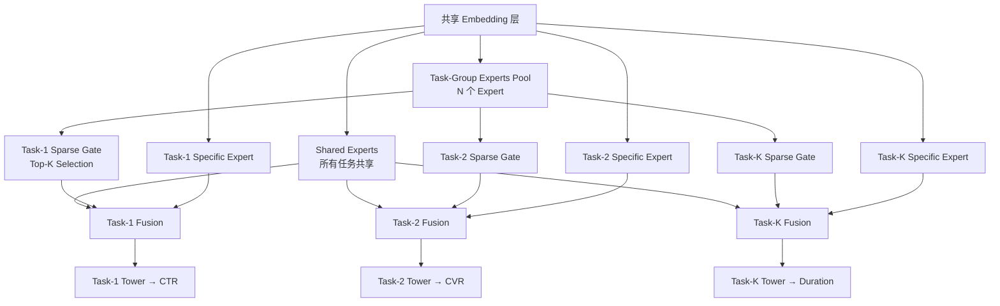

# SMES: Towards Scalable Multi-Task Recommendation via Expert Sparsity

> 来源：https://arxiv.org/abs/2602.09386 | 领域：rec-sys | 学习日期：20260403

## 问题定义

多任务学习（MTL）在推荐系统中被广泛应用，需要同时预测 CTR、CVR、停留时长、视频完播率等多个目标。传统的 MTL 架构如 MMoE、PLE 等采用 shared-bottom + task-specific tower 的范式，但随着任务数量增长到数十个，这些方法面临严重的参数冗余和负迁移（negative transfer）问题。

具体而言，当任务数从 3-5 个增加到 20-50 个时，传统 MoE 架构中每个 expert 被所有任务共享，导致：(1) expert 容易退化为通用表示而失去任务特异性；(2) 参数量随任务数线性增长导致训练和推理成本剧增；(3) 不相关任务之间的梯度冲突加剧。

SMES（Scalable Multi-task Expert Sparsity）提出基于稀疏激活的专家框架，通过让每个任务只激活少量相关 expert，解决了上述三个问题，支持数十个任务的联合训练。

## 核心方法与创新点

SMES 的核心思想是 **Sparse Expert Activation**：不是所有 expert 对所有任务都有用，每个任务应该只激活与自己最相关的 expert 子集。

**Task-Aware Sparse Gating**：对于任务 $t$，SMES 通过一个可学习的 gating network 选择 top-K 个 expert：

$$
\mathbf{h}_t = \sum_{i \in \text{TopK}(G_t(\mathbf{x}), K)} G_t(\mathbf{x})_i \cdot E_i(\mathbf{x})
$$

其中 $G_t(\mathbf{x}) = \text{Softmax}(\mathbf{W}_t^g \mathbf{x} + \epsilon)$ 是任务 $t$ 的 gating 函数，$E_i$ 是第 $i$ 个 expert network，$K \ll N$（$N$ 为总 expert 数）。通过只激活 top-K 个 expert，计算复杂度与任务数解耦。

**Load Balancing Loss**：为了防止所有任务都集中激活少数几个 expert（expert collapse），SMES 引入了辅助的负载均衡损失：

$$
\mathcal{L}_{\text{balance}} = N \cdot \sum_{i=1}^{N} f_i \cdot p_i, \quad f_i = \frac{1}{|B|}\sum_{\mathbf{x} \in B} \mathbb{1}[i \in \text{TopK}(G(\mathbf{x}))], \quad p_i = \frac{1}{|B|}\sum_{\mathbf{x} \in B} G(\mathbf{x})_i
$$

其中 $f_i$ 是 expert $i$ 被选中的频率，$p_i$ 是 expert $i$ 的平均 gate 权重。当所有 expert 被均匀使用时，该损失最小。

**层次化 Expert 组织**：
- **Shared Experts**：所有任务共享的 expert，捕捉通用模式
- **Task-Group Experts**：相关任务组（如电商场景中 CTR+CVR 为一组）共享的 expert
- **Task-Specific Experts**：每个任务独占的 expert
- Sparse gating 在 Task-Group Experts 层面进行选择

## 系统架构

## 实验结论

- **离线实验**：在公开数据集（AliCCP、KuaiRand）和工业数据集上，SMES 在 20+ 任务设置下：
  - 相比 MMoE：平均 AUC 提升 +0.82%
  - 相比 PLE：平均 AUC 提升 +0.54%
  - 相比 Dense MoE（所有 expert 全激活）：平均 AUC 提升 +0.37%，FLOPs 减少 60%
- **Scaling 特性**：任务数从 5 增加到 50，SMES 的性能稳步提升而不出现退化；传统 MMoE/PLE 在任务数超过 15 后性能明显下降。
- **Expert 利用率分析**：SMES 的 expert 利用率显著高于 Dense MoE（75% vs 45%），说明 sparse activation 有效避免了 expert collapse。

## 工程落地要点

1. **Expert 数量选择**：经验上 expert 数量应为任务数的 2-4 倍，K（每个任务激活的 expert 数）设为总 expert 数的 10-20%。
2. **训练效率**：Sparse activation 使得每个 sample 的 forward 计算量与单任务模型接近，训练吞吐量相比 Dense MoE 提升 2-3x。
3. **动态任务增减**：新增任务时只需新增 task-specific expert 和 gating network，无需重训所有 expert，支持增量式任务扩展。
4. **推理优化**：在线 serving 时每个请求只需要计算被激活的 expert，可以通过条件计算（conditional computation）实现高效推理。
5. **Expert 监控**：需要监控每个 expert 的激活频率和负载分布，及时发现 expert collapse 或负载不均问题。

## 面试考点

1. **SMES 如何解决传统 MTL 的负迁移问题？** 通过 sparse gating 让每个任务只激活最相关的 expert 子集，不相关任务不共享 expert，从根本上减少了梯度冲突和负迁移。
2. **Load Balancing Loss 的作用是什么？** 防止 expert collapse——如果没有负载均衡约束，gating network 倾向于让所有任务都选择同几个 expert，导致大部分 expert 闲置，模型退化为小容量 Dense MoE。
3. **SMES 相比 PLE 的关键优势？** PLE 为每个任务维护固定的 shared + specific expert 分配，无法动态调整；SMES 通过可学习的 sparse gating 自动发现任务间的关联关系，且计算量不随任务数线性增长。
4. **为什么 Sparse MoE 在推荐系统中特别适用？** 推荐的多任务目标天然存在关联性层次（如 CTR 和 CVR 强相关，CTR 和停留时长弱相关），sparse expert 可以自然地形成这种层次化共享结构。
5. **如何设置 Top-K 的 K 值？** K 过小导致模型容量不足，K 过大退化为 Dense MoE；实践中 K 设为总 expert 数的 10-20%，并通过验证集 AUC 做超参搜索确定。
