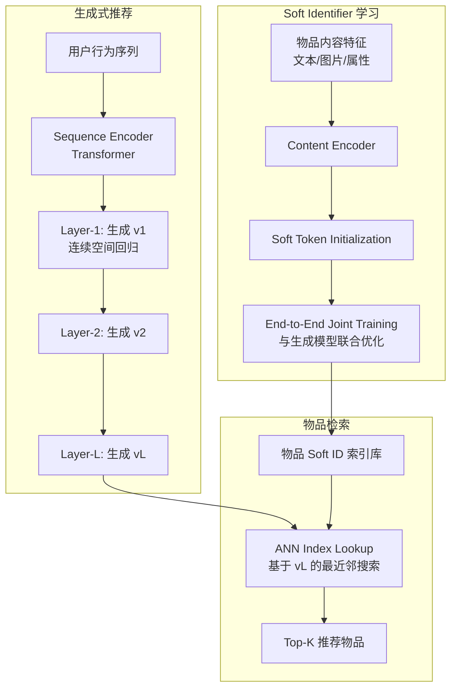

# UniGRec: Unified Generative Recommendation with Soft Identifiers for End-to-End Optimization

> 来源：https://arxiv.org/abs/2601.17438 | 领域：rec-sys | 学习日期：20260403

## 问题定义

现有生成式推荐方法在物品表示上面临一个根本矛盾：离散化（discrete tokenization）是生成式框架的基础，但离散化过程（如 VQ-VAE、RQ-VAE）不可避免地引入量化误差，丢失了物品表示的精细信息。具体而言：

1. **量化误差问题**：RQ-VAE 将连续的物品 embedding 量化为离散 codebook 中最近的向量，量化误差随层数累积，导致相似但不同的物品被映射到相同的 Semantic ID（碰撞）。
2. **两阶段优化割裂**：传统方法先训练 RQ-VAE 得到 Semantic ID，再训练生成模型。两个阶段的优化目标不一致——RQ-VAE 优化重建误差，生成模型优化推荐准确率，导致次优解。
3. **Codebook 容量有限**：离散 codebook 的大小决定了 Semantic ID 的表达上限，物品数量增大时需要更大的 codebook 或更多层，增加了生成复杂度。

UniGRec 提出使用 **Soft Identifiers**（软标识符）替代离散 Semantic ID：每个物品用连续向量序列表示，整个推荐过程端到端可微，无需离散化步骤。

## 核心方法与创新点

**Soft Identifier 定义**：每个物品 $i$ 被表示为一组可学习的连续向量（soft tokens）：

$$
\text{SoftID}(i) = (\mathbf{v}_1^{(i)}, \mathbf{v}_2^{(i)}, ..., \mathbf{v}_L^{(i)}), \quad \mathbf{v}_l^{(i)} \in \mathbb{R}^d
$$

与离散 Semantic ID 不同，soft tokens 不需要从 codebook 中查找最近邻，而是直接作为连续参数参与模型训练。这消除了量化误差，且支持端到端梯度传播。

**End-to-End Generative Framework**：生成过程改为在连续空间中自回归生成 soft tokens：

$$
P(\text{item} | \text{user}_{	ext{seq}}) = \prod_{l=1}^{L} P(\mathbf{v}_l | \mathbf{v}_{<l}, \mathbf{h}_{\text{user}})
$$

每一步的生成不是从离散 codebook 中选择一个 token，而是在连续空间中回归出一个向量。训练损失包含两部分：

$$
\mathcal{L} = \mathcal{L}_{\text{gen}} + \lambda \mathcal{L}_{\text{reg}}, \quad \mathcal{L}_{\text{gen}} = \sum_{l=1}^{L} \|\hat{\mathbf{v}_l - \mathbf{v}_l^*\|^2, \quad \mathcal{L}_{\text{reg}} = \text{InfoNCE}(\hat{\mathbf{v}_L, \mathbf{v}_L^*)
$$

其中 $\mathcal{L}_{\text{gen}}$ 是逐层的回归损失，$\mathcal{L}_{\text{reg}}$ 是基于 InfoNCE 的对比损失确保生成的最终表示在全局物品空间中具有区分性。

**Item Retrieval from Soft IDs**：生成出连续向量后，需要在物品库中找到最近邻物品。UniGRec 构建了一个 approximate nearest neighbor (ANN) 索引，基于所有物品的 soft token 序列的最后一层表示：

$$
\text{retrieved}_{	ext{item}} = \arg\min_{i \in \mathcal{I}} \|\hat{\mathbf{v}_L - \mathbf{v}_L^{(i)}\|^2
$$

**Hierarchical Soft Tokens**：
- 第一层 soft token 编码物品的粗粒度语义（品类级别）
- 中间层逐步细化
- 最后一层唯一标识具体物品
- 层次结构通过辅助聚类损失来约束

## 系统架构

## 实验结论

- **公开数据集**（Amazon Beauty/Sports/Toys, Yelp）：
  - 相比 TIGER（离散 Semantic ID + 生成）：Recall@10 +5.8%，NDCG@10 +6.2%
  - 相比 P5（文本 ID + seq2seq 生成）：Recall@10 +11.3%
  - 相比 SASRec（传统序列推荐）：Recall@10 +15.7%
- **量化误差分析**：
  - 离散 Semantic ID 的平均量化误差为 0.23（L2 距离归一化后）
  - Soft ID 的端到端优化使得物品表示更精确，尤其在相似物品区分上提升显著
- **物品碰撞率**：离散 Semantic ID 在 100K 物品库下碰撞率约 3.2%，Soft ID 碰撞率为 0%（连续空间不存在碰撞）。
- **端到端训练效果**：联合优化 vs 两阶段优化，Recall@10 差异 +2.4%，验证了端到端训练的优势。
- **ANN 检索精度**：使用 HNSW 索引，Top-10 recall 达到 99.2%，检索延迟 <1ms。

## 工程落地要点

1. **ANN 索引更新**：物品库变化时需要更新 ANN 索引。Soft tokens 是模型参数的一部分，每次模型更新后需要重建索引。建议使用支持增量更新的 ANN 库（如 Milvus、Qdrant）。
2. **Soft Token 维度**：每层 soft token 的维度 $d$ 通常设为 64-128，层数 $L$ 设为 3-4。总参数量 = 物品数 $\times L \times d$，在千万级物品库下约 10-50GB。
3. **内存优化**：大规模物品库下 soft tokens 占用大量内存，可以使用 embedding 分片（embedding sharding）或混合精度存储（FP16/INT8）降低内存占用。
4. **训练稳定性**：连续空间的自回归生成容易出现训练不稳定（误差累积），建议使用 scheduled sampling 和 gradient clipping。
5. **与离散方法的融合**：可以先用 RQ-VAE 初始化 soft tokens，再端到端微调，加速收敛且效果更好。
6. **在线服务流程**：用户请求 → 序列编码 → 逐层生成 soft tokens → ANN 检索 → 排序 → 返回。总延迟约 5-10ms。

## 面试考点

1. **Soft Identifier 相比离散 Semantic ID 的核心优势？** 消除了量化误差和物品碰撞问题，支持端到端优化使得物品表示和生成模型联合最优化，不存在两阶段训练目标不一致的问题。
2. **连续空间生成的挑战是什么？** 离散空间生成可以用 cross-entropy loss，搜索空间有限；连续空间生成用回归损失，搜索空间无限，容易出现误差累积和训练不稳定，需要对比损失（InfoNCE）提供全局区分性约束。
3. **生成出 soft token 后如何找到对应的物品？** 用生成的最后一层 soft token 向量在预构建的 ANN 索引中做最近邻搜索，返回距离最近的 K 个物品。ANN 索引基于所有物品的最后一层 soft token 构建。
4. **UniGRec 的物品库规模限制在哪？** 主要瓶颈在 soft tokens 的存储——每个物品需要 $L \times d$ 个浮点参数。千万级物品库下约 10-50GB，可以通过量化和分片缓解，但亿级物品库仍有挑战。
5. **端到端训练为什么比两阶段训练好？** 两阶段训练中，RQ-VAE 优化重建误差而非推荐目标，产生的 Semantic ID 不一定是推荐最优的物品表示；端到端训练让 soft tokens 直接为推荐目标优化，物品表示和生成模型协同进化。
