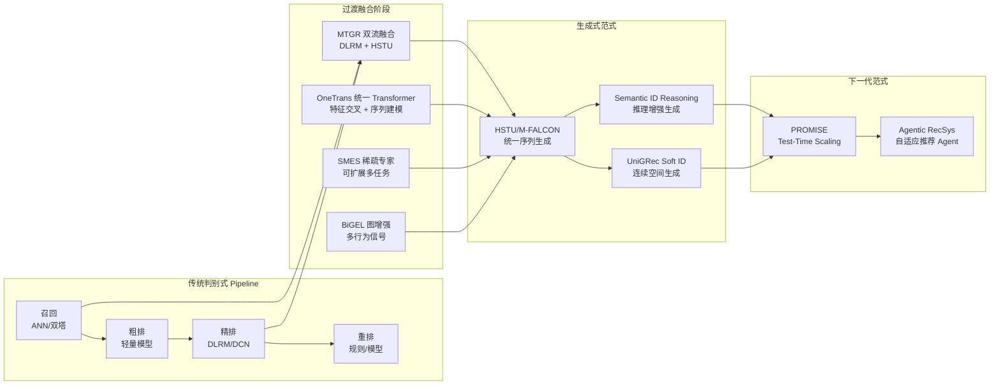

# 生成式推荐范式统一 — 20260403 论文综述

> 本综述覆盖10篇推荐系统前沿论文，聚焦生成式推荐的范式统一趋势。从 Meta HSTU 的万亿参数序列 Transformer 到 Agentic RecSys 的自适应推荐管线，我们正在见证推荐系统从"特征工程+多阶段 pipeline"向"统一生成式模型+推理时扩展"的根本转变。

---

## 今日核心论文综述

### 1. [Actions Speak Louder than Words (HSTU)](../papers/actions_speak_louder_trillion_parameter_sequential.md) — Meta HSTU, 万亿参数序列 Transformer

HSTU 是生成式推荐范式的奠基性工作。它将推荐问题重新定义为序列生成问题：用户历史行为（点击、购买、停留等）构成输入序列，模型通过自回归方式生成下一步推荐。最关键的创新是 Pointwise Aggregated Attention（用 ReLU 替代 softmax），在长行为序列下实现了 3-5 倍的推理加速。论文首次在推荐领域验证了类似 LLM 的 scaling law 存在性：模型从 1.5B 扩展到 1.5T 参数，性能持续提升且未出现饱和。HSTU 统一了召回与排序为单一生成式模型，消除了多阶段 pipeline 的信息损失，在 Meta 多个产品线实现了显著的在线业务指标提升。

### 2. [MTGR](../papers/mtgr_industrial_scale_generative_recommendation.md) — 美团生成式推荐框架

MTGR 直面 HSTU 的工业落地局限：纯序列模型丢失了 DLRM 中丰富的 side features（用户画像、物品属性、上下文特征等）。美团提出双流架构（Dual-Stream Fusion），一路是 HSTU 风格的序列建模流，另一路是 DLRM 风格的特征交叉流，通过自适应 gating mechanism 融合。这一设计的核心洞察是：生成式推荐和传统特征交叉并非互斥，而是互补的。MTGR 在美团外卖场景中 GAUC 提升 2.88pp，GMV 提升 2.1%，证明了融合范式的工业价值。渐进式训练策略（先预训练序列流，再联合训练双流）是关键的工程经验。

### 3. [SMES](../papers/smes_scalable_multi_task_expert_sparsity.md) — 稀疏专家多任务学习

SMES 解决了多任务推荐中一个关键的规模化问题：当任务数从 3-5 个增长到 20-50 个时，传统 MMoE/PLE 架构面临严重的参数冗余和负迁移。SMES 通过 Task-Aware Sparse Gating 让每个任务只激活与自己最相关的 expert 子集（Top-K 选择），计算复杂度与任务数解耦。层次化 Expert 组织（Shared / Task-Group / Task-Specific）和 Load Balancing Loss 的设计避免了 expert collapse。在 20+ 任务设置下，SMES 相比 PLE AUC 提升 0.54% 的同时 FLOPs 减少 60%。这一工作为生成式推荐的多任务扩展提供了基础设施。

### 4. [OneTrans](../papers/onetrans_unified_feature_interaction_sequence.md) — 字节统一 Transformer

OneTrans 从架构统一的角度推进生成式推荐：将特征交叉和序列建模合并到同一个 Transformer 中。所有输入（静态特征 + 行为序列）被统一 tokenize，通过 Heterogeneous Attention Mask 定义四种注意力模式（Feature-to-Feature, Feature-to-Action, Action-to-Action, Action-to-Feature），一次 forward pass 同时完成特征交叉和序列建模。相比分离式架构（DCN-V2 + DIN），OneTrans 参数量减少 35%、推理延迟降低 20%，AUC 提升 0.38%。这一工作证明了统一架构不仅更简洁，在效率和效果上也更优。

### 5. [BiGEL](../papers/bigel_behavior_graph_embedding_multi_task.md) — 多行为图嵌入

BiGEL 从多行为建模的角度丰富了生成式推荐的输入表示。通过级联门控反馈（Cascaded Gating Feedback）利用行为间的层级关系（view -> click -> purchase），全局上下文增强（R-GCN 图嵌入）捕捉多跳协同信号，以及对比偏好对齐确保不同行为空间的表示一致性。在购买行为（最稀疏）上 AUC 提升幅度最大（+1.8%），说明级联门控有效地让稀疏行为从丰富行为借用信息。BiGEL 的图嵌入可以作为生成式推荐模型的增强输入，提供全局协同信号。

### 6. [Generative Recommenders](../papers/generative_recommenders_meta_hstu_implementation.md) — Meta 开源实现

Meta 开源的生成式推荐实现包含 HSTU 和 M-FALCON 两个核心算法，填补了学术界和工业界之间的复现鸿沟。M-FALCON 通过 cross-attention 将物品多维特征显式注入序列表示，比纯 HSTU Recall@20 提升 2.1%。项目的工程价值在于完整的训练推理管线：Jagged Tensor 处理变长序列、FSDP 多 GPU 训练、BF16 混合精度、KV-cache 增量推理。在 H100 上单样本推理延迟 <5ms，KV-cache 比全序列推理快 10 倍。这一开源项目让整个社区能够在生成式推荐的基础上快速迭代。

### 7. [PROMISE](../papers/promise_process_reward_test_time_scaling.md) — 过程奖励测试时扩展

PROMISE 揭示了推荐系统的全新性能提升维度：test-time compute scaling。借鉴 LLM 中 o1-style reasoning 的思路，在推理阶段生成多个候选推荐列表，用 Process Reward Model（PRM）逐步骤评估质量，选择最优列表。Best-of-64 策略下 Recall@10 提升 9.1%，且性能随 $\log(N)$ 线性增长。PRM 比 Outcome Reward Model 效果好 2.3%，验证了过程级评估的价值。Beam Search 在相同计算量下效果优于 Best-of-N（K=8 的 beam search 相当于 Best-of-64），是更实际的部署策略。

### 8. [Agentic RecSys](../papers/rethinking_recommendation_pipelines_to_agentic.md) — Agent 推荐系统

这篇综述论文系统性地提出了从固定 pipeline 到 Agentic Recommender 的演进方向。Agent 具有感知、规划、行动、反思四种能力，能根据用户状态动态编排推荐流程——目标明确的用户直接调用精排，探索性用户增加召回多样性。三层架构设计（Micro/Meso/Macro Agent）覆盖了从单模块智能化到跨平台策略统筹的完整谱系。核心挑战在于 LLM 推理延迟（100ms-1s）和成本（10-100 倍于传统模型），建议通过离线策略编译和 Agent 缓存来缓解。

### 9. [Semantic ID Reasoning](../papers/reasoning_semantic_ids_generative_recommendation.md) — 语义 ID 推理

本文将 chain-of-thought 推理引入生成式推荐的 Semantic ID 解码过程。Semantic ID 的层次化结构（从粗到细的多层 codebook token）天然适合"先想后做"的推理模式：在生成每层 token 前插入可学习的 reasoning tokens，让模型进行隐式推理。Recall@10 相比无 reasoning 的 Semantic ID 生成提升 4.7%，在冷启动物品上增益更大（+7.2%），说明推理能力增强了模型对未见物品的语义泛化。这一工作桥接了 LLM reasoning 和生成式推荐，开辟了"推理增强推荐"的新方向。

### 10. [UniGRec](../papers/unigrec_unified_generative_soft_identifiers.md) — 软标识符统一生成推荐

UniGRec 从根本上质疑了离散化在生成式推荐中的必要性。用连续向量序列（Soft Identifiers）替代离散 Semantic ID，消除了量化误差和物品碰撞问题，支持端到端可微优化。生成过程在连续空间中自回归回归 soft tokens，最终通过 ANN 检索定位物品。相比 TIGER（离散 Semantic ID）Recall@10 提升 5.8%，物品碰撞率从 3.2% 降至 0%。端到端训练比两阶段训练提升 2.4%，验证了联合优化的价值。挑战在于大规模物品库的 soft token 存储（千万级物品约 10-50GB）。

---

## 技术趋势分析

### 趋势一：推荐系统的 Scaling Law

HSTU 首次验证了推荐领域的 scaling law，其性能随参数量和数据量的增长遵循幂律关系：

$$
L(N, D) = \alpha N^{-\beta} + \gamma D^{-\delta} + \epsilon
$$

其中 $N$ 为模型参数量，$D$ 为训练数据量。从 1.5B 到 1.5T 参数的扩展实验证明性能持续提升且未饱和。SMES 从多任务维度进一步验证了 scaling 特性：任务数从 5 扩展到 50，稀疏专家框架的性能稳步提升，而传统 MMoE/PLE 在 15 个任务后开始退化。

这意味着推荐系统正在步入与 LLM 类似的 "scaling era"。但推荐的 scaling 存在独特约束：(1) 延迟敏感性（P99 < 10-20ms）限制了可部署的模型规模；(2) 数据异构性使得 scaling 效率系数不同于纯文本模型；(3) 推理成本与 QPS 成正比，工业落地需要精细的成本控制。

### 趋势二：生成式 vs 判别式范式迁移

今日 10 篇论文清晰地展现了从判别式到生成式的范式迁移路径：

$$
\underbrace{P(y|\mathbf{x}, \text{item})}_{\text{判别式：给定候选打分}} \longrightarrow \underbrace{P(\text{item}|\mathbf{x})}_{\text{生成式：直接生成推荐}}
$$

这一迁移分为四个层次：

1. **基础层**：HSTU 证明统一生成式模型可以替代多阶段 pipeline；Meta 开源实现降低了入门门槛。
2. **融合层**：MTGR、OneTrans 解决了纯生成式模型丢失特征信息的问题；SMES 为多任务扩展提供支撑；BiGEL 丰富了行为建模信号。
3. **增强层**：Semantic ID Reasoning 引入推理增强；UniGRec 用连续空间消除量化误差。
4. **扩展层**：PROMISE 开辟了 test-time scaling 新维度；Agentic RecSys 展望了自适应推荐 Agent 的未来。

### 趋势三：Test-Time Compute 与过程奖励

PROMISE 将 LLM 领域的 test-time scaling 引入推荐系统，揭示了推荐质量的第三个提升维度（除模型参数和训练数据外）。其核心公式为：

$$
\hat{y} = \arg\max_{y^{(i)}, i \in [N]} \sum_{t=1}^{T} \text{PRM}(y_{<t}^{(i)}, y_t^{(i)}, c)
$$

这一趋势与 Semantic ID Reasoning 形成了有趣的呼应：Reasoning 通过在生成过程中引入隐式推理来提升单次生成质量，PROMISE 通过多次生成 + PRM 评估来提升最终输出质量。两者可以组合使用——用 reasoning-enhanced model 作为生成器，PRM 作为验证器，形成"生成-推理-验证"的完整闭环。

### 趋势四：Agentic 推荐系统的涌现

从固定 pipeline 到 Agentic RecSys 的演进是一个更长周期的趋势。今日论文中可以看到 Agent 能力的雏形：

- PROMISE 的 PRM 可以视为 Agent 的反思模块——评估推荐结果质量并指导搜索
- Semantic ID Reasoning 的推理机制对应 Agent 的规划能力——在生成前先思考
- MTGR 的自适应 gating 对应 Agent 的感知能力——根据用户状态动态调整策略

当前的核心瓶颈在于延迟和成本。LLM Agent 的推理延迟（100ms-1s）远高于传统推荐模型（<10ms）。可行的过渡方案是：用 LLM Agent 离线制定策略，将策略编译为轻量级规则或小模型在线执行，逐步积累 Agent 能力。

### 物品表示范式的演进

今日论文展现了物品 ID 表示从简单到复杂的完整演进：

| 方案 | 代表工作 | 优势 | 劣势 |
|------|----------|------|------|
| 原始 ID (Random Int) | DLRM | 简单 | 无语义，冷启动差 |
| Learned Embedding | SASRec/DIN | 端到端学习 | 无层次结构 |
| Discrete Semantic ID | TIGER, RQ-VAE | 有语义层次 | 量化误差，碰撞 |
| Semantic ID + Reasoning | 本文 Paper 9 | 推理增强生成 | 推理 token 增加延迟 |
| Soft Identifiers | UniGRec | 无量化误差，端到端 | 存储开销大，ANN 依赖 |

---

## Q&A 精华

### Q1: HSTU 的 Pointwise Aggregated Attention 为什么在推荐场景中比 softmax attention 更好？

**A:** 两个层面的原因。(1) **效率层面**：推荐行为序列长达数千，softmax attention 的 $O(n^2)$ 复杂度成为瓶颈。Pointwise Aggregated Attention 用 ReLU/SiLU 替代 softmax 后，注意力计算可分解为矩阵乘法链，利用 GPU tensor core 加速，推理延迟降低 3-5 倍。(2) **效果层面**：推荐场景中 token 表示的分布与自然语言显著不同——行为 token 的多样性更高（异构特征组合）且分布更稀疏，softmax 的归一化反而可能抹平重要信号的差异。HSTU 去除 softmax 和 LayerNorm 的实验均表明，推荐场景有其独特的归纳偏置。

### Q2: MTGR 的双流架构和 OneTrans 的统一 Transformer 哪个方案更优？如何选择？

**A:** 两者解决了同一个问题（融合特征交叉与序列建模）但采用了不同的路线。MTGR 双流架构保留了 DLRM 和 HSTU 的独立结构，用 gating 融合，**优势在于**可以复用已有的 DLRM 和序列模型工程栈、支持渐进式迁移、两路可独立调优。OneTrans 将一切统一到单个 Transformer 中，**优势在于**架构更简洁、参数更少（-35%）、延迟更低（-20%）、特征与序列的交互更直接。选择建议：如果团队已有成熟的 DLRM 工程栈且需要低风险迁移，选 MTGR 路线；如果从零建设或追求极致效率，选 OneTrans 路线。长期来看，OneTrans 的统一方向更代表趋势。

### Q3: SMES 的 Sparse Expert Activation 与 LLM 中 Mixture-of-Experts（如 Mixtral）的 MoE 有何异同？

**A:** **相同点**：都采用 Top-K 稀疏激活策略，每个样本只使用部分 expert，配合 load balancing loss 防止 expert collapse，实现了计算量与 expert 总数的解耦。**不同点**：(1) SMES 的 gating 是 task-aware 的——每个任务有独立的 gating network，而 LLM MoE 的 gating 是 token-level 的，每个 token 独立选择 expert。(2) SMES 有层次化 Expert 组织（Shared / Task-Group / Task-Specific），这种结构是推荐多任务特有的；LLM MoE 的 expert 通常是对等的。(3) SMES 的 sparse activation 主要目标是避免任务间负迁移，LLM MoE 的目标是增加模型容量的同时控制计算量。

### Q4: 离散 Semantic ID（Paper 9）和 Soft Identifier（UniGRec）哪个代表未来方向？

**A:** 两者各有长期价值。**离散 Semantic ID 的优势**：生成过程是标准的分类问题，搜索空间有限可控，与 beam search / MCTS 等搜索策略天然兼容；Reasoning over Semantic ID 进一步增强了其表达能力。**Soft Identifier 的优势**：消除量化误差（碰撞率从 3.2% 降至 0%），端到端优化更彻底（Recall 多 5.8%）。**实际选择取决于场景**：物品库 <1M 且追求极致精度时用 Soft ID；物品库 >10M 且需要高效搜索时用离散 Semantic ID（Soft ID 的存储和 ANN 开销在大规模下成为瓶颈）。未来可能出现混合方案——粗层用离散 token 做高效搜索，细层用连续向量做精确匹配。

### Q5: PROMISE 的 Process Reward Model 训练需要什么样的数据？相比 LLM 的 PRM 有何特殊性？

**A:** PROMISE 的 PRM 需要位置级的用户反馈数据：不仅要知道用户是否与推荐列表交互，还要知道交互了哪个位置的哪个物品。大多数推荐系统已经记录了这些信息（展示日志 + 点击日志），无需额外标注。与 LLM PRM 的差异：(1) LLM PRM 评估推理步骤的正确性（二元判断），推荐 PRM 评估推荐位置的质量（连续评分）；(2) LLM PRM 的标注通常需要人工，推荐 PRM 可以直接用用户行为作为监督信号；(3) 推荐 PRM 需要感知位置偏差（position bias）——相同物品在不同位置的点击概率不同，PRM 需要区分"物品质量高"和"位置靠前"。

### Q6: Agentic RecSys 的"规划"能力在实际推荐场景中如何体现？能否举具体例子？

**A:** 以电商推荐为例。**传统 pipeline**：所有用户走相同的 召回→粗排→精排→重排 流程。**Agentic 规划**：(1) 对于"目标明确"的用户（搜索了"iPhone 16 手机壳"），Agent 感知到用户意图明确，规划直接调用精准检索工具 + 排序模型，跳过泛化召回；(2) 对于"随便逛逛"的用户，Agent 规划增加多样性召回（增加冷门品类曝光）+ 探索性重排策略；(3) 对于"犹豫不决"的用户（反复对比多个商品），Agent 规划调用对比分析工具生成商品对比卡片 + 调用评价摘要工具辅助决策。关键差异在于：pipeline 的流程是静态固定的，Agent 的流程是动态编排的。

### Q7: Semantic ID Reasoning 的 reasoning tokens 学到了什么？有没有可解释性？

**A:** 论文通过 attention 可视化发现了清晰的层次化模式：第一层 reasoning tokens 主要关注用户的近期行为大类（如"用户最近主要浏览电子产品"），最后一层 reasoning tokens 关注用户与候选物品的细粒度特征匹配（如"用户偏好 128GB 存储 + 黑色配色"）。这与 Semantic ID 的层次结构（粗类→细类→具体物品）自然吻合。可解释性方面：reasoning tokens 的 attention 权重可以揭示模型在每层做决策时最依赖的用户历史行为，为推荐解释提供了新的途径。但 reasoning tokens 本身是连续向量，不像 LLM 的 CoT 可以直接读取文本内容。

### Q8: 生成式推荐模型（HSTU、MTGR）的在线服务延迟如何控制在 10-20ms 以内？

**A:** 多层面的优化组合：(1) **KV-cache 增量推理**：用户新产生一个 action 时不重算全序列，只增量计算新 token 的 K/V 并追加到 cache，将复杂度从 $O(n)$ 降到 $O(1)$。开源实现中 KV-cache 比全序列推理快 10 倍。(2) **高效注意力**：HSTU 的 Pointwise Aggregated Attention 去掉 softmax，利用矩阵乘法硬件加速。(3) **模型压缩**：MTGR 使用 INT8 量化 + 知识蒸馏，模型体积压缩到 1/4。(4) **批处理调度**：将多个用户请求打包为 batch，利用 GPU 并行度。(5) **序列长度截断**：基于时间衰减采样限制序列长度（通常 200-500），避免过长序列。

### Q9: BiGEL 的图嵌入如何与生成式推荐（如 HSTU）结合使用？

**A:** BiGEL 的 R-GCN 图嵌入捕捉的是全局协同信号（多跳邻居的交互模式），这与 HSTU 的序列建模（用户个体的时序行为模式）是互补的信息。结合方式有两种：(1) **作为 side feature 注入**：将图嵌入作为物品和用户的额外特征，类似 MTGR 的 side feature 注入方式，通过 FFN 融合到行为 token 表示中。(2) **作为 soft token 初始化**：在 UniGRec 的框架下，用图嵌入初始化物品的 soft identifiers，使得生成目标自带全局协同信息。图嵌入可以离线预计算并定期更新（如每小时），不增加在线推理延迟。

### Q10: 如果要从零搭建一个工业级生成式推荐系统，基于今日 10 篇论文的最佳技术栈是什么？

**A:** 推荐分阶段实施：

**Phase 1 — 基础生成式模型**：基于 Meta 开源实现搭建 HSTU/M-FALCON 基线。使用 M-FALCON 而非纯 HSTU，因为工业场景特征丰富。超参：embedding 维度 128-256，Transformer 4-8 层，序列长度 200-500。

**Phase 2 — 融合增强**：根据团队情况选择 MTGR 双流路线（有 DLRM 历史包袱时）或 OneTrans 统一路线（新建时）。引入 SMES 做多任务扩展（CTR + CVR + 时长等）。用 BiGEL 的图嵌入作为 side feature 增强。

**Phase 3 — 高级能力**：引入 Semantic ID（或 Soft ID，根据物品库规模选择）做端到端生成。在高价值场景（首页推荐、新用户引导）引入 PROMISE 的 test-time scaling（Best-of-4 或 Beam Search K=8）。

**Phase 4 — Agentic 探索**：在特定场景（冷启动、长尾查询）试点 LLM Agent 做推荐策略规划，将 Agent 决策编译为轻量级规则在线执行。

### Q11: 今日 10 篇论文中，哪些创新可以互相组合产生更大价值？

**A:** 最有价值的组合方向：

- **HSTU + MTGR + SMES**：用 HSTU 做统一序列建模，MTGR 的双流机制注入丰富特征，SMES 的稀疏专家框架扩展到 20+ 任务。这是"短期可落地"的最强组合。
- **Semantic ID Reasoning + PROMISE**：用 reasoning-enhanced model 做高质量单次生成，PRM 做多次生成的评估筛选。两者分别提升了单次质量和多次质量的上界。
- **UniGRec + BiGEL**：用 BiGEL 的图嵌入初始化 soft identifiers，使得端到端生成目标自带全局协同信息，缓解 UniGRec 在稀疏物品上的表达不足。
- **OneTrans + Semantic ID**：OneTrans 的统一 tokenization 为 Semantic ID 提供了更丰富的上下文编码（特征+序列联合 attention），可能提升层次化生成的每一步决策质量。

### Q12: 从算力效率角度看，生成式推荐相比传统 DLRM 的 ROI 如何？

**A:** 生成式推荐的算力消耗显著高于 DLRM（约 5-10 倍），但 ROI 需要从多个维度评估：

**算力成本增加**：(1) Transformer 的 attention 计算 vs DLRM 的简单 MLP；(2) 自回归生成需要多步 forward vs DLRM 单次 forward；(3) test-time scaling（PROMISE）进一步放大推理成本。

**收益维度**：(1) MTGR 在美团的 GMV 提升 2.1%，对于千亿 GMV 的平台相当于数十亿增量收入；(2) 统一模型消除了多阶段 pipeline 的工程维护成本（通常需要多个团队分别维护召回、粗排、精排）；(3) 模型迭代效率更高（单一模型 vs 多个模型的协调更新）。

**最佳实践**：先在高价值场景（首页推荐、核心转化流程）部署生成式模型获取最大 ROI，低价值场景保持传统 DLRM。逐步用模型压缩（INT8、蒸馏）降低边际成本。

---

## 总结与展望

今日 10 篇论文共同描绘了推荐系统从判别式 pipeline 向生成式统一模型演进的完整图景。核心趋势可以用三个关键词概括：

1. **统一（Unification）**：HSTU 统一召回与排序，OneTrans 统一特征交叉与序列建模，UniGRec 统一物品表示与推荐生成。架构的统一带来了效率和效果的双重提升。

2. **扩展（Scaling）**：参数规模扩展（HSTU 1.5T）、任务规模扩展（SMES 50 任务）、推理时计算扩展（PROMISE test-time scaling）。推荐系统正在同时在三个维度上追赶 LLM 的 scaling 步伐。

3. **智能（Intelligence）**：Semantic ID Reasoning 引入推理增强，PROMISE 引入过程奖励评估，Agentic RecSys 引入自适应规划。推荐系统正在从"模式匹配"走向"推理决策"。

未来 1-2 年，预计会看到生成式推荐在工业界的大规模普及，test-time scaling 成为高价值场景的标配，以及 Agentic 能力在特定场景的初步落地。

---

## 相关概念

- [[concepts/generative_recsys|生成式推荐统一视角]]
- [[concepts/attention_in_recsys|Attention 在搜广推中的演进]]
- [[concepts/multi_objective_optimization|多目标优化]]
- [[concepts/embedding_everywhere|Embedding 技术全景]]
- [[concepts/sequence_modeling_evolution|序列建模演进]]
- [[concepts/vector_quantization_methods|向量量化方法]]
