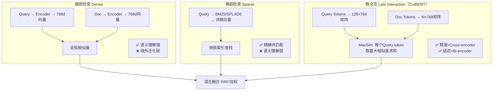

# 检索三角：Dense vs Sparse vs Late Interaction
> 📚 参考文献
> - [Dense Retrieval Vs Sparse Retrieval A Unified Eval](../papers/Dense_Retrieval_vs_Sparse_Retrieval_A_Unified_Evaluation.md) — Dense Retrieval vs Sparse Retrieval: A Unified Evaluation...
> - [Dense-Retrieval-Vs-Sparse-Retrieval-A-Unified-E...](../papers/Dense_Retrieval_vs_Sparse_Retrieval_A_Unified_Evaluation.md) — Dense Retrieval vs Sparse Retrieval: A Unified Evaluation...
> - [Dense-Retrieval-Vs-Sparse-Retrieval-Unified-Eva...](../papers/Dense_Retrieval_vs_Sparse_Retrieval_A_Unified_Evaluation.md) — Dense Retrieval vs Sparse Retrieval: A Unified Evaluation...
> - [Colbert V3 Efficient Neural Retrieval With Late...](../papers/ColBERT_v3_Efficient_Neural_Retrieval_with_Late_Interacti.md) — ColBERT v3: Efficient Neural Retrieval with Late Interaction
> - [Dense Vs Sparse Retrieval Eval](../papers/Dense_Retrieval_vs_Sparse_Retrieval_Unified_Evaluation_Fr.md) — Dense Retrieval vs Sparse Retrieval: Unified Evaluation F...
> - [Dense-Passage-Retrieval-Conversational-Search](../papers/Dense_Passage_Retrieval_in_Conversational_Search.md) — Dense Passage Retrieval in Conversational Search
> - [Dense Passage Retrieval For Open-Domain Questio...](../papers/Dense_Passage_Retrieval_for_Open_Domain_Question_Answerin.md) — Dense Passage Retrieval for Open-Domain Question Answerin...
> - [Splade V3 Sparse Retrieval](../papers/SPLADE_v3_Advancing_Sparse_Retrieval_with_Deep_Language_M.md) — SPLADE-v3: Advancing Sparse Retrieval with Deep Language ...

> 知识卡片 | 创建：2026-03-23 | 领域：search

## 架构总览



## 📐 核心公式与原理

### 1. BM25

$$
\text{BM25}(q,d) = \sum_{t \in q} \underbrace{\ln\!\left(\frac{N - df_t + 0.5}{df_t + 0.5} + 1\right)}_{\text{IDF}(t)} \cdot \underbrace{\frac{tf_{t,d} \cdot (k_1 + 1)}{tf_{t,d} + k_1\!\left(1 - b + b \cdot \frac{|d|}{avgdl}\right)}_{TF 饱和项}}
$$

**推导步骤：**
1. **IDF**：稀有词信息量大，$\text{IDF}(t) \approx \log\frac{N}{df_t}$，加 0.5 平滑防止 $df_t=0$ 或 $df_t>N/2$ 时负值
2. **TF 饱和**：朴素 $tf$ 线性增长不合理；用 $\frac{tf}{tf + k_1}$ 做饱和，$tf \to \infty$ 时趋向 1，$k_1 \in [1.2, 2.0]$ 控制饱和速度
3. **长度归一化**：长文档词频自然高，$(1 - b + b \cdot |d|/avgdl)$ 将文档长度效应折算为相对于平均长度的比例，$b=0.75$ 部分归一化

**符号说明：**
- $N$：文档总数；$df_t$：含词 $t$ 的文档数；$tf_{t,d}$：词 $t$ 在文档 $d$ 的频次
- $|d|$：文档词数；$avgdl$：语料平均文档长度；$k_1 \approx 1.5$，$b \approx 0.75$

**直观理解：** BM25 = "罕见词 × 词频（边际递减）÷ 文档长度修正"，三个部分各解决一个问题：词的区分度、词频饱和、长文档不公平优势。

### 2. Dense Retrieval：双编码器相似度

$$
s(q, d) = E_q^\top E_d = \sum_{k=1}^{D} E_{q,k} \cdot E_{d,k}
$$

训练目标（In-batch Negative Softmax）：

$$
\mathcal{L}_{\text{DPR}} = -\log \frac{e^{s(q, d^+)/\tau}}{e^{s(q, d^+)/\tau} + \sum_{j \neq +} e^{s(q, d_j)/\tau}}
$$

**推导步骤：**
1. $E_q = \text{BERT}_Q(\text{[CLS]}, q)$，$E_d = \text{BERT}_D(\text{[CLS]}, d)$，两个独立编码器
2. In-batch Negative：batch 内其他 query 的正样本充当负样本，无需额外采样
3. 温度 $\tau$ 越小，分布越尖锐，模型区分正负样本的"要求"越高

**符号说明：**
- $E_q, E_d \in \mathbb{R}^D$：Query 和 Doc 的 [CLS] 向量（$D=768$）
- $d^+$：正样本；$d_j$：In-batch 负样本；$\tau$：温度（通常 0.1）

### 3. ColBERT MaxSim 推导

$$
s(q, d) = \sum_{i=1}^{|q|} \max_{j=1}^{|d|} E_{q_i}^\top E_{d_j}
$$

**推导步骤：**
1. **Token 级编码**：$\mathbf{E}_q \in \mathbb{R}^{|q| \times D}$，$\mathbf{E}_d \in \mathbb{R}^{|d| \times D}$，维度压缩到 $D=128$
2. **MaxSim 操作**：对每个 Query token $i$，取其与所有 Doc token 中最高的相似度，$\text{MaxSim_{i = }\max}_{j E_{q}_{\text{i}}^\top E_{d_j}$
3. **求和聚合**：$|q|$ 个 MaxSim 之和为最终分数。比 Bi-encoder 精细（保留 token 对齐），比 Cross-encoder 快（Doc 向量可离线预计算）

**符号说明：**
- $E_{q_i}, E_{d_j} \in \mathbb{R}^{128}$：Query token $i$ 和 Doc token $j$ 的压缩向量
- $\max_j$：沿 Doc 维度 MaxPooling（每个 Query token 找最匹配的 Doc token）

**直观理解：** MaxSim = "每个问题词找文档中最能回答它的词"，再把所有问题词的满足度加起来。比单向量相似度更灵活——文档无需整体语义相近，局部 token 匹配即可得分。

---

**一句话**：搜索检索的三条路线——精确词匹配（Sparse）、语义理解（Dense）、两者融合的晚期交互（Late Interaction）——今天的论文把它们的边界、优劣、工业选择说得最清楚。

**类比**：
- Sparse（BM25）= 关键词搜索，像图书馆目录，快但不懂语义
- Dense（DPR/E5）= 语义搜索，像问图书管理员，慢但能理解意思
- Late Interaction（ColBERT）= 带索引的精读，像先靠目录找到章节再细读

---

## 三角权衡完整图

```
                    精确度
                      ↑
              Cross-Encoder (BERT Reranker)
              └── 精确度最高，速度 O(N)，无法大规模使用
                  |
              ColBERT v2/v3（Late Interaction）
              └── token 级 MaxSim，精度≈Cross-Encoder×98%
                  速度 = Bi-Encoder × 1/5 ~ 1/10
                  存储 = Bi-Encoder × 50-200x
                  |
              Bi-Encoder（Dense，DPR/E5/GTE）
              └── 单向量，ANN 检索，速度 O(log N)
                  精度 < ColBERT，存储小
                  |
              BM25 / SPLADE（Sparse）
              └── 无向量，倒排索引，速度 O(1) 近似
精确度          精确关键词匹配，泛化弱
↓ 速度 →
```

---

## 今日新进展

### BM25s（BM25 的极速实现）
```
问题：传统 BM25 Python 实现慢（全量 token 迭代）
方案：Scipy 稀疏矩阵 + JIT 编译，向量化 batch 查询
结果：比 rank_bm25 快 500x，接近 Lucene 速度，纯 Python 可用
工业意义：BM25 不应该成为系统瓶颈，以后可以"免费"用 BM25 做混合基线
```

### SPLADE-v3（稀疏神经检索最强）
```
创新：DeBERTa 基座 + Dense 模型蒸馏 + INT8 量化
数字：BEIR NDCG@10 = 0.546（BM25=0.427，Dense Best≈0.570）
场景定位：精确查询（型号/代码/人名）用 SPLADE，比 Dense 精确 3-5%
          语义查询（概念/意图）用 Dense，比 SPLADE 好 10-15%
```

### ColBERT v3（晚期交互最新版）
```
MaxSim 公式：score(q,d) = Σ_{qi∈Q} max_{dj∈D} qi·dj
创新：更激进的 token 压缩（减少存储30%），PLAID v2 近似（+50%速度）
数字：比 v2 +1-2% NDCG；比 Bi-Encoder 精准 3-5%，慢 5-10x

工业化关键：PLAID 两阶段（centroid粗筛→全量精算），使 ColBERT 可用于亿级索引
```

### Dense Retrieval 统一评测（今日综述）
```
关键发现：
1. 无监督场景：BM25 仍然优于大多数 Dense 模型
2. 有监督场景（domain 内）：Dense 比 BM25 +20-30%
3. 跨域泛化：Sparse > Dense（BM25 在 BEIR 跨域优于早期 DPR）
4. 混合检索（BM25 + Dense）：几乎总是 ≥ 单一最优方案
```

---

## 工业场景选择矩阵

| 查询类型 | 规模 | 延迟要求 | 推荐方案 |
|---------|------|---------|---------|
| 精确词/代码/ID | 任意 | 严格 <10ms | BM25s / SPLADE |
| 语义/意图理解 | <1亿 | 中等 <100ms | Dense Bi-Encoder + ANN |
| 高精度召回 | <1000万 | 宽松 <500ms | ColBERT v3 + PLAID |
| 最终精排 | <1000 | 宽松 <1s | Cross-Encoder |
| 通用生产 | 任意 | 中等 | BM25 + Dense 混合（RRF融合） |

---

## 技术演进脉络

```
TF-IDF (1970s) → 词频+逆文档频率，奠基
    ↓
BM25 (Robertson 1994) → 改进 TF 饱和，长度归一化，40年后仍是基线
    ↓
DPR (Karpukhin 2020) → 双塔 Dense，问答任务首次超 BM25
    ↓
ColBERT (Khattab 2020) → Late Interaction，精度↑，存储↑↑
    ↓
SPLADE (2021) → 学习稀疏表示，BM25 的"进化版"
    ↓
BGE-M3 / GTE (2024) → 统一多路（稀疏+稠密+多向量）单模型
    ↓
今日：BM25s（极速实现）+ SPLADE-v3（SOTA稀疏）+ ColBERT v3（SOTA晚期交互）
    ↓（预测）
生成式检索（DSI/MINDER）→ 直接生成 DocID，无需检索索引
```

---

## 常见考点

1. **Q: 为什么混合检索（Sparse + Dense）几乎总是最优？**
   A: 互补性——Sparse 精确匹配（型号/姓名），Dense 语义泛化（同义/上下位）；RRF 融合几乎无超参，工业可直接用

2. **Q: ColBERT 的 MaxSim 操作是什么？**
   A: 对 query 每个 token，找 document 中与之最相似的 token；所有 query token 的 MaxSim 求和为最终分数；细粒度交互但不用完整 Attention

3. **Q: 为什么无监督场景 BM25 往往胜过 Dense？**
   A: Dense 模型的泛化依赖训练数据 domain，跨域时表示质量下降；BM25 是无参数的精确匹配，天然 domain-agnostic

4. **Q: GTE（General Text Embedding）的统一是什么意思？**
   A: 单一模型支持对称（句对语义相似）和非对称（问答检索）任务，多阶段训练覆盖多任务

5. **Q: 电商搜索中 Sparse 和 Dense 各占什么角色？**
   A: Sparse 召回精确品名/SKU/型号（用户明确知道要什么），Dense 召回语义相关（用户描述需求），排序阶段用 Cross-Encoder 融合

### Q1: 搜索系统的评估指标有哪些？
**30秒答案**：离线：NDCG、MRR、MAP、Recall@K。在线：点击率、放弃率、首页满意度、查询改写率。注意：离线和在线可能不一致。

### Q2: 稠密检索的训练数据构造？
**30秒答案**：正样本：人工标注/点击日志。负样本：①随机负样本；②BM25 Hard Negative；③In-batch Negative。Hard Negative 对效果至关重要。

### Q3: 搜索排序特征有哪些？
**30秒答案**：①Query-Doc 匹配（BM25/embedding 相似度/TF-IDF）；②Doc 质量（PageRank/内容长度/freshness）；③用户特征（搜索历史/偏好）；④Context（设备/地理/时间）。

### Q4: 向量检索的工程挑战？
**30秒答案**：①索引构建耗时（十亿级 HNSW 需要数小时）；②内存占用大（每个向量 128*4=512B，十亿=500GB）；③更新延迟（新文档需要重建索引）；④多指标权衡（召回率/延迟/内存）。

### Q5: RAG 系统的常见问题和解决方案？
**30秒答案**：①检索不相关：优化 embedding+重排序；②答案幻觉：加入引用验证；③知识过时：定期更新索引；④长文档处理：分块+层次检索。

### Q6: E5 和 BGE 嵌入模型的区别？
**30秒答案**：E5（微软）：通用文本嵌入，支持 instruct 前缀。BGE-M3（BAAI）：多语言+多粒度+多功能（dense+sparse+ColBERT 三合一）。BGE-M3 更全面但模型更大。

### Q7: 搜索系统的 Query 分析流水线？
**30秒答案**：①Tokenization/分词→②拼写纠错→③实体识别→④意图分类→⑤Query 改写/扩展→⑥同义词映射。每一步都可以用 LLM 替代或增强，但要注意延迟约束。

### Q8: 搜索相关性标注的方法？
**30秒答案**：①人工标注（5 级相关性）：金标准但成本高；②点击日志推断：点击=相关（有噪声）；③LLM 标注：用 GPT-4 做自动标注（便宜但需校准）。实践中混合使用。

### Q9: 个性化搜索和通用搜索的区别？
**30秒答案**：通用搜索：同一 query 返回相同结果。个性化搜索：结合用户历史偏好调整排序。方法：用户 embedding 作为额外特征输入排序模型。风险：过度个性化导致信息茧房。

### Q10: 搜索系统的 freshness（时效性）怎么做？
**30秒答案**：①时间衰减因子：较新文档加权；②实时索引更新：新文档分钟级可搜；③时效性意图识别：检测「最新」「今天」等时效性 query。电商搜索中 freshness 影响较小，新闻搜索中至关重要。

---

## 相关概念

- [[embedding_everywhere|Embedding 技术全景]]
- [[generative_recsys|生成式推荐统一视角]]
- [[multi_objective_optimization|多目标优化]]

---

## 记忆助手 💡

### 类比法

- **BM25 = 关键词搜索**：像在字典里查单词，精确匹配但不懂同义词（"苹果手机"搜不到"iPhone"）
- **Dense Retrieval = 意会搜索**：把查询和文档都变成"语义指纹"（向量），指纹相似就相关，能懂同义词但可能误解字面意思
- **ColBERT Late Interaction = 逐字对比**：Query 每个词和 Document 每个词两两比较取最大相似度，精度接近 Cross-Encoder，速度接近 Bi-Encoder
- **混合检索 = 双保险**：BM25 抓住精确匹配（不漏"iPhone 15"），Dense 抓住语义相关（"苹果手机"找到"iPhone"），RRF 融合取长补短

### 对比表

| 检索方法 | 核心机制 | 语义理解 | 精确匹配 | 延迟 | 存储 |
|---------|---------|---------|---------|------|------|
| BM25 | 词频统计 | 弱 | 强 | 极低 | 低 |
| DPR/Dense | 双编码器向量 | 强 | 弱 | 低 | 中 |
| SPLADE | 学习稀疏表示 | 中强 | 中强 | 低 | 中 |
| ColBERT | Token级晚交互 | 强 | 强 | 中 | 高 |
| Cross-Encoder | 全交互 | 最强 | 最强 | 高 | 低 |
| 混合(BM25+Dense) | RRF融合 | 强 | 强 | 低 | 中 |

### 口诀/助记

- **检索三角一句话**："稀疏擅词匹配，稠密擅语义，晚交互两全其美但存储贵"
- **混合检索金律**："BM25 + Dense + RRF = 最鲁棒方案"
- **RRF 公式记**："score = Σ 1/(k+rank)，k=60 默认值"
- **ColBERT 记忆**："Max Sim：每个 Query token 找 Doc 中最相似的，求和得总分"

### 面试一句话

- **Dense vs Sparse**："BM25 精确匹配强但无语义理解，Dense Retrieval 语义理解强但精确匹配弱（搜'iPhone 15'可能漏匹配），混合检索 RRF 融合是工业最佳实践"
- **ColBERT**："Token 级延迟交互，Query 每个 token 和 Doc 每个 token 计算相似度取 MaxSim，精度接近 Cross-Encoder 但 Doc 向量可预计算，延迟接近 Bi-Encoder"
