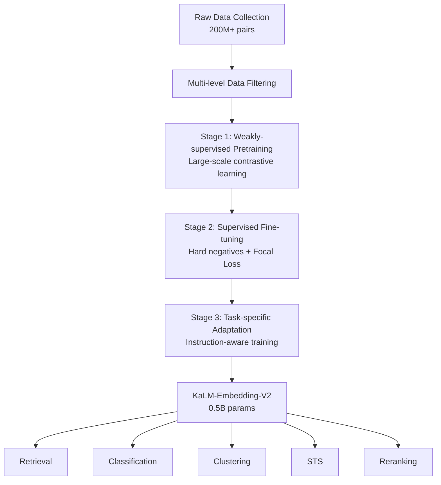

# KaLM-Embedding-V2: Superior Training Techniques for a Versatile Embedding Model

> 来源：https://arxiv.org/abs/2506.20923 | 领域：search | 学习日期：20260403

## 问题定义

文本嵌入模型 (Text Embedding Model) 是现代信息检索、语义搜索和 RAG 系统的基石。近年来大规模 embedding 模型（如 E5-Mistral-7B、GTE-Qwen2-7B 等）虽然在 MTEB 等评测上取得了优异成绩，但其参数量庞大（3B-26B），部署成本极高，难以满足在线低延迟、高吞吐的工业需求。

KaLM-Embedding-V2 尝试解决的核心问题是：能否用一个仅 0.5B 参数的紧凑模型，通过更优的训练策略和数据工程，在 MTEB 等主流基准上击败 3-26x 更大的模型？这不仅是一个学术问题，更是一个工程经济性问题——如果能用 1/10 的计算资源达到同等甚至更优的效果，对搜索和推荐系统的 embedding 服务成本将有巨大影响。

该工作的另一个关键挑战在于 embedding 模型的多任务泛化能力。MTEB 包含 retrieval、classification、clustering、STS、reranking 等多种任务类型，如何让一个小模型在所有任务上同时表现优秀，是训练策略设计的核心难点。

## 核心方法与创新点

KaLM-Embedding-V2 的核心技术贡献在于提出了一套 **Progressive Multi-Stage Training** (渐进式多阶段训练) 框架，配合 **Focal Contrastive Loss** 进行难样本重加权。

### 1. 渐进式多阶段训练

训练分为三个阶段：
- **Stage 1 (Weakly-supervised Pre-training)**: 使用大规模弱监督数据（如标题-正文对、问答对等）进行对比学习预训练，建立基础语义理解能力。
- **Stage 2 (Fine-grained Supervised Training)**: 使用高质量标注数据进行精调，引入 hard negatives mining。
- **Stage 3 (Task-specific Adaptation)**: 针对不同下游任务类型进行适配训练，使用 instruction-aware 的训练方式。

### 2. Focal Contrastive Loss

标准的 InfoNCE 对比损失对所有负样本等权对待，但在大规模训练中，大量 easy negatives 贡献的梯度信号有限。KaLM-V2 引入了 Focal 重加权机制：

$$\mathcal{L}_{\text{focal}} = -\log \frac{e^{s(q, d^+)/\tau}}{\sum_{i} (1 - p_i)^{\gamma} \cdot e^{s(q, d_i)/\tau}}$$

其中 $p_i$ 是样本 $d_i$ 被正确分类的概率，$\gamma$ 是聚焦参数。当 $\gamma > 0$ 时，easy negatives 的权重被降低，hard negatives 得到更多关注。

### 3. 数据质量工程

模型使用了多层数据过滤策略：基于 LLM 的质量评分、基于规则的去重、以及基于 embedding 相似度的 cross-batch deduplication。训练数据总量约 200M pairs，经过严格过滤后约 50M pairs 进入最终训练。

### 4. Embedding 相似度计算

查询 $q$ 与文档 $d$ 的相似度通过余弦相似度计算：

$$s(q, d) = \frac{\mathbf{h}_q^T \mathbf{h}_d}{\|\mathbf{h}_q\| \cdot \|\mathbf{h}_d\|}$$

其中 $\mathbf{h}_q, \mathbf{h}_d$ 分别为 query 和 document 经过 encoder 后的 [CLS] token 表示或 mean pooling 表示。

## 系统架构

## 实验结论

- **MTEB English 综合得分**: KaLM-V2 (0.5B) 在 MTEB English leaderboard 上取得了与 GTE-Qwen2-7B (7B) 可比甚至更优的成绩，整体排名进入前列。
- **Retrieval 任务**: 在 BEIR 等 retrieval benchmark 上，nDCG@10 平均提升 +2.1% 相比同等参数量的 baseline (如 BGE-base, E5-base)。
- **参数效率**: 以 3-26x 更少的参数量击败了 E5-Mistral-7B、GTE-Qwen2-7B 等大模型，证明训练策略的重要性远超参数规模。
- **Focal Loss 消融**: 引入 Focal 重加权后，retrieval 任务上 nDCG@10 提升约 +0.8-1.2%，对 hard negatives 的利用效率显著提升。
- **多阶段训练消融**: 去掉 Stage 1 预训练后整体性能下降约 3-4%，说明弱监督预训练对下游泛化至关重要。

## 工程落地要点

1. **部署成本**: 0.5B 模型可以在单张 A10G (24GB) 上以 FP16 部署，batch encoding 吞吐量约为 7B 模型的 10-15x，极大降低 embedding 服务成本。
2. **量化方案**: 支持 INT8/INT4 量化，量化后精度损失 < 0.5%，适合大规模在线 serving。
3. **向量维度**: 输出维度通常为 768 或 1024，配合 Matryoshka Representation Learning 可支持动态维度截断。
4. **索引兼容性**: 生成的 embedding 可直接用于 FAISS、Milvus、Qdrant 等向量数据库，无需额外适配。
5. **增量训练**: 三阶段训练框架天然支持增量更新——当有新领域数据时，只需在 Stage 2/3 进行微调，无需从头训练。
6. **Hard Negative Mining**: 工程上建议使用 BM25 top-100 + 当前模型 top-100 的交集作为 hard negatives 候选池。

## 面试考点

1. **Q: KaLM-V2 如何用 0.5B 参数击败 7B+ 模型？** A: 通过渐进式三阶段训练（弱监督预训练 -> 监督精调 -> 任务适配）和 Focal Contrastive Loss 对 hard negatives 进行重加权，最大化利用训练信号。
2. **Q: Focal Contrastive Loss 相比标准 InfoNCE 的优势是什么？** A: 通过 $(1-p_i)^\gamma$ 因子降低 easy negatives 的梯度贡献，让模型更多关注有区分度的 hard negatives，提升收敛质量。
3. **Q: 为什么多阶段训练比直接在高质量数据上训练效果更好？** A: Stage 1 的大规模弱监督数据帮助模型建立广泛的语义理解基础，Stage 2 的高质量数据进行精细化校准，Stage 3 的任务适配进一步优化特定任务性能，逐步递进避免过拟合。
4. **Q: 在实际部署中如何平衡 embedding 质量和推理速度？** A: 使用 Matryoshka 表示学习支持动态维度截断，结合 INT8 量化，可在精度损失 < 1% 的情况下将推理速度提升 3-5x。
5. **Q: Hard Negative Mining 在 embedding 训练中为什么重要？** A: 随机负样本与 query 差异过大，提供的梯度信号弱；hard negatives 是与 query 语义相近但不相关的文档，能迫使模型学习细粒度区分能力，显著提升 retrieval 性能。
