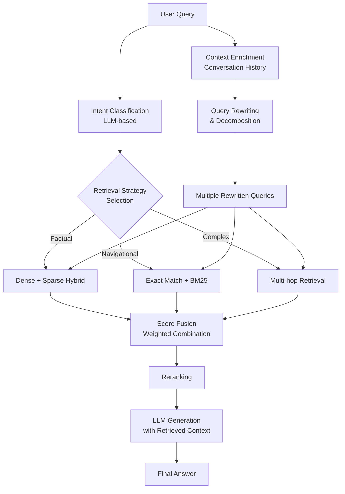

# Omni-RAG: Leveraging LLM-Assisted Query Understanding for Live Retrieval-Augmented Generation

> 来源：https://arxiv.org/abs/2506.21384 | 领域：search | 学习日期：20260403

## 问题定义

Retrieval-Augmented Generation (RAG) 系统已成为将 LLM 与外部知识源结合的主流范式。然而，现有 RAG 系统面临一个关键瓶颈：用户查询与知识库文档之间存在严重的 **语义鸿沟 (Semantic Gap)**。用户的原始查询往往是模糊的、口语化的、缺乏上下文的，直接用原始查询检索常常无法召回最相关的文档。

Omni-RAG 论文指出，传统 RAG 系统的 retrieval 环节过于依赖 query-document 的直接匹配，忽视了对 query 本身的深层理解和改写。而在工业级搜索系统中，Query Understanding (QU) 早已是不可或缺的模块（包括 query rewriting、intent classification、entity recognition 等），但在 RAG 场景中却被严重低估。

Omni-RAG 的核心目标是将 LLM 驱动的查询理解能力引入 live RAG 系统，通过 LLM-assisted query understanding 弥合用户意图与文档表示之间的差距。这里 "live" 强调的是实时性——系统需要在毫秒级延迟内完成查询理解和检索，而非离线批处理场景。

## 核心方法与创新点

### 1. LLM-Assisted Query Understanding Pipeline

Omni-RAG 提出了一个多层次的查询理解流水线：

- **Intent Classification**: 使用 LLM 对 query 进行意图分类（factual、navigational、comparative、procedural 等），决定后续检索策略。
- **Query Decomposition**: 将复杂查询分解为多个子查询，分别检索后合并结果。
- **Query Expansion & Rewriting**: LLM 生成多个语义等价的改写查询，扩大召回范围。
- **Context Augmentation**: 利用对话历史补全隐含上下文信息。

### 2. 融合检索评分

对于原始查询 $q$ 和 LLM 改写后的查询集合 $\{q_1', q_2', \ldots, q_k'\}$，最终的文档评分通过加权融合计算：

$$
\text{score}(d) = \alpha \cdot s(q, d) + (1 - \alpha) \cdot \max_{i \in [k]} s(q_i', d)
$$

其中 $s(\cdot, \cdot)$ 为检索模型的相似度函数，$\alpha$ 为原始查询与改写查询的融合权重。实验表明 $\alpha = 0.3$ 时效果最优，说明 LLM 改写的查询质量通常优于原始查询。

### 3. Adaptive Retrieval Strategy

根据 intent classification 的结果，系统动态选择检索策略：
- **Factual queries**: dense retrieval + sparse retrieval 混合
- **Navigational queries**: 优先使用 exact match + BM25
- **Complex/comparative queries**: query decomposition + multi-hop retrieval

### 4. 检索质量与生成质量的联合优化

Omni-RAG 引入了一个 retrieval-aware generation 目标，将检索质量信号反馈到查询理解模块：

$$
\mathcal{L}_{\text{joint}} = \mathcal{L}_{\text{gen}}(y | q, D_{\text{ret}}) + \lambda \cdot \mathcal{L}_{\text{ret}}(D_{\text{ret}} | q')
$$

其中 $\mathcal{L}_{\text{gen}}$ 是生成损失，$\mathcal{L}_{\text{ret}}$ 是检索损失，$\lambda$ 平衡两者的贡献。

## 系统架构

## 实验结论

- **End-to-end QA 准确率**: 在 NaturalQuestions、TriviaQA 等 benchmark 上，Omni-RAG 相比 naive RAG (直接用原始 query 检索) 提升了 +8.3% 的 EM (Exact Match) 分数。
- **Retrieval Recall@20**: 从 baseline 的 72.1% 提升到 81.5%，query rewriting 贡献了主要的召回提升。
- **Query Decomposition 效果**: 对于 multi-hop 问题，decomposition 策略将 recall 从 58.3% 提升到 74.6%。
- **延迟分析**: LLM query understanding 增加约 50-100ms 延迟（使用小型 LLM 如 Qwen2-1.5B 进行 QU），在工业可接受范围内。
- **消融实验**: Query rewriting 贡献最大 (+5.2% EM)，intent-based routing 贡献 +1.8% EM，context augmentation 贡献 +1.3% EM。

## 工程落地要点

1. **QU 模型选择**: 工业部署中，query understanding 模块建议使用 1-3B 的小型 LLM (如 Qwen2-1.5B)，通过 distillation 从大模型获得改写能力，保证延迟在 50ms 以内。
2. **异步并行**: Query rewriting 和 intent classification 可以并行执行，不在关键路径上串行。
3. **缓存策略**: 对高频 query 的改写结果进行缓存，命中率通常可达 30-50%，显著降低 LLM 调用量。
4. **Fallback 机制**: 当 LLM QU 服务不可用时，自动降级到基于规则的 query rewriting (同义词替换、停用词去除等)。
5. **A/B 测试**: 建议从 query rewriting 单一模块开始灰度上线，逐步加入 intent routing 和 decomposition。
6. **成本估算**: 以日均 1000 万次 RAG 请求为例，使用 1.5B QU 模型约需 4 张 A10G GPU，月成本约 $2000-3000。

## 面试考点

1. **Q: Omni-RAG 如何解决用户查询与文档之间的语义鸿沟？** A: 通过 LLM-assisted query understanding pipeline 对 query 进行意图分类、改写、分解和上下文补全，将模糊的用户查询转化为多个精确的检索查询。
2. **Q: 为什么 query rewriting 后的融合评分中原始 query 权重较低 ($\alpha=0.3$)？** A: 实验表明 LLM 改写的 query 在语义精确性和召回覆盖度上通常优于用户原始 query，但保留原始 query 的部分权重有助于防止改写引入的语义漂移。
3. **Q: Query Decomposition 适用于什么类型的查询？** A: 主要适用于 multi-hop 和 comparative 类型的复杂查询，将一个需要多步推理的查询分解为多个独立可检索的子查询，分别召回后合并结果。
4. **Q: 在工程上如何控制 LLM QU 引入的延迟？** A: 使用蒸馏后的小型 LLM (1-3B) 做 QU、异步并行执行各 QU 子任务、高频 query 缓存、以及降级到规则引擎的 fallback 机制。
5. **Q: Omni-RAG 与传统搜索系统中的 Query Understanding 有什么区别？** A: 传统 QU 依赖规则和轻量级分类模型，而 Omni-RAG 利用 LLM 的深层语义理解能力，能处理开放域的复杂查询改写和意图理解，泛化性更强。
