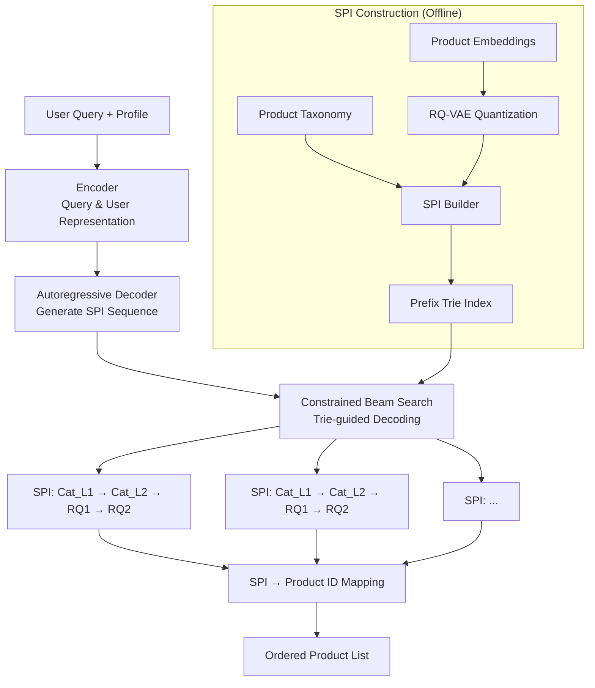

# OneSearch: A Unified End-to-End Generative Framework for E-commerce Search

> 来源：https://arxiv.org/abs/2509.03236 | 领域：search | 学习日期：20260403

## 问题定义

传统电商搜索系统遵循经典的 **多阶段级联架构 (Multi-stage Cascade Architecture)**：Query Understanding -> Retrieval -> Pre-ranking -> Ranking -> Re-ranking -> Post-processing。每个阶段由独立的模型负责，阶段之间通过候选集传递进行信息交互。这种架构虽然成熟稳定，但存在几个根本性问题。

首先是 **信息损失和误差累积**：每个阶段只能看到上一阶段的输出，无法感知全局信息。召回阶段漏掉的商品在后续阶段永远无法挽回，排序阶段的错误也无法被下游纠正。其次是 **优化目标不一致**：各阶段模型独立训练，优化目标不同（如召回优化 recall，排序优化 NDCG，重排优化 CTR），导致全局最优难以达成。第三是 **维护成本高**：多个独立模型的训练、部署、监控工作量巨大。

OneSearch 提出了一个激进的解决方案：用 **单一的生成式模型** 统一替代整个搜索流水线，包括 retrieval、ranking 和 re-ranking，实现真正的 end-to-end 搜索。

## 核心方法与创新点

### 1. Generative Search Paradigm

OneSearch 将搜索问题重新定义为序列生成问题：给定用户 query $q$ 和用户画像 $u$，模型直接生成一个有序的商品 ID 序列：

$$
P(y_1, y_2, \ldots, y_n | q, u) = \prod_{i=1}^{n} P(y_i | y_{<i}, q, u)
$$

其中 $y_i$ 是排序后的第 $i$ 个商品标识符 (Product Identifier)。模型通过 autoregressive generation 直接输出排好序的商品列表，天然融合了 retrieval 和 ranking。

### 2. Semantic Product Identifier (SPI)

直接生成原始商品 ID（如 SKU 编号）是不可行的——ID 空间过大且缺乏语义信息。OneSearch 提出了 **Semantic Product Identifier (SPI)** 方案：

- 使用 hierarchical product taxonomy (类目树) 作为 ID 的语义骨架。
- 在每个类目节点内，通过 RQ-VAE (Residual Quantized VAE) 对商品 embedding 进行量化编码。
- 最终的 SPI 是一个多级编码序列，如 `[L1_Cat] -> [L2_Cat] -> [L3_Cat] -> [RQ_Code_1] -> [RQ_Code_2]`。

### 3. Multi-task Training Objective

OneSearch 的训练目标融合了多个信号：

$$
\mathcal{L} = \mathcal{L}_{\text{gen}} + \alpha \cdot \mathcal{L}_{\text{rank}} + \beta \cdot \mathcal{L}_{\text{rel}}
$$

其中：
- $\mathcal{L}_{\text{gen}}$: 标准的 autoregressive generation loss，学习生成正确的 SPI 序列。
- $\mathcal{L}_{\text{rank}}$: Listwise ranking loss，确保生成顺序与真实排序一致。
- $\mathcal{L}_{\text{rel}}$: Query-product relevance loss，确保生成的商品与 query 相关。

### 4. Constrained Beam Search

推理时使用受约束的 beam search，确保生成的 SPI 序列对应真实存在的商品：
- 使用 prefix tree (Trie) 存储所有有效的 SPI 序列。
- 每一步生成时，只允许 Trie 中合法的 next token。
- 支持动态过滤（如库存为 0 的商品不参与生成）。

### 5. 与传统架构的关键区别

| 维度 | 传统级联 | OneSearch |
|------|----------|-----------|
| 模型数量 | 5-8 个独立模型 | 1 个统一模型 |
| 优化目标 | 各阶段独立 | 端到端统一 |
| 信息传递 | 单向、有损 | 全局、无损 |
| 候选集 | 逐阶段缩小 | 直接生成 Top-N |

## 系统架构

## 实验结论

- **离线指标**: 在内部电商数据集上，OneSearch 的 NDCG@10 相比传统级联系统提升 +4.7%，Recall@50 提升 +6.2%。
- **在线 A/B 测试**: 上线后 CTR 提升 +2.3%，GMV (交易额) 提升 +1.8%，搜索无结果率下降 -15.3%。
- **Latency**: 使用 constrained beam search，P99 延迟约 80ms（beam_size=20），相比传统级联的 150ms 有所降低。
- **SPI 质量**: RQ-VAE 量化后的 SPI 在商品聚类任务上的 NMI (Normalized Mutual Information) 达 0.82，说明 SPI 保留了良好的语义信息。
- **消融实验**: 去掉 $\mathcal{L}_{\text{rank}}$ 后 NDCG@10 下降 2.1%，去掉 $\mathcal{L}_{\text{rel}}$ 后相关性指标下降 3.5%。
- **长尾 query 表现**: 对于低频长尾 query，OneSearch 相比传统系统在 Recall@50 上提升 +11.3%，泛化能力显著更强。

## 工程落地要点

1. **SPI 索引更新**: 商品上下架需要实时更新 Trie 索引，建议使用增量更新机制，新商品的 SPI 通过在线 RQ-VAE 编码生成。
2. **模型规模**: OneSearch 的模型规模约 1-3B 参数，部署在 A100/H100 GPU 上，单机可支撑约 500-1000 QPS。
3. **Fallback 策略**: 为保证系统稳定性，建议保留传统级联系统作为 fallback，当 OneSearch 延迟超阈值或置信度不足时自动降级。
4. **冷启动问题**: 新商品缺乏行为数据，但可通过 SPI 的语义特性（基于类目和商品 embedding）实现冷启动，无需历史点击数据。
5. **商品库规模**: 当前实验在千万级 SKU 上验证，对于亿级 SKU 场景，SPI 的 Trie 索引内存占用约 10-20GB，需要分片部署。
6. **训练数据**: 使用搜索日志中的 query-click-purchase 三元组作为训练数据，点击数据用于 ranking loss，购买数据用于 generation loss。

## 面试考点

1. **Q: OneSearch 如何用一个模型替代整个搜索级联？** A: 将搜索重定义为 autoregressive generation 问题，模型直接生成排好序的 Semantic Product Identifier 序列，天然融合了 retrieval 和 ranking 能力。
2. **Q: Semantic Product Identifier (SPI) 是如何构建的？** A: 由两部分组成——商品类目树提供层级语义骨架，RQ-VAE 对商品 embedding 进行残差量化编码提供细粒度区分，最终形成类似 `[Cat_L1][Cat_L2][RQ1][RQ2]` 的多级编码。
3. **Q: Constrained Beam Search 的作用是什么？** A: 通过 Prefix Trie 约束每一步的生成空间，确保模型只输出对应真实商品的合法 SPI 序列，同时支持动态过滤（如排除库存为 0 的商品）。
4. **Q: OneSearch 相比传统级联架构的核心优势在哪？** A: 端到端统一优化消除了多阶段之间的信息损失和目标不一致问题，尤其对长尾 query 的召回提升显著 (+11.3% Recall@50)。
5. **Q: 这种生成式搜索方案的主要工程挑战是什么？** A: 商品库的实时更新（SPI Trie 的增量维护）、亿级 SKU 下的 Trie 内存开销、以及需要 GPU serving 带来的成本和延迟控制。
