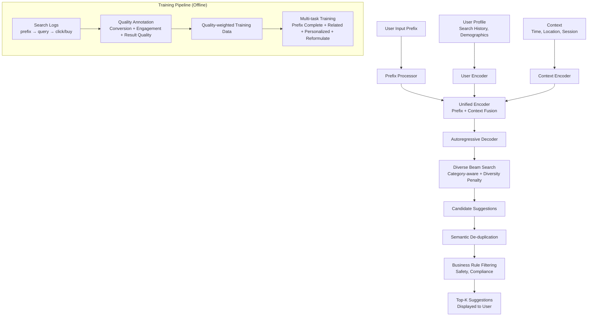

# OneSug: The Unified End-to-End Generative Framework for E-commerce Query Suggestion

> 来源：https://arxiv.org/abs/2506.06913 | 领域：search | 学习日期：20260403

## 问题定义

Query Suggestion (搜索建议/搜索联想) 是电商搜索的重要入口功能——当用户在搜索框中输入部分文字时，系统实时推荐补全的搜索词，帮助用户快速表达搜索意图。一个好的 query suggestion 系统直接影响搜索 CTR、搜索转化率和用户体验。

传统的 query suggestion 系统同样遵循级联架构：(1) **Query Prefix Matching** 根据前缀从历史 query 库中召回候选；(2) **Query Understanding** 对候选进行意图分类和质量打分；(3) **Ranking** 根据历史点击率、query 热度等特征排序；(4) **Filtering** 根据业务规则过滤低质量或违规 query。这种架构的问题类似于搜索系统——多阶段独立优化、信息割裂、候选空间受限于历史 query 库。

OneSug 提出了电商 query suggestion 的端到端生成式框架，核心思想是：**不再从历史 query 库中"选"建议，而是让模型直接"生成"建议**。这突破了传统方法受限于历史 query 词表的限制，能够生成从未被搜索过但高度相关的新 query。

## 核心方法与创新点

### 1. 生成式 Query Suggestion 范式

给定用户输入的前缀 $p$、用户画像 $u$ 和当前上下文 $c$（如浏览历史、时间等），OneSug 直接生成 top-K 个建议 query：

$$
\{q_1^*, q_2^*, \ldots, q_K^*\} = \arg\text{top-K} \prod_{t=1}^{|q|} P(q_t | q_{<t}, p, u, c; \theta)
$$

其中 $q_t$ 是生成 query 的第 $t$ 个 token，$\theta$ 为模型参数。通过 beam search 或 diverse beam search 生成多个候选。

### 2. 统一的多任务建模

OneSug 将多个子任务统一建模在一个生成框架中：

- **Prefix Completion**: 给定前缀补全完整 query (如 "手机" -> "手机壳 防摔")。
- **Related Query Generation**: 生成语义相关但不限于前缀匹配的 query。
- **Personalized Suggestion**: 结合用户画像生成个性化建议。
- **Query Reformulation**: 当搜索无结果时，生成替代搜索词。

通过 instruction prefix 区分不同任务：
- `[PREFIX_COMPLETE] 手机` -> 模型生成补全结果
- `[RELATED_QUERY] 手机壳 防摔` -> 模型生成相关搜索词
- `[PERSONALIZE] user_emb + 手机` -> 模型生成个性化建议

### 3. Quality-Aware Training

训练数据来源于搜索日志，但不同 query 的质量差异巨大。OneSug 引入了 quality-aware 训练机制：

$$
\mathcal{L} = -\sum_{(p, q) \in \mathcal{D}} w(q) \cdot \log P(q | p, u, c; \theta)
$$

其中质量权重 $w(q)$ 综合考虑：
- **Conversion quality**: query 带来的购买转化率
- **Result quality**: query 的搜索结果页质量（有结果 vs 无结果）
- **Engagement quality**: query 的平均点击次数和停留时长
- **Diversity penalty**: 避免过度集中在热门 query 上

### 4. Diverse Generation Strategy

为了保证生成的建议词多样性，OneSug 采用了以下策略：
- **Diverse Beam Search (DBS)**: 在 beam search 中引入 diversity penalty，鼓励不同 beam 生成语义不同的 query。
- **Category-aware Decoding**: 在生成过程中引导模型覆盖不同商品类目。
- **De-duplication**: 对生成结果进行语义去重，基于编辑距离和语义相似度过滤近似重复。

### 5. 实时个性化

用户画像信息通过 cross-attention 机制注入生成过程：
- 用户的历史搜索 query 序列通过 encoder 得到 user embedding。
- 生成 decoder 的每一层都通过 cross-attention attend to user embedding。
- 这使得同一个前缀对不同用户生成不同的建议（如 "苹果" -> 数码用户看到 "苹果15手机壳"，食品用户看到 "苹果 新鲜水果"）。

## 系统架构

## 实验结论

- **离线指标 (MRR@10)**: OneSug 相比传统 prefix matching + ranking 系统提升 +7.8%，在长尾前缀 (输入仅 1-2 字符) 上提升 +14.2%。
- **新颖 query 生成**: OneSug 生成的建议中约 12-18% 是从未在历史搜索日志中出现过的新 query，但其搜索结果质量和传统建议持平。
- **在线 A/B 测试**: 搜索建议的 CTR 提升 +3.5%，从搜索建议进入的搜索转化率提升 +2.1%。
- **个性化效果**: 个性化建议相比非个性化建议，CTR 提升 +4.7%，说明用户画像信息对 suggestion 质量有显著贡献。
- **Diversity 指标**: Diverse Beam Search 使得建议覆盖的商品类目数从平均 2.3 个提升到 4.1 个，同时 MRR 仅下降 0.3%。
- **延迟**: 基于 1.5B 参数模型 + beam_size=10，P99 延迟约 35ms，满足搜索框实时联想的延迟要求 (< 50ms)。

## 工程落地要点

1. **延迟优化**: 搜索建议对延迟极其敏感（用户每输入一个字符都可能触发），建议使用 TensorRT/vLLM 加速，配合 KV-cache 复用前缀的计算结果。
2. **前缀缓存**: 对高频前缀（如 "手机"、"女装"）的生成结果进行缓存，命中率可达 40-60%，大幅减少模型推理调用。
3. **安全过滤**: 生成式方法可能产生不当内容，必须在输出层增加安全分类器，对生成的 query 进行合规检测。
4. **A/B 回退**: 保留传统 prefix matching 系统作为 fallback，当生成模型延迟超标或服务异常时自动切换。
5. **模型更新频率**: 建议按周更新模型（使用最近一周的搜索日志），按天更新 quality weights（反映最新的商品转化数据）。
6. **多语言/多站点**: 模型架构天然支持多语言——通过不同的 instruction prefix 和多语言预训练 backbone 即可扩展。
7. **指标监控**: 重点监控生成 query 的搜索无结果率、安全违规率、以及建议的多样性覆盖度。

## 面试考点

1. **Q: OneSug 相比传统 query suggestion 的最大优势是什么？** A: 突破了历史 query 词表的限制，能够生成从未被搜索过但高度相关的新 query，尤其在长尾前缀场景下召回质量显著更高。
2. **Q: Quality-Aware Training 如何避免模型偏向热门 query？** A: 通过综合 conversion quality、result quality、engagement quality 和 diversity penalty 四维质量权重，降低纯热度驱动的偏差，鼓励模型学习高转化但低频的优质 query。
3. **Q: 如何保证生成式 query suggestion 的多样性？** A: 采用 Diverse Beam Search 引入 diversity penalty、category-aware decoding 引导覆盖不同类目、以及基于编辑距离和语义相似度的后处理去重。
4. **Q: 生成式 query suggestion 的主要风险是什么？如何应对？** A: 主要风险是生成不当或无结果的 query，应对方案包括输出层安全分类器、搜索结果质量预检、以及传统系统 fallback 机制。
5. **Q: 搜索建议场景对延迟有什么特殊要求？OneSug 如何满足？** A: 搜索建议需在用户输入过程中实时响应，P99 延迟须 < 50ms；OneSug 通过模型量化、TensorRT 加速、KV-cache 前缀复用和高频前缀缓存将延迟控制在 35ms 以内。
