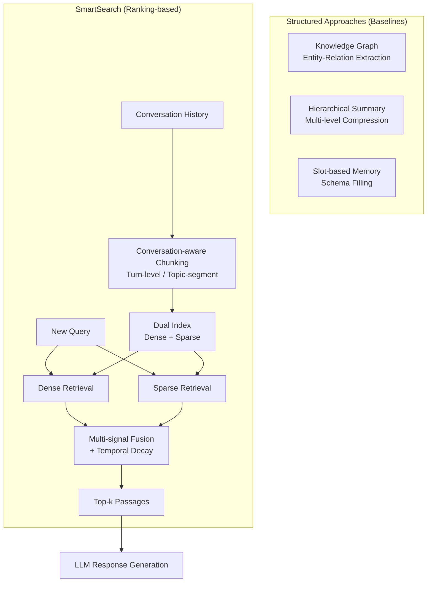

# SmartSearch: How Ranking Beats Structure for Conversational Memory Retrieval

> 来源：https://arxiv.org/abs/2603.15599 | 领域：search | 学习日期：20260403

## 问题定义

随着 LLM-based conversational agents 的普及，一个日益重要的问题是如何从长期对话历史中高效检索相关信息——即 **Conversational Memory Retrieval**。当 agent 与用户进行了数百甚至数千轮对话后，如何在新一轮对话中快速找到历史中的相关上下文，直接影响 agent 的个性化能力和用户体验。

现有的对话记忆管理方案主要分为两类：(1) **结构化方法 (Structured approaches)**，将对话历史组织为知识图谱、关系数据库、层级化摘要树等结构化形式；(2) **排序方法 (Ranking-based approaches)**，将对话历史切分为 passages 后直接建索引，使用检索模型进行排序。直觉上，结构化方法似乎更优——通过显式的知识组织和推理可以更精确地定位信息。

SmartSearch 论文的核心发现是反直觉的：**在大多数场景下，基于排序的简单方法显著优于复杂的结构化方法**。论文通过系统性的实验对比，揭示了结构化方法在对话记忆检索中的局限性，并提出了优化的 ranking-based 解决方案。

## 核心方法与创新点

### 1. 对话记忆检索的问题形式化

给定对话历史 $H = \{(u_1, a_1), (u_2, a_2), \ldots, (u_T, a_T)\}$（$u_t$ 为用户消息，$a_t$ 为 agent 回复），以及新的查询 $q$，目标是从 $H$ 中检索最相关的 passages 集合 $P^* \subset H$：

$$
P^* = \arg\max_{P \subset H, |P| \leq k} \sum_{p \in P} \text{rel}(q, p)
$$

其中 $\text{rel}(q, p)$ 为 query-passage 的相关性评分。

### 2. 结构化方法的系统性评估

论文评估了多种结构化方法：
- **Knowledge Graph (KG)**: 从对话中抽取实体和关系构建图谱，查询时通过图遍历检索。
- **Hierarchical Summary**: 构建多层摘要树，从粗粒度到细粒度逐层检索。
- **Slot-based Memory**: 将对话信息填充到预定义的 slot schema 中。
- **Entity-centric Index**: 以实体为中心组织对话片段。

### 3. 优化的 Ranking-based 方法

SmartSearch 提出的排序方法包含以下优化：
- **Conversation-aware Chunking**: 按对话轮次 (turn-level) 或话题段 (topic-segment) 进行切分，保留上下文窗口。
- **Temporal Decay Weighting**: 引入时间衰减因子，近期对话获得更高权重。
- **Multi-signal Fusion**: 融合稠密检索、稀疏检索和时间信号。

最终的排序分数为：

$$
\text{score}(q, p_t) = w_1 \cdot s_{\text{dense}}(q, p_t) + w_2 \cdot s_{\text{sparse}}(q, p_t) + w_3 \cdot \exp(-\beta (T - t))
$$

其中 $s_{\text{dense}}$ 和 $s_{\text{sparse}}$ 分别为稠密和稀疏检索分数，$\exp(-\beta(T-t))$ 为时间衰减项，$T$ 为当前时间步，$t$ 为 passage 所在的对话轮次。

### 4. 为什么结构化方法表现不佳？

论文分析了结构化方法失败的核心原因：
- **信息损失**: KG 抽取和摘要过程不可避免地丢失细节信息，尤其是隐式意图和情感信息。
- **Error Propagation**: 结构化过程中的每一步（实体抽取、关系识别、摘要生成）都会引入错误，错误逐层累积。
- **Schema Rigidity**: 预定义的结构无法覆盖对话中的所有信息类型。
- **Maintenance Cost**: 结构化索引的维护成本高，每次新对话都需要更新图谱/摘要。

## 系统架构

## 实验结论

- **整体对比**: Ranking-based 方法在 Recall@10 上平均超越 KG-based 方法 +12.4%，超越 Hierarchical Summary +8.7%，超越 Slot-based +15.2%。
- **不同对话长度**: 当对话历史 > 500 轮时，ranking 方法的优势更加明显（+18.1% Recall@10），因为结构化方法的 error propagation 随长度增长而加剧。
- **不同查询类型**: 对于 factual queries, ranking 优势最大 (+15.3%)；对于需要推理的 queries, 差距缩小但 ranking 仍胜出 (+5.2%)。
- **延迟对比**: Ranking 方法平均检索延迟 15ms，KG 方法 120ms，Hierarchical Summary 85ms。
- **Temporal Decay 消融**: 加入时间衰减后 Recall@10 提升 +3.1%，说明对话的时间性是重要信号。
- **Chunking 策略消融**: Topic-segment chunking 比固定长度 chunking 提升 +2.8% Recall@10。

## 工程落地要点

1. **索引设计**: 建议使用 turn-level chunking，每个 chunk 包含 1-3 轮对话并附加前后 1 轮作为上下文窗口，平均 chunk 长度约 200-400 tokens。
2. **双路检索**: Dense (如 BGE/GTE) + Sparse (BM25) 双路检索，通过 RRF 或学习权重融合，比单一检索方式提升约 5-8%。
3. **增量索引更新**: 每轮新对话产生后实时追加到索引中，不需要重建整个索引，支持毫秒级更新。
4. **存储成本**: 以 1000 轮对话 (~200K tokens) 为例，sparse index 约 5MB，dense index (768d) 约 3MB，总存储成本极低。
5. **个性化 Agent**: 该方案特别适合个人助手类 agent——通过高效的对话历史检索实现长期记忆，无需复杂的知识图谱维护。
6. **Scaling**: 当对话历史达到百万轮级别时，建议引入 ANN (近似最近邻) 索引如 HNSW，保证检索延迟在 50ms 以内。

## 面试考点

1. **Q: 为什么 ranking-based 方法在对话记忆检索中优于 KG 等结构化方法？** A: 结构化方法在信息抽取和组织过程中不可避免地丢失细节信息并累积错误，而 ranking 方法保留了原始对话的完整语义，配合现代 dense retrieval 模型已足够精确。
2. **Q: SmartSearch 中时间衰减因子的作用是什么？** A: 对话的时效性是重要信号——近期对话与当前查询的相关性通常更高，时间衰减因子 $\exp(-\beta(T-t))$ 为近期 passages 赋予更高权重，实验提升 +3.1% Recall@10。
3. **Q: Conversation-aware Chunking 为什么比固定长度切分更好？** A: 固定长度切分可能将一个完整的对话轮次截断，破坏语义完整性；turn-level 或 topic-segment 切分保证每个 chunk 是语义完整的对话单元。
4. **Q: 在什么场景下结构化方法可能反超 ranking 方法？** A: 当查询需要多跳推理（如"上次我提到的那个朋友推荐的餐厅在哪"）且对话历史极长时，KG 的关系链推理能力可能有优势，但 SmartSearch 的实验表明即便如此 ranking 仍微幅领先。
5. **Q: 如何将 SmartSearch 应用到多用户的 SaaS 场景？** A: 为每个用户维护独立的 dense + sparse index，索引按 user_id 分片存储，检索时路由到对应分片，单用户索引体量小，可在内存中完成检索。
