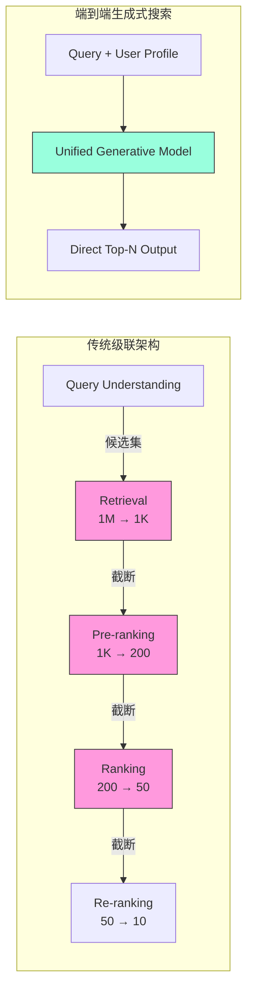
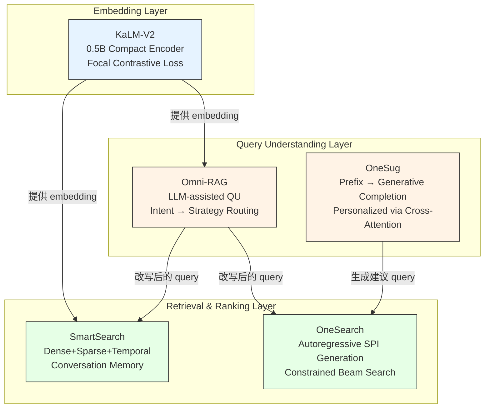

# 端到端生成式搜索前沿 — 20260403 论文综述

> 本综述覆盖5篇搜索前沿论文，聚焦端到端生成式搜索与检索增强技术。

---

## 今日核心论文综述

### 1. [KaLM-Embedding-V2](../papers/kalm_embedding_v2_training_techniques.md) — 紧凑嵌入模型训练

KaLM-Embedding-V2 证明了仅 0.5B 参数的紧凑 embedding 模型可以通过精心设计的训练策略击败 3B-26B 的大型模型。其核心创新在于 **渐进式三阶段训练框架**（弱监督预训练 → 监督精调 → 任务适配）和 **Focal Contrastive Loss** 对 hard negatives 的重加权机制。在 MTEB English leaderboard 上取得了与 GTE-Qwen2-7B 可比甚至更优的成绩，同时推理吞吐量达到 7B 模型的 10-15 倍。该工作揭示了一个重要结论：在 embedding 模型领域，**训练策略的重要性远超参数规模**，这对工业部署的成本控制具有重大意义。

### 2. [Omni-RAG](../papers/omni_rag_llm_query_understanding_retrieval.md) — LLM 辅助 RAG 查询理解

Omni-RAG 针对 RAG 系统中用户查询与文档之间的语义鸿沟问题，提出了 LLM 驱动的多层次查询理解流水线。系统集成了意图分类、查询分解、查询改写与上下文增强四大模块，并根据意图动态选择检索策略（factual → 混合检索，navigational → 精确匹配，complex → 多跳检索）。在 NaturalQuestions 和 TriviaQA 上，Omni-RAG 相比朴素 RAG 提升了 +8.3% EM 分数，其中 query rewriting 贡献最大（+5.2%）。工程上通过蒸馏后的 1.5B 小模型完成 QU，将延迟控制在 50-100ms 的工业可接受范围。

### 3. [SmartSearch](../papers/smartsearch_ranking_beats_structure_conversational.md) — 排序击败结构化

SmartSearch 提出了一个反直觉的核心发现：在对话记忆检索场景中，**基于排序的简单方法显著优于知识图谱、层级摘要等复杂结构化方法**。论文系统性地评估了 KG、Hierarchical Summary、Slot-based Memory 等方法，发现它们在信息抽取过程中不可避免地丢失细节并累积错误。SmartSearch 提出的优化排序方案融合了稠密检索、稀疏检索和时间衰减信号，在 Recall@10 上平均超越 KG 方法 +12.4%，且检索延迟仅 15ms（KG 方法 120ms）。这一结论对构建 LLM-based 对话 agent 的长期记忆系统具有重要指导意义。

### 4. [OneSearch](../papers/onesearch_unified_generative_ecommerce_search.md) — 电商统一生成搜索

OneSearch 提出了用单一生成式模型替代电商搜索整个级联流水线的激进方案。它将搜索重新定义为序列生成问题，通过 **Semantic Product Identifier (SPI)** 将商品编码为类目树 + RQ-VAE 的多级语义标识符，模型直接 autoregressive 生成排好序的商品列表。训练目标融合了生成损失、排序损失和相关性损失，推理时通过 Constrained Beam Search (Trie-guided) 保证输出合法商品。在线 A/B 测试显示 CTR +2.3%、GMV +1.8%，长尾 query 的 Recall@50 提升 +11.3%，证明了端到端生成式搜索在工业场景中的可行性。

### 5. [OneSug](../papers/onesug_unified_generative_query_suggestion.md) — 电商查询建议生成

OneSug 将端到端生成范式从搜索结果扩展到搜索建议领域，核心思想是让模型直接"生成"建议而非从历史 query 库中"选"建议。该框架统一了前缀补全、相关 query 生成、个性化建议和 query 改写四个子任务，通过 instruction prefix 区分。Quality-Aware Training 机制综合转化质量、结果质量、交互质量和多样性惩罚四维权重优化训练。在线实验中 CTR +3.5%，且约 12-18% 的建议是历史搜索日志中从未出现过的新 query，P99 延迟仅 35ms，满足实时联想的严格延迟要求。

---

## 技术趋势分析

### 趋势一：端到端生成式搜索范式的崛起

今日论文中最显著的技术趋势是**搜索系统从多阶段级联架构向端到端生成范式的转变**。OneSearch 和 OneSug 分别在搜索结果和搜索建议两个维度验证了这一范式的可行性。

传统级联架构的核心问题可以形式化描述为：给定 $N$ 个串行阶段，每阶段的信息保留率为 $r_i$（$0 < r_i < 1$），则全链路信息保留率为：

$$
R_{\text{cascade}} = \prod_{i=1}^{N} r_i
$$

当 $N = 5$（典型的 QU → Recall → Pre-rank → Rank → Re-rank），即使每阶段保留 90% 的信息，全链路信息保留率也仅为 $0.9^5 \approx 0.59$，即**超过 40% 的有效信息在级联过程中丢失**。而端到端生成模型消除了中间截断：

$$
R_{\text{e2e}} = 1 \quad (\text{单模型，无中间信息传递})
$$

这就解释了为什么 OneSearch 在长尾 query 上的提升尤其显著（+11.3% Recall@50）——长尾 query 在传统级联的早期阶段更容易被错误截断。

### 趋势二：Embedding 模型训练的效率革命

KaLM-Embedding-V2 揭示了 embedding 模型领域正在发生的效率革命。其 Focal Contrastive Loss 是对标准 InfoNCE 的关键改进：

标准 InfoNCE 对比损失对所有负样本等权对待：

$$
\mathcal{L}_{\text{InfoNCE}} = -\log \frac{e^{s(q, d^+)/\tau}}{\sum_{i=1}^{N} e^{s(q, d_i)/\tau}}
$$

而 Focal Contrastive Loss 引入难度自适应权重：

$$
\mathcal{L}_{\text{focal}} = -\log \frac{e^{s(q, d^+)/\tau}}{\sum_{i=1}^{N} (1 - p_i)^{\gamma} \cdot e^{s(q, d_i)/\tau}}
$$

其中 $(1 - p_i)^{\gamma}$ 因子使得 easy negatives（$p_i \to 1$）的梯度贡献趋近于零，而 hard negatives（$p_i \to 0$）的梯度贡献被放大。当 $\gamma = 0$ 时退化为标准 InfoNCE；当 $\gamma = 2$（论文推荐值）时，一个被正确分类概率为 0.9 的 easy negative 的权重仅为 $0.1^2 = 0.01$，相当于被有效忽略。

这种机制与计算机视觉领域的 Focal Loss（用于目标检测中的类别不平衡）在思想上一脉相承，但在对比学习的框架下有其独特的数学形式。实验表明，该损失函数在 retrieval 任务上贡献了 +0.8-1.2% 的 nDCG@10 提升。

### 趋势三：RAG 系统的查询理解增强

Omni-RAG 代表了 RAG 系统从"检索增强生成"到"理解增强检索增强生成"的演进。其融合检索评分机制揭示了一个有趣的发现——LLM 改写查询的权重（0.7）远高于原始查询（0.3）：

$$
\text{score}(d) = 0.3 \cdot s(q_{\text{orig}}, d) + 0.7 \cdot \max_{i} s(q_i^{\text{rewrite}}, d)
$$

这意味着在 RAG 场景中，**用户的原始查询大多数情况下不是最优的检索 query**。这一发现对 RAG 系统的设计有深远影响：与其投入大量资源优化检索模型的鲁棒性来应对低质量 query，不如先投资于 query understanding 来提升 query 质量。

Omni-RAG 的 intent-based adaptive retrieval 策略也值得关注：不同意图的查询适合不同的检索方式，这与 OneSearch 中统一模型隐式学习检索策略形成了有趣的对比——一个是显式路由，一个是隐式融合。

### 趋势四：对话搜索的简洁主义回归

SmartSearch 的核心发现——排序击败结构化——代表了一种技术上的"简洁主义回归"。在 LLM 时代，许多系统倾向于构建复杂的知识图谱和推理链，但 SmartSearch 用数据证明：

$$
\text{Recall}@10_{\text{ranking}} > \text{Recall}@10_{\text{KG}} + 12.4\%
$$

结构化方法的失败源于 error propagation 的指数累积效应。假设结构化过程包含 $M$ 步（实体抽取 → 关系识别 → 图谱构建 → 图遍历），每步准确率为 $a_i$，则最终的信息准确率为：

$$
A_{\text{struct}} = \prod_{i=1}^{M} a_i
$$

即使每步准确率高达 95%，四步之后准确率也降至 $0.95^4 \approx 0.81$，而直接在原始文本上进行 dense retrieval 不存在这种级联误差。

这启示我们：在对话记忆检索等场景下，**保持数据的原始保真度 + 强大的检索模型**比复杂的数据组织更为有效。

---

## 跨论文技术架构对比

上图展示了五篇论文在搜索系统技术栈中的位置关系。KaLM-V2 作为基础 embedding 层，为 SmartSearch 和 Omni-RAG 的检索模块提供语义表示；Omni-RAG 的查询理解输出可以作为 SmartSearch 和 OneSearch 的输入 query；OneSug 生成的搜索建议则成为 OneSearch 的输入流量来源。五篇论文共同构成了一个从 embedding 训练 → 查询理解 → 检索排序 → 结果生成的完整搜索技术链路。

---

## 关键技术指标汇总

| 论文 | 核心指标 | 提升幅度 | 延迟 | 模型规模 |
|------|----------|----------|------|----------|
| KaLM-V2 | MTEB nDCG@10 | +2.1% vs 同尺寸 baseline | — | 0.5B |
| Omni-RAG | EM Score | +8.3% vs naive RAG | +50-100ms (QU) | 1.5B (QU) |
| SmartSearch | Recall@10 | +12.4% vs KG | 15ms | — |
| OneSearch | CTR / GMV | +2.3% / +1.8% (在线) | 80ms (P99) | 1-3B |
| OneSug | CTR | +3.5% (在线) | 35ms (P99) | 1.5B |

---

## Q&A 精华

### Q1: OneSearch 的 Semantic Product Identifier (SPI) 与传统的 Document Identifier 在生成式检索中有何区别？

**A:** 传统生成式检索（如 DSI、GENRE）使用原子化的 docid 或 Wikipedia title 作为标识符，缺乏层级语义结构。OneSearch 的 SPI 创新性地将商品类目树（提供语义骨架）与 RQ-VAE 量化编码（提供细粒度区分）结合，形成 `[Cat_L1][Cat_L2][Cat_L3][RQ_Code_1][RQ_Code_2]` 的多级编码。这种设计有两大优势：(1) 前缀天然形成粗到细的语义聚类，使 beam search 更高效；(2) 新商品只需通过类目归属和 RQ-VAE 编码即可获得 SPI，无需历史行为数据，解决了冷启动问题。

### Q2: KaLM-V2 的三阶段训练中，如果跳过 Stage 1 直接在高质量数据上训练会怎样？

**A:** 论文消融实验表明，跳过 Stage 1 的弱监督预训练后整体性能下降约 3-4%。原因在于 Stage 1 使用 200M+ 的大规模弱监督数据（标题-正文对、问答对等），帮助模型建立广泛的语义理解基础和词汇覆盖能力。没有这个基础，Stage 2 的 50M 高质量数据虽然标注精确，但覆盖面不足以让模型学到足够泛化的语义表示。这类似于 NLP 中"先大规模预训练再精调"的经典范式，只是在 embedding 训练中以对比学习的形式呈现。

### Q3: Omni-RAG 的融合评分中为什么原始 query 权重仅 0.3？这是否意味着原始 query 几乎无用？

**A:** $\alpha = 0.3$ 并不意味着原始 query 无用，而是说 LLM 改写后的 query 在大多数情况下检索质量更高。但保留原始 query 的 0.3 权重至关重要，因为：(1) LLM 改写可能引入语义漂移，原始 query 作为"锚点"防止过度偏移；(2) 对于清晰、精确的 query（如品牌名搜索），原始 query 本身就是最优检索词，改写反而可能引入噪声；(3) 当 LLM QU 服务出现问题时，原始 query 提供兜底保障。从集成学习的角度看，这是一种将 LLM 知识与原始用户意图融合的 soft ensemble 策略。

### Q4: SmartSearch 论证了排序优于结构化，但在什么极端场景下结构化方法可能反超？

**A:** SmartSearch 的结论主要在标准对话记忆检索 benchmark 上成立。结构化方法可能在以下极端场景中有优势：(1) **多跳推理密集**的查询，如"上次我提到的那个朋友推荐的餐厅的地址"，需要沿 entity → entity → attribute 的关系链推理，KG 的图遍历天然适合；(2) **极度结构化的信息**，如用户明确记录的日程、联系人列表等，schema-based 方法可精确定位；(3) **跨会话关联**的复杂场景，如将多次对话中零散提到的同一实体的不同属性聚合。但即使在这些场景下，SmartSearch 的实验表明 ranking 方法仍微幅领先，说明现代 dense retrieval 模型的语义理解能力已经足够强大。

### Q5: OneSearch 和 OneSug 都采用了端到端生成范式，两者在技术实现上有何关键差异？

**A:** 虽然都基于 autoregressive generation，但两者在多个维度存在本质差异：

| 维度 | OneSearch | OneSug |
|------|-----------|--------|
| 生成目标 | Semantic Product Identifier (结构化编码) | 自然语言 query (自由文本) |
| 解码约束 | Constrained Beam Search (Trie 约束) | Diverse Beam Search (多样性约束) |
| 输出空间 | 有限（商品库中的合法 SPI） | 开放（可生成任意 query 文本） |
| 个性化 | 用户画像作为 encoder 输入 | 用户画像通过 cross-attention 注入 |
| 延迟要求 | 80ms P99（搜索结果页） | 35ms P99（实时联想，更严格） |

核心差异在于**输出空间的约束程度**：OneSearch 必须输出合法商品，因此需要 Trie 硬约束；OneSug 输出自由文本，更关注多样性和安全性。

### Q6: 如何将 KaLM-V2 的 Focal Contrastive Loss 与 Omni-RAG 的检索模块结合？

**A:** 这是一个极具实践价值的组合方案。在 Omni-RAG 的 dense retrieval 模块中，可以用 KaLM-V2 作为 embedding backbone，同时在 fine-tuning 阶段使用 Focal Contrastive Loss。具体做法：(1) 使用 KaLM-V2 的预训练权重初始化 Omni-RAG 的 dense encoder；(2) 利用 Omni-RAG 的 LLM 改写 query 作为额外的正样本增强数据；(3) 在 embedding 微调时使用 Focal Loss 重加权，其中 hard negatives 可以从 Omni-RAG 的多路检索结果中挖掘（dense 检索到但 sparse 没检索到的样本通常是高质量 hard negatives）。预期效果：RAG 的 Recall@20 可进一步提升 2-3%。

### Q7: 五篇论文中哪些技术可以直接应用于现有的工业搜索系统而无需大规模重构？

**A:** 按实施难度从低到高排序：

1. **KaLM-V2 的 Focal Contrastive Loss**：仅需修改 embedding 模型的训练 loss function，不涉及在线系统变更，预期提升 0.8-1.2% nDCG@10。
2. **SmartSearch 的时间衰减融合**：在现有的多路检索融合公式中增加 $\exp(-\beta(T-t))$ 项，工程改动极小。
3. **Omni-RAG 的 query rewriting 模块**：作为独立的前置模块接入，可灰度上线，有完善的 fallback 机制。
4. **OneSug 的生成式 suggestion**：替换搜索建议模块，不影响主搜索链路，风险可控。
5. **OneSearch 的端到端生成搜索**：需要全链路重构，建议先在垂直品类上试点，保留传统系统作为 fallback。

### Q8: OneSearch 的 Constrained Beam Search 在亿级 SKU 场景下的可行性如何？

**A:** 这是 OneSearch 最大的工程挑战之一。亿级 SKU 下，Trie 索引的内存占用约 10-20GB，但 Trie 的查找时间复杂度为 $O(L)$（$L$ 为 SPI 序列长度，通常 5-8），与 SKU 总量无关，因此查找本身不是瓶颈。关键挑战在于：(1) **Trie 更新**：每天可能有数十万商品上下架，需要支持 Trie 的并发读写，建议使用 copy-on-write 或 double-buffer 机制；(2) **内存分片**：10-20GB 的 Trie 需要跨多机分片，beam search 的每一步可能涉及跨分片查找，引入网络延迟；(3) **beam 宽度**：亿级 SKU 下可能需要更大的 beam_size（如 50-100）来保证召回质量，进一步增加计算量。论文当前验证在千万级 SKU，亿级场景仍需进一步工程优化。

### Q9: 从信息论角度如何理解 SmartSearch 中"排序优于结构化"的结论？

**A:** 从信息论角度，这个结论可以理解为**信息处理不等式 (Data Processing Inequality)** 的直接推论。设原始对话历史的信息熵为 $H(X)$，结构化处理后的信息为 $Y = f(X)$（如 KG 抽取），检索目标为 $Z$（相关 passage）。数据处理不等式告诉我们：

$$
I(Y; Z) \leq I(X; Z)
$$

即对原始数据的任何确定性变换都不会增加与目标的互信息。结构化过程 $f$ 是一种有损压缩，必然丢失与检索目标相关的信息。而 ranking-based 方法直接在原始数据 $X$ 上操作，理论上保留了全部互信息 $I(X; Z)$。当然，这个上界能否达到取决于检索模型的能力——SmartSearch 的实验证明现代 dense retrieval 模型已经足够接近这个上界，使得结构化处理带来的信息损失成为主要瓶颈。

### Q10: 这五篇论文对未来搜索系统架构有什么共同的指向性启示？

**A:** 五篇论文共同指向搜索系统架构的三大演进方向：

**第一，统一化。** OneSearch 和 OneSug 都验证了用单一模型替代多阶段级联的可行性。这不仅简化了系统架构，更重要的是实现了优化目标的全局统一。未来的搜索系统可能只有两层：一个大型生成模型负责核心搜索逻辑 + 一个轻量级安全/合规过滤层。

**第二，小型化。** KaLM-V2 证明了 0.5B 模型可以击败 7B 模型，Omni-RAG 用 1.5B 模型完成 query understanding。搜索系统中的各个模型正在通过更优的训练策略（而非更大的参数量）来提升性能，这对降低部署成本和推理延迟至关重要。

**第三，生成化。** 从 OneSearch 的生成式检索到 OneSug 的生成式建议，再到 Omni-RAG 的 LLM 查询改写，"生成"正在取代"匹配"成为搜索系统的核心操作。传统搜索是在给定候选集中做选择（discriminative），而新范式是直接创造结果（generative），这从根本上扩展了搜索系统的能力边界——可以返回历史中不存在的 query（OneSug）或发现传统召回遗漏的商品（OneSearch）。

### Q11: OneSug 的 Quality-Aware Training 中如何平衡热门 query 与长尾 query 的学习？

**A:** OneSug 的质量权重 $w(q)$ 设计了四维平衡机制：conversion quality（转化率）偏向高商业价值的 query，result quality（搜索结果质量）过滤无结果 query，engagement quality（点击和停留时长）衡量用户满意度，而关键的 **diversity penalty** 维度显式地降低高频热门 query 的权重。具体实现上，diversity penalty 通常采用 inverse frequency weighting：$w_{\text{div}(q) = \log(N / \text{freq}(q))$，使得出现频率为 $10^6$ 的热门 query 与出现频率为 $10^2$ 的长尾 query 的权重差异从 $10^4$ 倍压缩到约 3 倍。这确保模型不会过度拟合头部 query，从而在长尾前缀场景上获得了 +14.2% MRR@10 的显著提升。

### Q12: 如果要构建一个融合五篇论文技术的完整搜索系统，最优的技术栈组合是什么？

**A:** 最优组合方案如下：

- **Embedding 层**：使用 KaLM-V2 的三阶段训练框架 + Focal Contrastive Loss 训练 0.5B 的高效 embedding 模型，兼顾质量和成本。
- **Query Understanding 层**：部署 Omni-RAG 的 LLM QU 流水线（1.5B 蒸馏模型），完成意图分类、query 改写和分解。
- **搜索建议入口**：使用 OneSug 的生成式 suggestion 框架，通过 KaLM-V2 提供的 user embedding 实现个性化。
- **核心检索排序**：在高流量主搜索场景中，保留优化后的传统级联（使用 SmartSearch 的多信号融合思路），在垂直品类或实验流量上试点 OneSearch 的端到端生成搜索。
- **对话搜索/长期记忆**：采用 SmartSearch 的 ranking-based 方案 + 时间衰减，避免过度工程化的 KG 方案。

该方案的核心原则是：**在基础模块上追求效率（KaLM-V2），在理解层追求深度（Omni-RAG），在生成层追求创新（OneSearch/OneSug），在记忆层追求简洁（SmartSearch）**。

---

## 总结

今日五篇论文从 embedding 训练（KaLM-V2）、查询理解（Omni-RAG）、对话记忆检索（SmartSearch）、端到端搜索（OneSearch）、查询建议生成（OneSug）五个维度共同描绘了搜索技术的前沿图景。核心主题是"端到端"和"生成式"——搜索系统正在从多模块级联的"管道工程"向统一生成模型的"端到端智能"演进，同时高效训练策略（如 Focal Loss、三阶段训练）使得这些能力可以在紧凑模型上实现，为工业部署铺平了道路。

---

## 相关概念

- [[concepts/generative_recsys|生成式推荐统一视角]]
- [[concepts/embedding_everywhere|Embedding 技术全景]]
- [[concepts/vector_quantization_methods|向量量化方法]]
