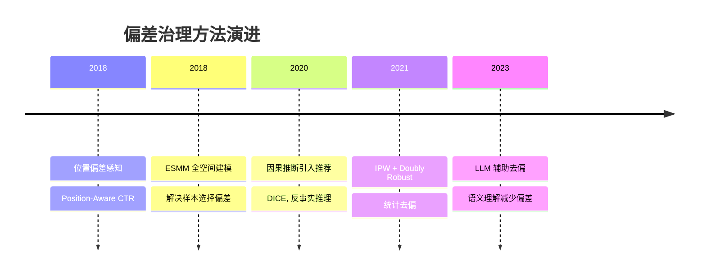

# 偏差治理与因果推断：从相关性到因果性

---

## 🆚 偏差治理方案创新对比

| 偏差类型 | 传统处理 | 创新方案 | 代表方法 |
|---------|---------|---------|---------|
| 位置偏差 | 忽略 | **IPW 逆倾向加权** | Position-Aware CTR |
| 样本选择偏差 | 只用曝光数据 | **全空间建模 ESMM** | 全量曝光训练 |
| 流行度偏差 | 无处理 | **因果去偏 / DICE** | 反事实推理 |
| 反馈延迟偏差 | 丢弃延迟正样本 | **延迟反馈建模** | DFM/ESDFM |
| 曝光偏差 | 忽略 | **因果推断 do-calculus** | 干预分布学习 |

---

## 📈 偏差治理技术演进



---

> 📚 参考文献与源文件
> - [[广告系统偏差治理三部曲|广告系统偏差治理三部曲]] — 广告系统的位置偏差、样本偏差
> - [[推荐系统因果推断|推荐系统因果推断]] — 推荐系统的因果效应识别
> - [[推荐系统全链路架构概览|推荐系统全链路架构概览]] — 数据闭环与反馈偏差

> 💡 **本文统一讲解偏差的来源、识别和治理方法**，覆盖广告、推荐、搜索系统中常见的三大偏差：展示偏差、样本选择偏差、位置偏差

---

## 第 1 部分：偏差的三大类型

### 1.1 什么是模型偏差？

在数据驱动的系统中，模型学到的是**观察数据的相关性**，而不是真实的因果关系。

**例**：推荐系统的位置偏差
```
观察到的数据：
  - 排名第 1 位的物品被点击概率 20%
  - 排名第 10 位的物品被点击概率 2%
  
模型学到：
  位置越靠前，点击概率越高
  
真实因果：
  可能是：物品本身质量好，所以被排在前面并被点击
  而不是：排名靠前导致更多点击
```

### 1.2 三大常见偏差

#### 偏差 1：展示偏差（Selection Bias）

**定义**：系统倾向于展示某类物品，导致训练数据不是随机抽样。

**例子**：
```
推荐系统：
  - 历史上多推荐热门物品
  - 模型只看到热门物品的点击
  - 对冷门但优质的物品建模不足

广告系统：
  - 历史上多展示高出价的广告
  - 模型高估了高出价广告的价值
  - 无法正确评估低出价广告的真实效果
```

**危害**：
- 冷启动物品无法获得流量
- 长尾多样性丧失
- 系统陷入"富者越富"的循环

#### 偏差 2：样本选择偏差（Training Sample Bias）

**定义**：训练数据的分布与真实需要预测的分布不同。

**例子**：CVR 预估
```
观察到的标签：
  - 只能看到被点击后的转化标签
  - 未被点击的样本无转化标签（信息缺失）
  
训练数据：
  - CTR=1（点击）的样本中，有些转化（CVR=1），有些未转化（CVR=0）
  - 完全无CTR的样本无法用（标签缺失）
  
模型实际学到：
  P(CVR | CTR=1)  ← 条件概率，不是我们想要的 P(CVR | expose)
```

**危害**：
- CVR 模型在应用于未点击的样本时会产生严重偏差
- 无法正确评估"从展示→转化"的概率

#### 偏差 3：位置偏差（Position Bias）

**定义**：不同位置的物品有不同的展示/点击概率，与位置本身有关，而非物品质量。

**例子**：搜索结果排序
```
Google 搜索结果中，第 1 位的点击率通常 > 第 2 位 > 第 3 位

但这是因为：
  - Google 的算法本身排在前面的结果通常质量好
  - 用户更倾向点击前面的结果（不看完整列表）
  
问题：
  - 如果一个好结果排在第 10 位，点击率会被低估
  - 模型学到"位置好"比"质量好"更重要
```

**数学形式**：

$$
P(\text{click}) = P(\text{examine}) \times P(\text{relevant | examine})
$$

其中 $P(\text{examine})$ 依赖位置（高位置检查概率高）。

---

## 第 2 部分：偏差的治理方法

### 2.1 展示偏差的治理

#### 方法 1：数据增强与样本重采样

```python
# 问题：历史上热门物品多，冷门物品少
# 解决：过采样冷门物品

cold_items = df[df['popularity'] < threshold]
hot_items = df[df['popularity'] >= threshold]

# 过采样冷门物品
cold_items_upsampled = cold_items.sample(
    n=len(hot_items), 
    replace=True
)

df_balanced = pd.concat([hot_items, cold_items_upsampled])
```

**缺点**：改变数据分布，需要样本权重修正

#### 方法 2：反向概率加权（IPW, Inverse Propensity Weighting）

```
核心思想：
  冷门物品在历史系统中被展示的概率低
  → 给冷门物品的样本更高的权重
  
公式：
  w = 1 / P(shown | item)
  
例子：
  热门物品 P(shown)=0.8 → w=1.25
  冷门物品 P(shown)=0.2 → w=5.0
  
训练时使用加权损失：
  L = sum(w_i * loss_i)
```

**优势**：数学上无偏

**缺点**：权重差异大时，方差高，需要正则化

#### 方法 3：因果森林估计倾向得分

通过因果森林学习每个物品的展示倾向，再用 IPW 加权。

更精确的倾向评估，但计算成本高。

### 2.2 样本选择偏差（CVR 预估）的治理

#### 问题重述

CVR 预估的经典问题：
```
我们观察到的数据：P(CVR | click)
我们想要的数据：P(CVR | expose)

转化只有在点击后才能观察到
未点击的样本完全没有转化信息
```

#### 方法 1：ESMM（全空间多任务学习）

**核心洞察**：在全曝光空间建模，用 CTR × CVR = CTCVR 作为约束。

```
模型输出：
  pCTR = P(click | expose)
  pCVR = P(convert | click)
  
隐式约束：
  pCTCVR = pCTR * pCVR (在全空间)
  
训练数据：
  1. 点击且转化：L_CTCVR = cross_entropy(label=1, pred=pCTCVR)
  2. 点击未转化：L_CTCVR = cross_entropy(label=0, pred=pCTCVR)
  3. 未点击样本：L_CTR = cross_entropy(label=0, pred=pCTR)
```

**优势**：
- CVR 模型在全空间获得约束，缓解样本偏差
- 简单优雅，业界标配

**局限**：
- 假设 CTR 和 CVR 独立（实际有关联）
- 无法处理严重的时间差问题

#### 方法 2：Delayed Feedback 处理

在电商场景，用户点击后可能 7 天才转化。

```
问题：
  某个物品今天被点击，7 天后才转化
  训练数据中，这个样本现在标记为"未转化"
  等 7 天后数据到达，才能更新标签
  
解决方案：

1. Wait & See 法：
   点击后等待 7 天，确认转化标签后再用于训练
   缺点：浪费数据，模型更新滞后

2. Fake Negative Calibration：
   短期内标记为负样本（Fake Negative）
   等到终态转化标签后，回溯修正
   
3. Elapsed Time Model：
   特征中加入"点击后经过时间"
   模型预测：P(eventually_convert | time_since_click)
```

#### 方法 3：建模转化延迟

```
不同商品的转化窗口不同：
  - 低价商品：通常当天转化（窗口 1 天）
  - 高价商品：可能购物对比周期长（窗口 7-30 天）
  - 服务类：可能永远不转化（窗口无穷）
  
模型设计：
  features 中加入 commodity_type
  头部预测短期转化（1-7天）
  多任务预测多个时间窗口（1天、7天、30天）
```

### 2.3 位置偏差的治理

#### 方法 1：IPW 修正位置偏差

```
数据：
  用户在不同位置的点击率（有位置偏差）
  
目标：
  估计真实的相关性（无位置偏差）
  
公式：
  P(relevant | expose) 
  = P(click | position) / P(examine | position)
  
例子：
  第 1 位：15% 点击率，80% 检查率 → 18.75% 相关性
  第 10 位：2% 点击率，10% 检查率 → 20% 相关性
  
发现：第 10 位的相关性其实比第 1 位高！
```

#### 方法 2：PAL（Position-Aware Learning）分解

```
原始模型：
  click_prob = f(features)
  
改进模型：
  click_prob = examine_prob * relevance_prob
  
其中：
  examine_prob = g(position)（只依赖位置）
  relevance_prob = h(features)（仅依赖物品质量）
  
好处：
  relevance 不受位置干扰，更准确
  examine 是位置的确定函数，无需学习
```

#### 方法 3：随机实验（Interleaving Test）

```
大规模随机化实验：
  - 随机改变结果顺序
  - 观察点击率变化
  - 估计位置偏差大小
  
成本：
  - 短期用户体验可能下降（随机排序）
  - 但获得无偏数据，训练更好的模型
  
Tradeoff：
  一次性成本 vs 长期收益
```

---

## 第 3 部分：因果推断

### 3.1 因果推断的核心概念

#### 相关性 vs 因果性

```
例：看电影多的用户转化率更高

相关性解释：
  用户看电影 → 用户更活跃 → 转化率高
  
因果解释：
  用户看电影 → 用户更愿意消费 → 转化率高
  
混淆因素：
  实际上可能是：活跃用户更多看电影，也更容易转化
  看电影本身不导致转化，只是相关
```

#### 因果DAG（有向无环图）

```
混淆因素模型：
       ↙ User_Active ↖
      /               \
  Movie_Watch ←→ Purchase
      
User_Active 同时影响 Movie_Watch 和 Purchase
导致两者相关，但 Movie_Watch 不因果导致 Purchase
```

### 3.2 因果推断的三大方法

#### 方法 1：随机对照试验（RCT）

**黄金标准**：随机分组，控制混淆变量

```python
# 分组
control_group = random_sample(users, 0.5)
treatment_group = remaining_users

# 干预
control_group: 不给电影推荐
treatment_group: 给电影推荐

# 观察
causal_effect = conversion_rate(treatment) - conversion_rate(control)
```

**优点**：无偏、可信

**缺点**：成本高，可能伤害用户体验（控制组）

#### 方法 2：倾向得分匹配（PSM）

```
思想：
  虽然不能随机分配，但可以找到特征相似的用户
  一些用户恰好看了电影，一些恰好没看
  比较这两组的转化差异
  
步骤：
  1. 学习 P(watch_movie | features)（倾向得分）
  2. 对每个看电影的用户，找倾向相似但未看电影的用户
  3. 比较两组转化率
```

**优点**：可用观察数据，不需要实验

**缺点**：只能控制可观测变量，无法控制隐藏混淆

#### 方法 3：双重差分法（DID）

```
适用于：有时间序列的数据

设置：
  - 时间 T1：实验前
  - 时间 T2：实验后
  
分组：
  - 处理组：从 T2 开始给电影推荐
  - 对照组：全程不给电影推荐
  
效应估计：
  causal_effect = (Y_treatment_T2 - Y_treatment_T1) 
                - (Y_control_T2 - Y_control_T1)
```

**直觉**：两组在时间变化上的差异，减少了时间趋势的干扰。

### 3.3 工业应用：特征的因果重要性

通常我们关心：**这个特征对预测的因果贡献是多少？**

#### 应用 1：特征选择

```
相关性排序：
  1. 用户历史转化率：相关性高
  2. 用户观看视频次数：相关性高
  3. 平台日活：相关性中
  
因果排序（通过实验）：
  1. 用户历史转化率：因果效应强（用户本身质量）
  2. 用户观看视频次数：因果效应弱（只是相关）
  3. 平台日活：因果效应无（环境因素）
```

#### 应用 2：归因分析

```
用户在多个接触点（广告、邮件、推荐等）与品牌互动
问题：哪个接触点导致最终转化？
```

**Multi-Touch Attribution 框架**：

```
方法 1：Last-Click（最后一次点击）
  100% 归因给最后一个接触点
  简单但偏差大

方法 2：Linear Attribution（线性）
  平均分配给所有接触点
  无因果根据

方法 3：Markov Chain（马尔可夫）
  基于接触顺序的转移概率
  更接近因果，但假设过强

方法 4：Causal Forest（因果森林）
  用机器学习估计每个接触点的因果贡献
  最准确，但计算复杂
```

---

## 第 4 部分：工业实践建议

### 4.1 偏差治理优先级

```
高优先级（必做）：
  ✓ CVR 预估使用 ESMM
  ✓ 位置偏差用 IPW 或 PAL 修正
  ✓ 定期检查模型性能下降（可能因为分布偏差）

中优先级（应该做）：
  ✓ 新用户/新物品的展示偏差处理
  ✓ Delayed Feedback 校准
  ✓ 离线评估和在线评估的差异分析

低优先级（可选）：
  ✓ 因果森林估计倾向
  ✓ 复杂的多接触点归因
```

### 4.2 常见陷阱

**陷阱 1**：用相关性替代因果性
```
❌ 错误："用户看电影的人转化率高，所以推荐电影会增加转化"
✅ 正确：需要 A/B 测试验证，不能只看数据相关性
```

**陷阱 2**：盲目应用 IPW 而不检查权重分布
```
❌ 错误：直接用 IPW 加权，权重最高是最低的 100 倍
        → 方差爆炸，模型不稳定
        
✅ 正确：
  1. 检查权重分布
  2. 裁剪极端权重（例：最高权重限制 10 倍）
  3. 正则化
```

**陷阱 3**：ESMM 假设 CTR 和 CVR 独立
```
❌ 错误：假设过强，实际两者有关联
        例：容易点击的物品也更容易转化
        
✅ 正确：
  1. 定期验证假设是否成立
  2. 如果不成立，考虑改进（如 ESMM-based variants）
  3. 用 A/B 测试验证模型效果
```

---

## 总结表：偏差治理方法对比

| 偏差类型 | 主要方法 | 实现难度 | 业界采用 |
|---------|---------|---------|---------|
| 展示偏差 | IPW / 因果森林 | 中 | 推荐系统 |
| 样本选择偏差 | ESMM | 低 | 广告/推荐标配 |
| 位置偏差 | IPW / PAL | 中 | 搜索/推荐 |
| 因果推断 | RCT / PSM / DID | 高 | 实验设计 |

---

## 知识体系连接

**上游依赖**：
- CTR/CVR 模型
- 数据清洗与标签定义
- 在线实验框架

**下游应用**：
- 模型评估与选型
- A/B 测试设计
- 长期效果监测

**相关 synthesis**：
- [01_CTR_CVR预估统一框架](./01_CTR_CVR预估统一框架.md)
- [[推荐系统全链路架构概览|推荐系统全链路架构概览]]

---

*MelonEggLearn - 偏差治理与因果推断统一框架*
