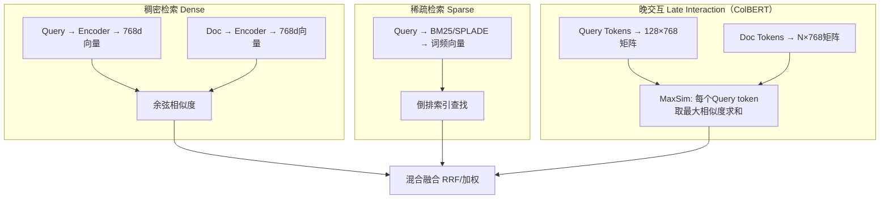

# 检索范式：从稀疏到稠密到混合检索

> 综合文档 | 领域：搜索/信息检索 | 合并自 4 篇 synthesis | 更新：2026-04-13
> 来源：检索三角_Dense_Sparse_LateInteraction.md、混合检索的工业化演进.md、混合检索融合_多路召回实践.md、稀疏vs密集检索决策.md

---

## 一、架构总览



---

## 二、核心公式

### 2.1 BM25

$$
\text{BM25}(q,d) = \sum_{t \in q} \underbrace{\ln\!\left(\frac{N - df_t + 0.5}{df_t + 0.5} + 1\right)}_{\text{IDF}(t)} \cdot \underbrace{\frac{tf_{t,d} \cdot (k_1 + 1)}{tf_{t,d} + k_1\!\left(1 - b + b \cdot \frac{|d|}{avgdl}\right)}}_{\text{TF 饱和项}}
$$

- **IDF**：稀有词信息量大，加 0.5 平滑
- **TF 饱和**：$\frac{tf}{tf + k_1}$，$tf \to \infty$ 时趋向 1，$k_1 \in [1.2, 2.0]$
- **长度归一化**：$(1 - b + b \cdot |d|/avgdl)$，$b=0.75$
- **直观**：BM25 = "罕见词 x 词频（边际递减）/ 文档长度修正"

### 2.2 Dense Retrieval（双编码器）

$$
s(q, d) = E_q^\top E_d, \quad \mathcal{L}_{\text{DPR}} = -\log \frac{e^{s(q, d^+)/\tau}}{e^{s(q, d^+)/\tau} + \sum_{j \neq +} e^{s(q, d_j)/\tau}}
$$

- $E_q = \text{BERT}_Q(\text{[CLS]}, q)$，$E_d = \text{BERT}_D(\text{[CLS]}, d)$
- In-batch Negative：batch 内其他 query 的正样本充当负样本
- 温度 $\tau$ 越小，分布越尖锐

### 2.3 ColBERT MaxSim

$$
s(q, d) = \sum_{i=1}^{|q|} \max_{j=1}^{|d|} E_{q_i}^\top E_{d_j}
$$

- Query 每个 token 找 Doc 中最相似的 token，求和得总分
- 精度 $\approx$ Cross-encoder $\times$ 98%，速度 = Bi-encoder $\times$ 1/5~1/10
- 存储 = Bi-encoder $\times$ 50-200x（PLAID 压缩后可降 32x）

### 2.4 RRF（Reciprocal Rank Fusion）

$$
\text{RRF}(d) = \sum_{r \in \text{rankers}} \frac{1}{k + \text{rank}_r(d)}, \quad k=60
$$

- 不需要分数归一化，只用排名
- 不同检索器分数尺度不同（BM25 可能 20，cosine 可能 0.8），排名可比
- 无超参（k=60 经验最优），工业可直接用

### 2.5 分数加权融合

$$
\text{score}_{fused} = \alpha \cdot \frac{s_{\text{dense}} - \min}{\max - \min} + (1-\alpha) \cdot \frac{s_{\text{sparse}} - \min'}{\max' - \min'}
$$

- 先 min-max 归一化到 [0,1]，再加权
- $\alpha$ 最佳值通常 0.5-0.7（稍偏语义检索），需验证集调优

### 2.6 互补性度量

$$
\text{Complementarity}(R_1, R_2) = \frac{|\text{Rel}(R_1) \cup \text{Rel}(R_2)| - |\text{Rel}(R_1) \cap \text{Rel}(R_2)|}{|\text{Rel}(R_1) \cup \text{Rel}(R_2)|}
$$

- BM25 和 Dense 互补性通常很高 —— 这是混合检索有效的根本原因

---

## 三、技术演进脉络

```
TF-IDF (1970s) → BM25 (Robertson 1994) → DPR (Karpukhin 2020)
    → ColBERT (Khattab 2020) → SPLADE (2021) → BGE-M3/GTE (2024)
        → BM25s（极速实现）+ SPLADE-v3（SOTA稀疏）+ ColBERT v3
            → 生成式检索 DSI/MINDER（直接生成 DocID）
```

**混合检索演进**：
```
BM25 单路 (~2018)
  → BM25 + Dense 双路 + 分数加权融合 (2019-2020)
    → 多路检索 + RRF 融合 (2020-2022)
      → 混合检索 + Cross-Encoder Reranker (2022-2024)
        → 混合检索 + LLM Reranker (2024-2026)
          → 统一模型 BGE-M3 (2024+)
```

**SPLADE 演进**：BM25 → DeepCT(2020) → SPLADE(2021) → SPLADE-v2(2022) → SPLADE-v3（DeBERTa+蒸馏+INT8，BEIR NDCG@10=0.546）

---

## 四、核心对比表

### 4.1 检索方法对比

| 检索方法 | 核心机制 | 语义理解 | 精确匹配 | 延迟 | 存储 | 适用场景 |
|---------|---------|---------|---------|------|------|---------|
| BM25 | 词频统计 | 弱 | 强 | 极低 | 低 | 精确词/代码/ID |
| SPLADE | 学习稀疏表示 | 中强 | 中强 | 低 | 中 | 精确+语义混合 |
| DPR/Dense | 双编码器向量 | 强 | 弱 | 低 | 中 | 语义/意图理解 |
| ColBERT | Token级晚交互 | 强 | 强 | 中 | 高 | 高精度召回 |
| Cross-Encoder | 全交互 | 最强 | 最强 | 高 | 低 | 精排 top-100 |
| 混合(BM25+Dense) | RRF融合 | 强 | 强 | 低 | 中 | 通用生产（推荐） |

### 4.2 混合方案对比

| 方案 | 融合方式 | 适用场景 | 延迟 | 复杂度 |
|------|---------|---------|------|------|
| RRF 融合 | 同步双路+排名融合 | 通用混合检索 | 中 | 中 |
| BGE-M3 | 单模型多路 | 多语言、统一召回 | 中 | 中 |
| LeSeR | 顺序两阶段 | 垂直领域术语精排 | 较高 | 中 |
| Hybrid + LLM Re-rank | LLM 作精排 | 质量优先 | 高 | 高 |

### 4.3 工业场景选择矩阵

| 查询类型 | 规模 | 延迟要求 | 推荐方案 |
|---------|------|---------|---------|
| 精确词/代码/ID | 任意 | <10ms | BM25s / SPLADE |
| 语义/意图理解 | <1亿 | <100ms | Dense Bi-Encoder + ANN |
| 高精度召回 | <1000万 | <500ms | ColBERT v3 + PLAID |
| 最终精排 | <1000 | <1s | Cross-Encoder |
| 通用生产 | 任意 | 中等 | BM25 + Dense 混合（RRF） |

---

## 五、工业实践要点

### 5.1 混合检索标准架构

```
用户 query
    ↓
┌────────────────┬──────────────────┐
│ Sparse 召回     │  Dense 召回       │
│ (SPLADE/BM25)  │  (bi-encoder ANN) │
│ top-100        │  top-100          │
└────────────────┴──────────────────┘
         ↓ RRF 融合
     合并排序 top-200
         ↓ Cross-Encoder 精排
     最终 top-10
```

### 5.2 工业落地 vs 论文差异

| 论文做法 | 工业实际 |
|---------|---------|
| 两路检索 | 3-5 路召回并行（BM25 + Dense + 倒排 + 规则） |
| 固定权重融合 | 权重动态调整（query 意图分类后分配权重） |
| 单语言实验 | 多语言统一模型（BGE-M3）或分语言模型 |
| 离线批量评估 | 在线 CTR/答案质量双指标监控 |
| 单一检索阶段 | 召回→粗排→精排三阶段漏斗 |

### 5.3 索引同步一致性

稀疏索引（倒排）更新快（增量添加），稠密索引（HNSW）更新慢（需要重建图结构）。混合检索的工程难点在于两个索引的更新频率不同但需要保持一致。

---

## 六、面试 Q&A

### Q1: 为什么混合检索几乎总是最优？
互补性——Sparse 精确匹配（型号/姓名），Dense 语义泛化（同义/上下位）。RRF 融合几乎无超参，$\text{Recall}_{hybrid} \geq \max(\text{Recall}_{sparse}, \text{Recall}_{dense})$。

### Q2: 为什么无监督场景 BM25 往往胜过 Dense？
Dense 模型泛化依赖训练数据 domain，跨域时表示质量下降；BM25 是无参数的精确匹配，天然 domain-agnostic。

### Q3: ColBERT 的 MaxSim 操作是什么？
Query 每个 token 找 Doc 中最相似 token，求和得总分。细粒度交互但不用完整 Attention，Doc 向量可离线预计算。

### Q4: SPLADE 如何实现「语义稀疏」？
用 BERT MLM Head 给词汇表每个词生成权重，log(1+ReLU(w)) 强制稀疏。"跑鞋"查询时在"sneaker""athletic shoe"等维度也生成权重。检索时仍是倒排索引，速度接近 BM25。

### Q5: RRF 融合为什么常用 k=60？
k=60 平滑排名差异（rank=1 和 rank=2 的差距 1/61 vs 1/62）。k 越小越激进，k 越大越平滑。实际可通过 dev set 调优。

### Q6: 什么时候 Sparse 比 Dense 好？
(1) 精确品牌/型号查询；(2) 低延迟要求（sparse 比 ANN 快 3-5x）；(3) 可解释性要求；(4) 数据量少时（不需训练数据）。

### Q7: 向量检索的工程挑战？
(1) 十亿级 HNSW 构建需数小时；(2) 内存：十亿 $\times$ 512B = 500GB；(3) 更新延迟（新文档需重建索引）；(4) 多指标权衡（召回率/延迟/内存）。

### Q8: E5 和 BGE-M3 的区别？
E5（微软）：通用文本嵌入，支持 instruct 前缀。BGE-M3（BAAI）：多语言+多粒度+多功能（dense+sparse+ColBERT 三合一），更全面但更大。

### Q9: 搜索系统评估指标？
离线：NDCG、MRR、MAP、Recall@K。在线：CTR、放弃率、首页满意度、查询改写率。两者可能不一致。

### Q10: 稠密检索的训练数据如何构造？
正样本：人工标注/点击日志。负样本：(1) 随机；(2) BM25 Hard Negative；(3) In-batch Negative。Hard Negative 对效果至关重要。

---

## 七、记忆助手

**类比**：
- BM25 = 图书馆目录（快但不懂语义）
- Dense = 问图书管理员（慢但能理解意思）
- ColBERT = 带索引的精读（先靠目录找章节再细读）
- 混合检索 = 双保险（RRF 取长补短）

**口诀**：
- "稀疏擅词匹配，稠密擅语义，晚交互两全其美但存储贵"
- "BM25 + Dense + RRF = 最鲁棒方案"
- "RRF 公式：score = Sigma 1/(k+rank)，k=60"

---

## 相关概念

- [[concepts/embedding_everywhere|Embedding 技术全景]]
- [[concepts/generative_recsys|生成式推荐统一视角]]
- [[concepts/multi_objective_optimization|多目标优化]]
