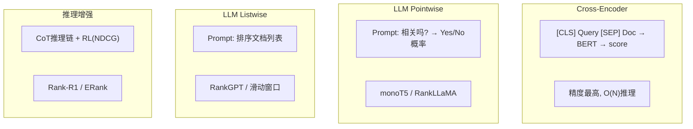

# Reranker 演进与 Learning to Rank

> 综合文档 | 领域：搜索排序 | 合并自 2 篇 synthesis | 更新：2026-04-13
> 来源：搜索Reranker演进.md、LearningToRank搜索排序三大范式.md

---

## 一、LTR 三大范式

```
BM25 启发式排序 (~2005)
  → RankSVM/RankNet Pairwise (2005-2010)
    → LambdaMART GBDT (2010-2018)
      → BERT Reranker (2019-2022)
        → LLM Listwise Reranker (2023+)
          → 推理增强 Reranker: Rank-R1/ERank (2025+)
```

| 范式 | 代表模型 | 优化目标 | 考虑文档间关系 | 工业使用率 |
|------|---------|---------|--------------|-----------|
| Pointwise | LR/GBDT | 回归/分类 | 否 | 中 |
| Pairwise | RankNet/RankSVM | 成对偏序 | 两两比较 | 中 |
| Listwise | LambdaMART/ListNet | 排序指标 | 全列表 | 高 |
| Neural | BERT Reranker | Cross-Attention | 查询-文档交互 | 高 |
| LLM | RankGPT/Rank-R1 | CoT+RL | 全交互+推理 | 上升中 |

---

## 二、核心公式

### 2.1 DCG / NDCG

$$
\text{DCG}@K = \sum_{i=1}^{K} \frac{2^{rel_i} - 1}{\log_2(i+1)}, \qquad \text{NDCG}@K = \frac{\text{DCG}@K}{\text{IDCG}@K}
$$

- CG 不考虑位置 → DCG 用 log 折扣（位置越靠后权重越小）→ NDCG 归一化到 [0,1]
- $2^{rel_i}-1$ 对高等级相关性给指数级奖励
- **NDCG 不可微**（涉及排序操作）→ LambdaRank 的根本动机

### 2.2 LambdaRank / LambdaMART

$$
\lambda_{ij} = \frac{-1}{1 + e^{s_i - s_j}} \cdot |\Delta\text{NDCG}_{ij}|
$$

$$
\lambda_i = \sum_{j:(i,j) \in \mathcal{P}} \lambda_{ij} - \sum_{j:(j,i) \in \mathcal{P}} \lambda_{ji}
$$

**推导**：
1. RankNet 交叉熵：$\mathcal{L} = \sum_{(i,j)} \log(1 + e^{-(s_i - s_j)})$
2. LambdaRank 关键改进：乘以 $|\Delta\text{NDCG}_{ij}|$（交换 i,j 后 NDCG 变化量）
3. 把 rank 1 相关文档排到 rank 10 惩罚远大于 rank 9 排到 rank 10
4. **LambdaMART** = LambdaRank + GBDT（梯度提升树），非深度学习排序 SOTA

### 2.3 Cross-Encoder

$$
\text{score}(q, d) = \text{MLP}(\text{BERT}_{CLS}([q; \text{SEP}; d]))
$$

- 全交互：query 和 doc 拼接过整个 Transformer
- 精度最高但延迟高（每个 doc 需一次 BERT 推理）
- 只能用于 top-100 精排，不能做全库检索

### 2.4 MonoBERT / DuoBERT

**Pointwise (MonoBERT)**：

$$
P(\text{relevant} | q, d) = \sigma(W \cdot \text{BERT}_{CLS}([q; d]) + b)
$$

- 简单直接但忽略文档间比较关系

**Pairwise (DuoBERT)**：

$$
P(d_i \succ d_j | q) = \sigma(W \cdot \text{BERT}_{CLS}([q; d_i; d_j]) + b)
$$

- "哪个更好"比绝对打分更稳定
- $O(n^2)$ 比较 → bubble sort 降至 $O(n \log n)$

### 2.5 LLM Reranker 三种范式

**Pointwise**：

$$
\text{score}(q, d) = \text{LLM}(\text{"1-5分评估相关性："} + q + d)
$$

- 简单但不稳定（positivity bias）

**Pairwise**：

$$
P(d_i \succ d_j) = \text{LLM}(\text{"哪个更相关？"} + q + d_i + d_j)
$$

- 更稳定，但 $O(n^2)$ 调用。优化：先粗排 top-20 再 pairwise

**Listwise (RankGPT)**：

$$
\text{排序} = \text{LLM}(\text{"对以下文档按相关性排序"} + q + d_{1:K})
$$

- 一次性排序整个列表。受 context length 限制
- 位置偏差：文档出现在 prompt 开头/结尾更易排高 → 多次随机打乱取平均

**Setwise（折中）**：

$$
\text{best}(d_1, ..., d_m) = \text{LLM}(\text{"最相关的是？"} + q + d_{1:m})
$$

- 每次看 m 篇选最好，heap sort 策略 $O(n \log n / m)$ 次调用

### 2.6 SoftmaxCE（Listwise Loss）

$$
\mathcal{L}_{SCE} = -\sum_{i \in \text{rel}} \log \frac{e^{s_i/\tau}}{\sum_j e^{s_j/\tau}}
$$

- 温度 $\tau=0.1$ 时效果最佳，NDCG +2% vs Pointwise
- 工业首选：实现简单、梯度稳定、扩展性好

### 2.7 位置偏差校正

$$
\mathcal{L}_{\text{debiased}} = \sum_i \frac{1}{P(\text{click}|\text{pos}_i, \text{rel}=1)} \cdot \mathcal{L}_i
$$

- 用户倾向点击靠前结果 → 高位点击权重降低
- IPW / 随机化实验 / Dual Learning (TrustBias)

---

## 三、Reranker 演进架构



---

## 四、工业落地要点

### 4.1 延迟控制

| 方法 | 策略 |
|------|------|
| 限制候选数 | top-50~100 |
| 模型蒸馏 | 大 CE → MiniLM |
| 量化 | INT8/FP16 |
| Batch 推理 | GPU 并行 |
| 分层路由 | 简单 query 用轻量模型，复杂 query 用 LLM |

### 4.2 Reranker 训练数据构建

1. 人工标注（query-doc 相关性 0-3 级）
2. 蒸馏标签（LLM 打分作 soft label）
3. 点击数据（搜索日志被点击=正例）
4. Hard Negative Mining（检索到但未点击=难负例）

### 4.3 LLM Reranker 部署方案

1. 只对 Top-20 调用 LLM Reranker
2. Batch inference + 结果缓存 1h
3. GPT-4 蒸馏到 7B，延迟 100ms → 50ms
4. 超时 fallback 到轻量 Cross-encoder
5. 高价值 query 才用 LLM（商业/广告触发）

---

## 五、搜索排序特征体系

| 类型 | 特征 |
|------|------|
| Query 特征 | 长度、意图类型、热度 |
| Doc 特征 | PageRank、长度、freshness |
| Query-Doc 交互 | BM25 分、embedding 相似度、term overlap |
| 用户特征 | 搜索历史、点击偏好 |
| 上下文 | 设备、地理、时间 |

---

## 六、面试 Q&A

### Q1: Pointwise/Pairwise/Listwise 的区别？
Pointwise 将排序转化为回归/分类；Pairwise 转化为文档对比较；Listwise 直接优化整个列表排序指标（NDCG）。Pointwise 最简单，Listwise 理论最优。

### Q2: LambdaMART 的核心思想？
梯度不是 loss 的导数，而是 Lambda 梯度 —— 直接反映"交换两个文档位置对 NDCG 的影响"。高位排错惩罚大，低位排错惩罚小。

### Q3: Cross-Encoder vs Bi-Encoder？
Bi-Encoder 独立编码再内积（交互少但快）；Cross-Encoder 拼接后过 Transformer（全交互但慢 100x）。Bi-Encoder 做召回，Cross-Encoder 做精排。

### Q4: SoftmaxCE 为什么成为工业 Listwise 损失首选？
(1) 标准交叉熵实现简单；(2) 梯度稳定；(3) 温度参数直观；(4) 扩展性好。

### Q5: LambdaRank vs SoftmaxCE？
LambdaRank：Top-1 精度特别重要时（语音搜索）。SoftmaxCE：通用排序，训练稳定。差异通常 0.1-0.3% NDCG。

### Q6: Rank-R1 的 CoT+RL 推理重排？
CoT 强制模型逐步分析"query 需要什么→doc 提供什么→匹配度如何"。RL 奖励=NDCG 改善量。BRIGHT 上 +23% vs 标准 LLM Reranker。

### Q7: Reranker 是搜索精度的"最后一公里"吗？
是的，在 top-100 候选上重排序，NDCG@10 提升 5-15%，投入产出比极高。

### Q8: 离线评估能代表在线效果吗？
经常不一致。离线评测有位置偏差，在线受展示/广告影响。必须做在线 A/B 测试，同时监控搜索放弃率、零结果率。

---

## 七、记忆助手

**类比**：
- Pointwise = 老师独立给每篇作文打分
- Pairwise = 擂台赛两两 PK
- Listwise = 选秀节目一次性排名
- NDCG = 带折扣的得分榜（越靠前权重越大）
- LambdaRank = "不是所有排错都同等严重"

**口诀**：
- LTR 三范式："单独打分→两两PK→整体排名"
- NDCG："分子 $2^{rel}-1$，分母 $\log_2(i+1)$，除以理想值归一"
- LambdaMART = LambdaRank + GBDT

---

## 相关概念

- [[concepts/embedding_everywhere|Embedding 技术全景]]
- [[03_推理增强检索与重排|推理增强检索与重排]]
- [[01_检索范式_稀疏到混合到稠密|检索范式]]
