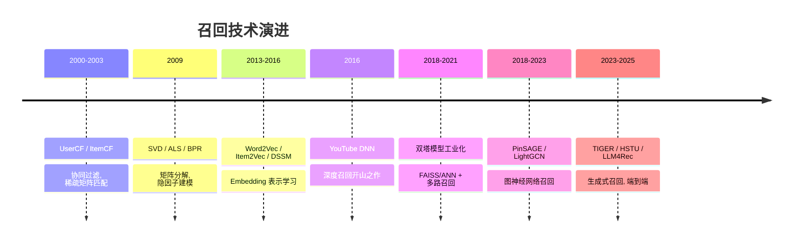

# 召回模块技术演进脉络

> 整理时间：2026-03-13 | MelonEggLearn

---

## 🆚 各代召回方案创新对比

| 代际 | 之前方案 | 创新点 | 核心突破 |
|------|---------|--------|---------|
| 矩阵分解 | UserCF/ItemCF（稀疏矩阵直接匹配） | **隐因子低秩分解** R≈UV^T | 从稀疏到稠密表示 |
| Embedding 召回 | 矩阵分解（线性） | **深度网络编码** + Skip-gram | 非线性特征捕获 |
| 双塔工业化 | YouTube DNN（Softmax 全量分类） | **独立编码 + ANN 检索** | O(1) 在线，毫秒级 |
| GNN 召回 | 双塔（只用用户自身行为） | **图结构聚合邻居信息** | 高阶关系捕获 |
| 生成式召回 | 检索式（从固定候选集选） | **自回归生成物品 ID** | 端到端，语义泛化 |

---

## 📈 召回技术演进时间线



---

## 📐 核心公式

### 1. BPR Loss（Bayesian Personalized Ranking）

$$
\mathcal{L}\_{BPR} = -\sum\_{(u,i,j) \in D\_s} \ln \sigma(\hat{r}\_{ui} - \hat{r}\_{uj}) + \lambda \|\Theta\|^2
$$

**符号说明**：
- $(u,i,j)$：用户 $u$ 的正样本 $i$ 和负样本 $j$
- $\hat{r}\_{ui} = \mathbf{u}\_u^T \mathbf{v}\_i$：预测交互分数
- $\sigma$：Sigmoid 函数
- $\lambda$：L2 正则系数

**直觉**：让正样本的预测分数比负样本高出一个 margin，是 pairwise 排序学习的经典 loss。

### 2. DSSM 双塔 Loss

$$
P(d|q) = \frac{\exp(\cos(\mathbf{q}, \mathbf{d})/ \tau)}{\sum\_{d' \in D} \exp(\cos(\mathbf{q}, \mathbf{d}')/ \tau)}
$$

$$
\mathcal{L} = -\sum\_{(q,d^+)} \log P(d^+|q)
$$

**符号说明**：
- $\mathbf{q}, \mathbf{d}$：Query/Doc（或 User/Item）经各自塔编码后的 Embedding
- $\tau$：温度参数，控制分布锐度
- $D$：负样本集合（Batch 内 + 随机采样）

**直觉**：Softmax over 余弦相似度，本质是对比学习——让正样本对的相似度远高于负样本对。

### 3. LightGCN 聚合

$$
\mathbf{e}\_u^{(k+1)} = \sum\_{i \in \mathcal{N}\_u} \frac{1}{\sqrt{|\mathcal{N}\_u||\mathcal{N}\_i|}} \mathbf{e}\_i^{(k)}
$$

$$
\mathbf{e}\_u = \sum\_{k=0}^{K} \alpha\_k \mathbf{e}\_u^{(k)}
$$

**直觉**：去掉 GCN 的特征变换和非线性，只保留邻域加权平均，最终 Embedding 是各层的加权和。简单但实测效果不亚于复杂 GCN。

---

## 各阶段详解

### 阶段一：协同过滤时代（2000-2012）

- **代表方法：** UserCF（基于用户的协同过滤）、ItemCF（基于物品的协同过滤）
- **核心思想：**
  - UserCF：找到与目标用户行为相似的用户群体，将他们喜欢但目标用户未接触的物品推荐出去。相似度计算通常用余弦相似度或Pearson相关系数。
  - ItemCF：计算物品之间的相似度，基于用户历史行为中交互过的物品，找到相似物品推荐。Amazon的经典实现（Linden 2003）。
- **核心局限：**
  - 用户-物品矩阵极度稀疏（99%以上为空），计算困难
  - 冷启动问题：新用户/新物品无行为数据
  - 无法捕获隐含特征，仅依赖显式行为
  - 实时性差，用户相似度矩阵更新代价高
  - 可扩展性受限：O(N²)复杂度
- **行业背景：** 2003年Amazon发表物品协同过滤论文，Netflix Prize（2006-2009）推动矩阵分解成为主流，工业界大量应用CF做推荐。
- **代表论文/系统：**
  - Amazon: "Item-to-Item Collaborative Filtering" (2003)
  - Tapestry系统（1992，最早的CF系统）
  - GroupLens协同过滤

### 阶段二：矩阵分解时代（2009-2014）

- **代表方法：** SVD、ALS（交替最小二乘）、BPR（贝叶斯个性化排序）、NMF（非负矩阵分解）
- **核心思想：**
  将用户-物品交互矩阵 R（M×N）分解为低秩表示：R ≈ U · V^T，其中 U ∈ R^{M×k}，V ∈ R^{N×k}，k为隐维数（通常32~256）。通过最小化已观测评分的重建误差（加L2正则）来学习用户和物品的隐向量。
  
  ```
  L = Σ_{(u,i)∈R} (r_{ui} - u_u^T · v_i)² + λ(||u_u||² + ||v_i||²)
  ```
  
  ALS交替优化：固定U优化V，再固定V优化U，迭代直至收敛。
  
- **核心局限：**
  - 仍然是线性模型，无法捕获高阶特征交叉
  - SVD对稀疏矩阵直接分解效率低（需Funk SVD等近似）
  - 无法引入side information（用户年龄、物品类目等）
  - 冷启动问题依然未解决
- **行业背景：** Netflix Prize获胜方案大量使用矩阵分解，Koren 2009发表"Matrix Factorization Techniques for Recommender Systems"成为里程碑。
- **代表论文/系统：**
  - Koren et al., "Matrix Factorization Techniques for Recommender Systems" (2009)
  - Rendle, "BPR: Bayesian Personalized Ranking from Implicit Feedback" (2009)
  - Hu et al., "Collaborative Filtering for Implicit Feedback Datasets" (2008, ALS)
  - Spark MLlib ALS（大规模工业化实现）

### 阶段三：Embedding时代—深度召回萌芽（2013-2017）

- **代表方法：** Word2Vec/Item2Vec、DSSM（最早版本）、YouTube DNN、FastText
- **核心思想：**
  受NLP中Word2Vec启发，将物品/用户映射为低维稠密向量（Embedding）。
  
  **Item2Vec（2016）**：将用户的历史点击序列类比句子，每个物品类比单词，用Skip-gram模型训练，共现的物品具有相似embedding。
  
  **YouTube DNN（2016）**：
  ```
  用户特征（历史观看视频ID序列 + 人口属性 + 搜索词）→ 多层DNN → User Embedding
  → 与所有视频Embedding做近似最近邻检索
  ```
  核心创新：把召回转化为超大规模多分类问题（Softmax over全部视频），训练时用负采样。
  
  **DSSM（2013，微软）**：最初用于搜索，将query和doc分别编码为向量，最大化相关pair的余弦相似度。后被引入推荐召回。

- **核心局限：**
  - Item2Vec无法处理side information
  - YouTube DNN训练与serving存在"gap"（训练时有时序信息，serving时没有）
  - 早期DSSM仅使用词袋特征，缺乏深度交互
  - ANN检索精度与速度权衡问题
- **行业背景：** 2013年Word2Vec论文发表，开启了表示学习在推荐中的应用热潮。2016年YouTube DNN论文发布，成为深度召回的工业标杆。
- **代表论文/系统：**
  - Mikolov et al., "Efficient Estimation of Word Representations in Vector Space" (2013)
  - Covington et al., "Deep Neural Networks for YouTube Recommendations" (2016)
  - Huang et al., "Learning Deep Structured Semantic Models" (DSSM, 2013)
  - Barkan & Koenigstein, "Item2Vec: Neural Item Embedding for CF" (2016)

### 阶段四：双塔模型工业化（2018-2021）

- **代表方法：** DSSM双塔、FAISS/ANN向量检索、多路召回融合、微信看一看双塔、快手双塔
- **核心思想：**
  双塔模型（Two-Tower Model）是工业界召回的主流范式：
  ```
  用户侧特征 → User Tower (深度网络) → User Embedding (256维)
                                              ↓  内积/余弦相似度
  物品侧特征 → Item Tower (深度网络) → Item Embedding (256维)
  ```
  Item Embedding离线预计算并建索引，User Embedding实时计算，通过FAISS等ANN检索TopK候选。
  
  **关键优化**：
  - **负样本策略**：全局随机负样本 + Batch内负样本 + 困难负样本（被粗排淘汰的样本）
  - **负采样纠偏**：训练相似度减去 log(p_i)，纠正热门物品偏差（YouTube方案）
  - **多路召回**：CF召回 + 双塔召回 + 热门召回 + 规则召回多路合并，互补
  - **特征丰富**：用户历史行为序列（Attention加权）+ 上下文 + 人口属性

- **核心局限：**
  - 用户侧和物品侧特征交叉不充分（两塔最终才交互，只做内积）
  - 无法像精排一样做充分的特征交叉
  - 负样本偏差问题需要精心设计
  - Item Embedding更新有延迟（通常T+1）
- **行业背景：** Facebook 2019年发表双塔模型推广工业化最佳实践，微信、快手、抖音等公司大规模应用。FAISS、Milvus等向量检索库逐渐成熟。
- **代表论文/系统：**
  - Yi et al., "Sampling-Bias-Corrected Neural Modeling" (YouTube, 2019)
  - Zhu et al., "EGES: Enhanced Graph Embedding with Side Information" (Alibaba, 2018)
  - 微信看一看双塔系统（2020）
  - 快手双塔召回实践（2020）

### 阶段五：图神经网络召回（2018-2023）

- **代表方法：** PinSAGE、EGES、NGCF、LightGCN、GraphSAGE应用
- **核心思想：**
  将用户-物品交互视为图结构，利用图神经网络聚合邻居信息生成更丰富的Embedding。
  
  **PinSAGE（Pinterest, 2018）**：工业级GNN召回先驱
  ```
  物品节点 → 随机游走采样邻居 → GraphSAGE局部聚合
  → 结合图像/文本特征 → Item Embedding
  ```
  核心创新：局部采样（不需要完整图）+ 负样本课程学习 + MapReduce离线推断
  
  **LightGCN（2020）**：简化GCN，去掉特征变换和非线性激活，只保留邻域聚合：
  ```
  E^(k+1) = (D^{-1/2} A D^{-1/2}) E^(k)
  最终Embedding = 各层的加权平均
  ```

- **核心局限：**
  - 训练复杂度高，大规模图（十亿节点）训练困难
  - 图更新延迟（实时新物品难处理）
  - 邻居采样策略影响效果
  - 工程复杂度高
- **行业背景：** GNN在图像、NLP领域成功后，2018年PinSAGE将其应用于工业级推荐。阿里EGES、微信STGCN等相继落地。
- **代表论文/系统：**
  - Ying et al., "Graph Convolutional Neural Networks for Web-Scale Recommender Systems" (PinSAGE, 2018)
  - Wang et al., "Neural Graph Collaborative Filtering" (NGCF, 2019)
  - He et al., "LightGCN: Simplifying and Powering Graph Convolution Network" (2020)
  - Zhu et al., "EGES: Enhanced Graph Embedding with Side Information" (Alibaba, 2018)

### 阶段六：生成式召回（2023-至今）

- **代表方法：** TIGER（Transformer Index for GEnerative Recommenders）、HSTU、LLM4Rec、RecGPT
- **核心思想：**
  传统召回：检索候选 → 排序。生成式召回：直接生成候选物品ID。
  
  **TIGER（2023）**：将物品编码为语义ID（RQ-VAE量化），用Seq2Seq模型直接生成物品token序列：
  ```
  用户历史 → Encoder → Decoder → 自回归生成物品语义ID
  ```
  
  **Meta HSTU（2024）**：将用户行为序列作为token输入Transformer，大规模预训练后直接用于召回和排序。
  
  **LLM召回**：利用LLM的语义理解能力，将物品转化为文本描述，用语言模型做语义召回，解决冷启动和长尾问题。

- **核心局限：**
  - 推理速度慢（自回归生成），工业落地挑战大
  - 语义ID设计复杂，召回空间爆炸
  - 训练数据需求量大
  - 与现有系统集成复杂
- **行业背景：** ChatGPT掀起LLM浪潮后，2023-2024年学术界和工业界大量探索生成式推荐。Meta、Google等公司开始在生产系统中试验。
- **代表论文/系统：**
  - Rajput et al., "Recommender Systems with Generative Retrieval" (TIGER, Google, 2023)
  - Zhai et al., "Actions Speak Louder than Words: Trillion-Parameter Sequential Transducers" (HSTU, Meta, 2024)
  - RecGPT相关工作（2024）
  - 本知识库: `rec-sys/生成式推荐.md`, `rec-sys/RecGPT_A_Large_Language_Model_for_Generative_Recommendati.md`

---

## 各方法横向对比

| 方法 | 提出时间 | 优势 | 局限 | 适用场景 | 代表公司/产品 |
|------|---------|------|------|---------|-------------|
| UserCF | ~2000 | 直观，可解释性强 | 稀疏性，O(N²)复杂度 | 用户量小，行为稠密 | 早期电商/新闻 |
| ItemCF | 2003 | 稳定，热门物品效果好 | 冷启动，稀疏性 | 物品量适中，行为多 | Amazon、早期淘宝 |
| ALS/SVD | 2009 | 隐因子建模，精度高 | 线性，无side info | 评分矩阵，中等规模 | Netflix、MovieLens |
| Item2Vec | 2016 | 序列语义，易训练 | 无用户建模 | 物品相似召回 | 部分早期推荐 |
| YouTube DNN | 2016 | 深度特征，规模大 | train-serving gap | 大规模视频推荐 | YouTube |
| 双塔DSSM | 2019+ | 工业级，ANN高效 | 特征交叉弱 | 大规模工业推荐 | 微信、快手、抖音 |
| PinSAGE | 2018 | 图结构，信息丰富 | 训练复杂，更新慢 | 社交/内容图谱丰富 | Pinterest |
| LightGCN | 2020 | 简单有效的GNN | 大图扩展性 | 中等规模，图丰富 | 学术/部分工业 |
| TIGER/生成式 | 2023+ | 端到端，语义泛化 | 推理慢，工程复杂 | 冷启动，长尾 | Google(探索中) |

---

## 面试常考点

**Q：双塔模型为什么适合工业级召回？和精排模型的核心区别是什么？**
> A：双塔模型的核心优势在于**用户侧和物品侧独立编码**，支持离线预计算Item Embedding，在线只需计算User Embedding然后做ANN检索，整体O(1)时间复杂度（检索对数级）。而精排模型（如DIN）需要对每个候选物品和用户特征做充分交叉，时间复杂度O(N)，无法在千万规模候选集上实时计算。代价是双塔丢失了特征交叉的精度，这也是为什么工业界用召回+精排两阶段架构。

**Q：负样本如何设计？为什么曝光未点击不能作为召回负样本？**
> A：召回负样本通常有三种策略：
> 1. **全局随机负样本**：从全量物料随机采样，样本偏简单但覆盖广
> 2. **Batch内负样本**：同一Batch中其他用户的正样本作为当前用户的负样本，计算高效
> 3. **困难负样本**：被召回但被粗排/精排淘汰的物品，让模型学会更精细的区分
> 
> **曝光未点击不能作为召回负样本**的原因：能曝光说明该物品已经通过了召回→粗排→精排的层层筛选，表明系统认为它高度匹配该用户，仅仅是用户没点击（可能因为位置偏差、注意力分配等），用它做召回负样本会导致模型把实际感兴趣的物品也过滤掉。这类样本更适合做排序阶段的负样本。

**Q：Item Embedding有延迟怎么办？如何解决新物品冷启动？**
> A：
> - **Item Embedding更新延迟**：通常T+1离线更新，可通过增量训练（每小时更新热门物品Embedding）、实时流计算（Flink实时更新）缓解
> - **新物品冷启动**：
>   1. **内容Embedding**：用物品的文本/图像特征做初始Embedding，不依赖行为
>   2. **类目平均**：用同类目物品Embedding的平均值初始化
>   3. **Graph方法**：基于物品的关联关系（同作者/同类目）通过图神经网络聚合邻居特征
>   4. **DropoutNet**：训练时随机丢弃行为特征，强制模型学习仅用内容特征也能生成合理Embedding

**Q：多路召回如何融合？分数怎么对齐？**
> A：多路召回（CF召回、双塔召回、热门召回等）的候选集来自不同系统，分数不可比。融合策略：
> 1. **直接合并去重**：最简单，丢失分数信息
> 2. **统一打分**：用粗排模型对所有候选统一打分，再选TopK
> 3. **分数校准（Score Calibration）**：对每路召回的分数做归一化（如减均值除标准差），再加权融合
> 4. **学习式融合**：训练一个小模型学习如何融合多路分数

**Q：FAISS和Milvus的区别？工业级向量检索如何选型？**
> A：
> - **FAISS（Facebook）**：纯C++库，支持多种ANN索引（HNSW、IVF、PQ等），无分布式，适合单机大规模
> - **Milvus**：分布式向量数据库，支持CRUD、多种索引、持久化，适合在线服务
> - **选型原则**：
>   - 离线批量检索：FAISS效率最高
>   - 在线实时服务：Milvus/Proxima/Vearch更适合
>   - 数据规模：亿级以上考虑分布式方案
>   - HNSW索引精度高但内存占用大；IVF+PQ精度稍低但内存友好

**Q：双塔模型的训练目标有哪些？Pointwise/Pairwise/Listwise区别？**
> A：
> - **Pointwise（点方式）**：将每个(user, item)对独立二分类，目标是预测点击概率。优点：简单易实现；缺点：未建模item间相对顺序
> - **Pairwise（对方式）**：构造(user, pos_item, neg_item)三元组，优化正样本得分高于负样本（BPR Loss、Triplet Loss）。更关注相对顺序
> - **Listwise（列表方式）**：将整个候选集视为一个分布，用Softmax Loss优化，目标是正样本在候选中概率最大。YouTube负采样方案即此，精度最高但需要足够多负样本

**Q：召回的线上延迟如何保证？工程架构是什么？**
> A：工业级召回系统架构：
> ```
> 用户请求 → 实时特征拉取（Redis，<1ms）
>           → User Embedding计算（模型推理，<5ms）
>           → ANN检索（FAISS/Milvus，<10ms）
>           → 多路召回结果合并（<2ms）
>           → 返回候选集（总<20ms）
> ```
> 优化手段：User Embedding预计算（定期刷新）、HNSW索引、量化压缩（PQ）、分级缓存


---

## 召回量化指标与演进

Recall@K：

$$\text{Recall@K} = \frac{|\text{Top-K} \cap \text{相关集}|}{|\text{相关集}|}$$

ANN 近似误差（HNSW）：

$$\epsilon = 1 - \frac{|\hat{N}(q,k) \cap N^*(q,k)|}{k}$$

工业目标 $\epsilon < 5\%$，通过调 ef_search 平衡精度与速度。

两塔模型相似度：

$$s(u,i) = \frac{e_u^\top e_i}{||e_u|| \cdot ||e_i||}$$

| 年代 | 技术 | Recall@100 | QPS | 局限 |
|------|------|-----------|-----|------|
| 2016 | ItemCF | ~60% | 极高 | 无语义 |
| 2018 | 两塔 DSSM | ~70% | 高 | 独立编码 |
| 2020 | 多路融合 | ~80% | 中 | RRF融合经验 |
| 2022 | Semantic ID | ~85% | 低 | beam search慢 |
| 2024 | BGE-M3混合 | ~92% | 中 | 部署成本 |
