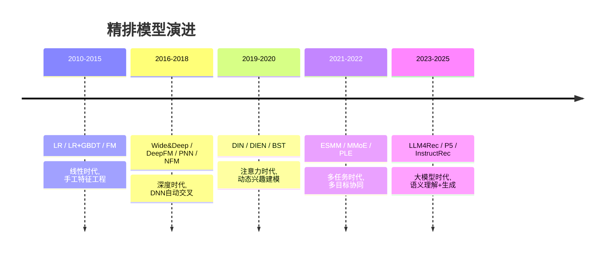

# 精排模型演进脉络

> MelonEggLearn | 搜广推核心技术系列 | 排序演进全景图

---

## 🆚 各代精排方案创新对比

| 代际 | 之前方案 | 创新点 | 核心突破 |
|------|---------|--------|---------|
| FM | LR（需手工特征交叉） | **隐向量自动二阶交叉** | 稀疏特征自动交叉 |
| Wide&Deep | FM（只有二阶） | **Wide 记忆 + Deep 泛化** | 首次 DNN 进入排序 |
| DeepFM | Wide&Deep（Wide 需手工） | **FM 替代 Wide** | 端到端学习交叉 |
| DIN | DeepFM（用户兴趣固定） | **Attention 动态加权历史** | 候选相关的兴趣表示 |
| DIEN | DIN（只看静态历史） | **GRU 建模兴趣演化** | 捕获兴趣变化趋势 |
| MMoE/PLE | 单任务或 Hard Share | **Expert 网络 + Gate 路由** | 多任务自适应共享 |
| LLM4Rec | 传统 ID-based 排序 | **语言理解 + 生成式排序** | 语义泛化+零样本 |

---

## 📈 精排模型演进 Mermaid



---

## 📐 核心公式

### 1. FM（Factorization Machines）

$$
\hat{y}(x) = w\_0 + \sum\_{i=1}^n w\_i x\_i + \sum\_{i=1}^n \sum\_{j=i+1}^n \langle \mathbf{v}\_i, \mathbf{v}\_j \rangle x\_i x\_j
$$

**符号说明**：$w\_0$ 偏置，$w\_i$ 一阶权重，$\mathbf{v}\_i \in \mathbb{R}^k$ 第 $i$ 个特征的隐向量，$\langle \cdot,\cdot \rangle$ 内积。

**直觉**：用隐向量内积替代显式二阶权重矩阵，参数从 $O(n^2)$ 降到 $O(nk)$，让稀疏特征的交叉成为可能。

### 2. DIN Attention

$$
\mathbf{v}\_u = \sum\_{i=1}^N \alpha\_i \mathbf{e}\_i, \quad \alpha\_i = \frac{\exp(f(\mathbf{e}\_i, \mathbf{e}\_a))}{\sum\_{j=1}^N \exp(f(\mathbf{e}\_j, \mathbf{e}\_a))}
$$

**符号说明**：$\mathbf{e}\_i$ 为用户历史行为 $i$ 的 Embedding，$\mathbf{e}\_a$ 为候选广告 Embedding，$f$ 为 Attention 网络。

**直觉**：用户看数码产品时，历史中买手机壳的权重应该高于买洗衣液的。候选相关性决定历史权重。

### 3. MMoE Gate 机制

$$
y\_k = h\_k\left(\sum\_{i=1}^n g\_k^{(i)}(x) \cdot f\_i(x)\right)
$$

$$
g\_k(x) = \text{softmax}(W\_{gk} \cdot x)
$$

**直觉**：每个任务 $k$ 有自己的 Gate 网络，自适应选择 Expert 的输出组合。不同任务可以学到不同的 Expert 使用模式。

---

## 演进时间线总览

```
精排模型演进时间线（2010 → 2024+）
════════════════════════════════════════════════════════════════════════════════════════════

 线性时代          深度时代              注意力时代          多任务时代          大模型时代
 2010──2015        2016──2018            2019──2020          2021──2022          2023──今
   │                  │                     │                   │                  │
   ▼                  ▼                     ▼                   ▼                  ▼
┌────────┐       ┌──────────┐          ┌─────────┐        ┌─────────┐        ┌─────────┐
│  LR    │──────▶│Wide&Deep │─────────▶│  DIN    │───────▶│  ESMM   │───────▶│LLM4Rec  │
│LR+GBDT │       │ DeepFM   │          │  DIEN   │        │  MMoE   │        │   P5    │
│  FM    │       │  PNN     │          │  BST    │        │  PLE    │        │InstructR│
└────────┘       │  NFM/AFM │          └─────────┘        └─────────┘        └─────────┘
                 └──────────┘

核心驱动力：
特征工程手工 → 自动交叉 → 用户兴趣建模 → 多目标协同 → 语言理解+生成

关键突破：
  2010: LR工业落地     2016: DNN进排序     2019: 注意力机制     2021: 多目标统一    2023: LLM赋能
  2014: FM二阶交叉     2017: Wide&Deep     2019: DIN动态兴趣    2020: MMoE专家网    2024: 生成式排序
  2015: LR+GBDT       2018: DeepFM        2020: DIEN序列       2020: PLE细粒度     2024: 端到端LLM

════════════════════════════════════════════════════════════════════════════════════════════
```

---

## 目录

1. [阶段一：线性时代（2010-2015）](#阶段一线性时代2010-2015)
2. [阶段二：深度时代（2016-2018）](#阶段二深度时代2016-2018)
3. [阶段三：注意力时代（2019-2020）](#阶段三注意力时代2019-2020)
4. [阶段四：多任务时代（2021-2022）](#阶段四多任务时代2021-2022)
5. [阶段五：大模型时代（2023-今）](#阶段五大模型时代2023-今)
6. [演进规律总结](#演进规律总结)
7. [面试高频问题](#面试高频问题)

---

## 阶段一：线性时代（2010-2015）

### 1.1 背景：广告系统的早期挑战

```
问题背景
═══════════════════════════════════════════════════════════
早期广告系统（2005-2010）使用规则 + 简单统计方法：
  - 点击率 = 历史点击次数 / 曝光次数  （极度稀疏，冷启动差）
  - 人工制定排序规则                    （无法泛化，维护成本极高）
  - 朴素贝叶斯                          （条件独立假设过强）

面临的核心挑战：
  ① 海量稀疏特征（用户ID、商品ID 亿级别）如何处理
  ② 特征间交叉组合爆炸（手工组合不可能枚举全部）
  ③ 在线实时预测，延迟要求 <10ms
  ④ 训练样本极度不平衡（正例<<负例）
═══════════════════════════════════════════════════════════
```

### 1.2 逻辑回归（LR）

**核心思想：**
用线性模型对点击率进行预测，将海量稀疏特征转化为 One-Hot 编码后输入。

**模型公式：**

```
P(y=1|x) = σ(w^T x + b)

其中：
  x ∈ R^d   — 高维稀疏特征向量（One-Hot）
  w ∈ R^d   — 权重向量
  σ(z) = 1/(1+e^{-z})  — sigmoid 函数

损失函数（对数损失）：
  L = -[y·log(p) + (1-y)·log(1-p)]

在线学习（FTRL）更新：
  w_{t+1} = argmin_{w} { Σ_{s≤t} [g_s·w + λ₁||w||₁ + λ₂/2||w||₂²] }
```

**代表论文+公司：**
- Google《Ad Click Prediction: a View from the Trenches》（2013）
- Facebook《Practical Lessons from Predicting Clicks on Ads at Facebook》（2014）
- FTRL-Proximal：Google（2013），工业界 SOTA 5年+

**工程优化：**

```
LR工业化关键技术：
┌─────────────────────────────────────────────────────┐
│  特征处理         │  训练优化         │  在线服务      │
├─────────────────────────────────────────────────────┤
│  One-Hot编码      │  FTRL在线学习     │  参数服务器    │
│  特征哈希         │  L1正则稀疏化     │  模型压缩      │
│  离散化/分桶      │  负采样           │  特征缓存      │
│  手工交叉特征     │  Adagrad自适应lr  │  A/B实验框架   │
└─────────────────────────────────────────────────────┘
```

**局限性：**
- 只能捕捉线性关系，无法自动学习特征交叉
- 特征交叉依赖人工组合，工作量大且不完备
- 高阶交叉（三阶+）几乎不可能手工完成

**面试必考点：**
> 1. LR 为什么适合 CTR 预估？（在线学习、稀疏特征友好、可解释）
> 2. FTRL 与 SGD/Adagrad 的区别？（L1稀疏化 + 自适应学习率结合）
> 3. LR 的特征工程包括哪些？（离散化、交叉特征、统计特征）

---

### 1.3 LR + GBDT 特征工程

**背景：** 2014年 Facebook 提出，利用 GBDT 自动学习非线性特征组合，再输入 LR。

**架构图：**

```
LR + GBDT 架构
═══════════════════════════════════════════════════════════════

原始特征 x
    │
    ▼
┌─────────────────────────────────────────────────────────┐
│                   GBDT（梯度提升树）                     │
│                                                         │
│  Tree 1          Tree 2          Tree k                │
│  /    \          /    \          /    \                 │
│ [L1] [L2]      [L3] [L4]      [L5] [L6]               │
│  ↑    ↑                                                │
│ 样本落在 leaf 1 和 leaf 4 和 ...                         │
└─────────────────────────────────────────────────────────┘
    │
    ▼
叶节点编码（One-Hot）：[1,0, 0,1, ..., 1,0]  ← 自动特征
    │
    ├── (拼接原始特征)
    │
    ▼
┌──────────────────────────────────────────────────────────┐
│                  Logistic Regression                      │
│          p = σ(w^T [gbdt_features; raw_features])        │
└──────────────────────────────────────────────────────────┘

效果：AUC 提升 ~3%（Facebook 报告）
```

**核心创新：**
- GBDT 自动完成非线性特征变换和组合
- 叶节点索引作为离散特征，天然适配 LR 稀疏输入
- 两阶段训练：GBDT 先训练 → 固定后训练 LR

**代表论文：**
- 《Practical Lessons from Predicting Clicks on Ads at Facebook》，He et al.，Facebook，2014

**局限性：**
- 两阶段训练，无法端到端优化
- GBDT 对高维稀疏特征不友好（ID 类特征处理差）
- GBDT 无法捕捉 user-item 协同信息

**面试必考点：**
> 1. GBDT 如何做特征工程？（叶节点One-Hot编码，自动学习非线性组合）
> 2. 为什么不直接用 GBDT 预测 CTR？（推断慢、稀疏ID特征不友好）

---

### 1.4 因子分解机（FM）

**背景：** 2010年 Rendle 提出，解决稀疏特征下的二阶交叉问题。

**核心公式：**

```
FM 模型
═══════════════════════════════════════════════════════════════

ŷ(x) = w₀ + Σᵢ wᵢxᵢ + Σᵢ Σⱼ>ᵢ <vᵢ, vⱼ> xᵢxⱼ

其中：
  w₀         — 全局偏置
  wᵢ         — 一阶权重
  vᵢ ∈ R^k  — 第 i 个特征的隐向量（embedding）
  <vᵢ,vⱼ>   — 内积，模拟二阶交叉权重

计算复杂度优化：O(kd) → 线性时间
═══════════════════════════════════════════════════════════════

朴素二阶交叉：O(d²) 个参数 → 稀疏数据无法学习
FM 分解：      O(kd) 个参数 → 通过隐向量共享解决稀疏

推导（关键技巧）：
Σᵢ Σⱼ>ᵢ <vᵢ,vⱼ>xᵢxⱼ = 1/2 [||Σᵢ vᵢxᵢ||² - Σᵢ ||vᵢ||²xᵢ²]
                       = 1/2 [||Σᵢ vᵢxᵢ||² - Σᵢ ||vᵢ||²xᵢ²]
```

**FM vs 矩阵分解 vs LR：**

```
┌─────────────┬───────────────┬──────────────────────────────┐
│   方法       │    参数量      │        核心假设               │
├─────────────┼───────────────┼──────────────────────────────┤
│ LR          │ O(d)          │ 特征独立                      │
│ Poly2 (SVM) │ O(d²)         │ 全量二阶交叉                  │
│ FM          │ O(kd)         │ 交叉权重可分解为隐向量内积     │
│ MF (矩阵分解)│ O(k·(U+I))   │ FM的特殊case（仅user+item）   │
└─────────────┴───────────────┴──────────────────────────────┘
FM 统一了 MF、SVD++、PITF 等多种模型
```

**代表论文：**
- 《Factorization Machines》，Rendle，ICDM 2010
- 《Field-aware Factorization Machines for CTR Prediction》，FFM，Juan et al.，RecSys 2016

**FFM 扩展：**

```
FFM：每个特征对不同 field 使用不同隐向量
ŷ = w₀ + Σᵢwᵢxᵢ + Σᵢ Σⱼ>ᵢ <vᵢ,fⱼ, vⱼ,fᵢ> xᵢxⱼ

其中 vᵢ,fⱼ 是特征 i 面对 field j 时使用的隐向量
参数量：O(k·d·F)，F 为 field 数量
Criteo 竞赛中 FFM > FM > LR
```

**局限性：**
- 只有二阶交叉，无法捕捉高阶特征组合
- 无法处理非线性关系（交叉仍是内积）
- 随着 DNN 崛起，表达能力受限

**面试必考点：**
> 1. FM 如何解决稀疏特征的交叉问题？（隐向量分解，参数共享）
> 2. FM 的时间复杂度优化？（从 O(d²k) 到 O(dk) 的推导）
> 3. FM vs FFM 的区别？（FFM 为不同 field 维护独立隐向量）

---

## 阶段二：深度时代（2016-2018）

### 2.1 背景：DNN 进入排序

```
线性时代的天花板
═══════════════════════════════════════════════════════════
① LR/FM 表达能力有限：无法学习任意高阶非线性交叉
② 手工特征工程瓶颈：复杂业务需要数百人月的特征维护
③ Embedding 的力量：Word2Vec(2013)证明低维稠密表示的威力
④ GPU 算力提升：大规模 DNN 训练变得可行
⑤ 数据规模爆炸：互联网广告每天数十亿行为日志

触发因素：Google 2016年在推荐系统中成功使用 DNN → 业界跟进
═══════════════════════════════════════════════════════════
```

### 2.2 Wide & Deep（2016）

**核心思想：** 记忆（Wide/LR）+ 泛化（Deep/DNN）联合训练。

**架构图：**

```
Wide & Deep 架构（Google Play 2016）
═══════════════════════════════════════════════════════════════

输入特征
│
├─────────────────────┬────────────────────────────────────────
│                     │
▼                     ▼
┌─────────────────┐   ┌──────────────────────────────────────┐
│   Wide 部分      │   │           Deep 部分                  │
│  (Memorization) │   │         (Generalization)             │
│                 │   │                                      │
│  Cross-Product  │   │  Embedding Layer                     │
│  特征 + 原始    │   │  [user_id] [item_id] [context]       │
│  稀疏特征       │   │      ↓         ↓        ↓            │
│                 │   │  [e_u]     [e_i]     [e_c]          │
│  y = w^T[x,φ] │   │      └─────────┬────────┘            │
│                 │   │              ↓                       │
│  记住历史上的   │   │         Concat + Dense               │
│  共现规律       │   │         Dense → Dense → Dense        │
│                 │   │                                      │
└────────┬────────┘   └──────────────┬───────────────────────┘
         │                           │
         └─────────────┬─────────────┘
                       │
                       ▼
              ┌─────────────────┐
              │   Joint 输出    │
              │  p = σ(w·[出wide, 出deep])  │
              └─────────────────┘

训练：两部分联合端到端反向传播
```

**核心创新：**

```
Wide 部分：记忆能力
  φ(x) = x₁^{c₁} × x₂^{c₂} × ... × xₙ^{cₙ}  (交叉积变换)
  适合学习：装了 App A 的用户也装 App B（精确记忆）

Deep 部分：泛化能力
  h^(l) = ReLU(W^(l) h^(l-1) + b^(l))
  适合学习：新用户/新商品的泛化推荐

联合训练（vs 集成）：
  梯度同时传播到 Wide 和 Deep
  使 Wide 只需少量高价值交叉特征（Deep 补充其余）
```

**代表论文+公司：**
- 《Wide & Deep Learning for Recommender Systems》，Cheng et al.，Google，RecSys 2016
- 应用：Google Play 商店下载推荐，上线后 APP 下载率 +3.9%

**局限性：**
- Wide 部分仍需手动设计交叉特征
- Deep 部分是 MLP，隐式交叉能力有限
- DNN 与 FM 的结合不够紧密

**面试必考点：**
> 1. Wide&Deep 的 Wide 和 Deep 分别解决什么问题？（记忆 vs 泛化）
> 2. 为什么联合训练比分开训练+融合更好？（梯度协同，Wide 无需太多特征工程）
> 3. Wide 部分的交叉特征怎么构造？（交叉积变换 cross-product transformation）

---

### 2.3 DeepFM（2017）

**背景：** Wide&Deep 的 Wide 部分仍需人工特征工程，DeepFM 用 FM 替换 Wide 部分。

**架构图：**

```
DeepFM 架构（华为 2017）
═══════════════════════════════════════════════════════════════

原始稀疏特征 x = [field₁, field₂, ..., fieldₘ]
                │
    ┌───────────┴───────────────────────────────┐
    │                                           │
    ▼                                           ▼
┌───────────────────────────┐     ┌─────────────────────────┐
│        FM 组件             │     │       DNN 组件           │
│   (二阶特征自动交叉)        │     │   (高阶特征隐式交叉)     │
│                           │     │                         │
│  一阶：Σᵢ wᵢxᵢ            │     │  Embedding（共享！）     │
│  二阶：ΣᵢΣⱼ <vᵢ,vⱼ>xᵢxⱼ  │     │  Dense → Dense → Dense  │
│                           │     │                         │
│  ↑ 共享 Embedding ↑        │     │  ↑ 共享 Embedding ↑    │
└───────────┬───────────────┘     └───────────┬─────────────┘
            │                                 │
            └──────────────┬──────────────────┘
                           │
                           ▼
                    ŷ = σ(y_FM + y_DNN)

关键：FM 和 DNN 共享同一套 Embedding！
     → FM 学好的 Embedding 直接帮助 DNN
     → 无需预训练，端到端训练
```

**核心创新：**

```
与 Wide&Deep 对比：
  Wide&Deep：Wide=LR（需手工交叉特征）+ Deep=DNN
  DeepFM   ：FM（自动二阶交叉）     + DNN（高阶）

关键设计：Embedding 共享
  FM 部分的 vᵢ 和 DNN 部分的 embedding 同一套参数
  → 协同训练，低阶和高阶信息互相增强

输出：
  ŷ = sigmoid(ŷ_FM + ŷ_DNN)
  ŷ_FM = <w, x> + Σᵢ Σⱼ>ᵢ <vᵢ, vⱼ>
  ŷ_DNN = σ(W·flatten(embedding) + b)
```

**代表论文+公司：**
- 《DeepFM: A Factorization-Machine based Neural Network for CTR Prediction》，Guo et al.，华为，IJCAI 2017
- 在 Criteo 数据集上超越 Wide&Deep

**局限性：**
- FM 仅二阶交叉，高阶仍靠 DNN 隐式学习
- 没有显式的高阶交叉模块
- 不同特征交叉的重要性权重未区分

**面试必考点：**
> 1. DeepFM 相比 Wide&Deep 的改进点？（FM 替换 Wide，Embedding 共享）
> 2. 为什么 Embedding 共享很重要？（低阶和高阶信息协同优化）

---

### 2.4 PNN（Product-based Neural Network，2016）

**背景：** DNN 的 concat 操作是加法组合，无法显式建模特征乘积交叉。

**架构图：**

```
PNN 架构（上海交大 2016）
═══════════════════════════════════════════════════════════════

输入层（稀疏特征）
    │
Embedding 层（每个 field 的 embedding）
    │
Product 层（关键创新！）
    │
    ├── z（Linear Signal）：embedding 直接 concat
    │   z = [e₁, e₂, ..., eₘ]
    │
    └── p（Product Signal）：两两交叉
        IPNN: pᵢⱼ = <eᵢ, eⱼ>     （内积，标量）
        OPNN: pᵢⱼ = eᵢ ⊗ eⱼ      （外积，矩阵）
    │
Concat [z, p] → Dense → Dense → Output
```

**变种对比：**

```
IPNN（Inner Product）：
  pᵢⱼ = eᵢ · eⱼ （内积，输出标量）
  计算量：O(m² · k)
  适合：捕捉两个 field 的相关性

OPNN（Outer Product）：
  pᵢⱼ = eᵢ eⱼᵀ （外积，输出矩阵）
  计算量：O(m² · k²) → 通常用 superposition 压缩
  适合：更丰富的交叉信息
```

**代表论文+公司：**
- 《Product-based Neural Networks for User Response Prediction》，Qu et al.，上海交大，ICDM 2016

**局限性：**
- 所有特征对等交叉，未区分重要性
- OPNN 计算开销大
- 没有注意力机制，不能区分哪些交叉更有用

**面试必考点：**
> 1. PNN 的 Product Layer 是什么？（特征两两内积/外积，显式建模乘法交叉）

---

### 2.5 NFM & AFM（2017）

**NFM（Neural FM）：**

```
NFM 架构（新加坡国立 2017）
═══════════════════════════════════════════════════════════════

核心：Bi-Interaction Pooling 层
f_BI(Vx) = Σᵢ Σⱼ>ᵢ (vᵢxᵢ) ⊙ (vⱼxⱼ)

操作：element-wise 相乘（Hadamard product）后求和
输出：k 维向量（保留丰富交叉信息）
然后接 DNN 学习高阶交叉

FM 是 NFM(0层DNN) 的特殊情况：
  NFM + 0层DNN = FM（Bi-Interaction后直接sum）
  NFM + DNN    = 比 FM 更强的高阶表达
```

**AFM（Attention FM）：**

```
AFM 架构（浙大 2017）
═══════════════════════════════════════════════════════════════

FM 平等对待所有二阶交叉项：Σᵢ Σⱼ <vᵢ,vⱼ>xᵢxⱼ
AFM 加权：ŷ = w₀ + Σᵢwᵢxᵢ + p^T Σᵢ Σⱼ αᵢⱼ(vᵢ⊙vⱼ)xᵢxⱼ

αᵢⱼ = softmax(a(vᵢ⊙vⱼ)) — 注意力得分
a(h) = w^T · ReLU(W·h + b)  — 注意力网络

含义：不同特征交叉对预测的重要性不同
     如"性别×年龄"交叉可能比"城市×天气"更重要
```

**代表论文：**
- NFM：《Neural Factorization Machines》，He & Chua，新加坡国立大学，SIGIR 2017
- AFM：《Attentional Factorization Machines》，Xiao et al.，浙大+新加坡国立，IJCAI 2017

**局限性（NFM/AFM 共同）：**
- 仍基于 FM 框架，高阶交叉能力有限
- AFM 注意力在成对特征层面，粒度不够细
- 序列行为、时间动态未建模

**面试必考点：**
> 1. NFM vs FM 的区别？（Bi-Interaction + DNN，FM是NFM的特例）
> 2. AFM 的注意力作用在哪里？（交叉特征对的重要性加权）

---

### 2.6 DCN & xDeepFM（2017-2018）

```
DCN（Deep & Cross Network，Google 2017）
═══════════════════════════════════════════════════════════════

核心：Cross Network 显式建模任意阶特征交叉

x_{l+1} = x₀ · x_l^T · w_l + b_l + x_l

x_{l} 是第 l 层的向量，x₀ 是输入
每经过一个 Cross Layer，阶数 +1
L 个 Cross Layer → L+1 阶显式多项式交叉

参数量：O(d) per layer（远少于 DNN）

xDeepFM（微软 2018）：
  用 CIN（Compressed Interaction Network）替代 Cross Network
  在 vector-wise 层面显式交叉（FM 是 bit-wise）

  CIN 第 k 层：
  X_k^h = Σᵢ Σⱼ W_k^{h,ij} (X_{k-1}^i ⊙ X_0^j)
```

**代表论文：**
- DCN：《Deep & Cross Network for Ad Click Predictions》，Wang et al.，Google，ADKDD 2017
- xDeepFM：《xDeepFM: Combining Explicit and Implicit Feature Interactions》，Lian et al.，微软，KDD 2018

---

## 阶段三：注意力时代（2019-2020）

### 3.1 背景：用户兴趣的动态性

```
深度时代的新问题
═══════════════════════════════════════════════════════════
① 用户兴趣是多元的：同一用户对手机和书籍感兴趣，行为差异大
② 用户兴趣是动态的：今天买了耳机，不代表明天还要买耳机
③ 行为序列的价值：用户点击/购买历史蕴含丰富兴趣信息
④ 深度时代局限：MLP + Embedding 将用户所有行为pooling
   → 把用户的所有历史行为等权平均，丢失兴趣差异

核心问题：
  候选商品 = 游戏耳机时，用户历史中的"耳机购买记录"
  应该比"图书浏览记录"更相关，如何动态建模？
═══════════════════════════════════════════════════════════
```

### 3.2 DIN（Deep Interest Network，2018）

**核心思想：** 引入注意力机制，针对候选商品动态激活用户相关历史行为。

**架构图：**

```
DIN 架构（阿里巴巴 2018）
═══════════════════════════════════════════════════════════════

候选商品 A (target item)
    │
    ├─── 作为 Query ────────────────────────────────────────┐
    │                                                       │
用户行为序列：[b₁, b₂, b₃, ..., bₙ]                        │
    │                                                       │
    ▼                                                       ▼
[e_b₁][e_b₂][e_b₃]...[e_bₙ]                         [e_target]
    │                                                       │
    │         注意力得分计算                                  │
    └──────► Activation Unit ◄─────────────────────────────┘
    │         a(eᵢ, e_target) = f(eᵢ, e_target, eᵢ⊙e_target)
    │         αᵢ = softmax(a(eᵢ, e_target))
    │
    ▼
加权求和：ṽ_u = Σᵢ αᵢ · eᵢ   ← 动态兴趣表示

然后：concat[ṽ_u, e_target, 用户画像, 上下文] → MLP → CTR

关键：不同候选商品 → 不同注意力分布 → 不同用户表示
```

**Activation Unit（激活单元）：**

```
DIN 的注意力函数（非 softmax！用 sigmoid）：

a(eᵢ, e_target) = V^T ReLU(W·[eᵢ; e_target; eᵢ-e_target; eᵢ⊙e_target] + b)

工程细节：
  - 使用 Dice 激活函数（数据自适应，优于 PReLU）
  - 注意力用 sigmoid 而非 softmax（允许权重不归一，更灵活）
  - 加入用户兴趣序列中各维度的差值和元素积（增强交叉）

Dice 激活：
  f(s) = p(s) · s + (1-p(s)) · αs
  p(s) = P(x>0|s) ≈ sigmoid((s-E[s])/√Var[s]+ε)
  → 数据自适应，根据输入分布决定激活范围
```

**代表论文+公司：**
- 《Deep Interest Network for Click-Through Rate Prediction》，Zhou et al.，阿里巴巴，KDD 2018
- 阿里淘宝广告系统，线上 CTR 显著提升

**局限性：**
- 只建模单跳兴趣，没有考虑行为间的时序演化
- 用户兴趣的演变过程（GRU/LSTM）未建模
- 行为序列长度有限（注意力计算 O(n)）

**面试必考点：**
> 1. DIN 相比传统 DNN 的改进？（动态注意力，针对候选item激活相关历史行为）
> 2. DIN 为什么用 sigmoid 而不是 softmax？（允许总权重不为1，部分行为不相关时置近0）
> 3. Dice 激活函数的优势？（数据自适应，比PReLU更灵活）

---

### 3.3 DIEN（Deep Interest Evolution Network，2019）

**背景：** DIN 的注意力机制忽略了行为序列的时序依赖和兴趣演化过程。

**架构图：**

```
DIEN 架构（阿里巴巴 2019）
═══════════════════════════════════════════════════════════════

用户行为序列：b₁ → b₂ → b₃ → ... → bₙ（时间先后）

第一层：兴趣抽取层（Interest Extractor Layer）
  使用 GRU 捕捉行为序列依赖：
  hₜ = GRU(eₜ, hₜ₋₁)

  辅助损失（关键创新！）：
  L_aux = Σₜ [log σ(<hₜ, eₜ₊₁>) + log(1 - σ(<hₜ, ê>))]
  目标：让 hₜ 能预测下一个行为 eₜ₊₁（正样本），排除随机行为（负样本）

第二层：兴趣进化层（Interest Evolving Layer）
  使用 AUGRU（Attention-based GRU with Update gate）：
  h'ₜ = (1-u'ₜ) ⊙ h'ₜ₋₁ + u'ₜ ⊙ h̃'ₜ

  u'ₜ = αₜ · uₜ   ← 更新门乘以注意力分数！
  αₜ = softmax(score(hₜ, e_target))

  含义：只让与目标商品相关的历史兴趣进化
        不相关行为：αₜ≈0 → 更新门关闭 → 兴趣不演化

最终输出：h'ₙ（最后一步的演化兴趣）→ concat → MLP

═══════════════════════════════════════════════════════════════
DIN vs DIEN 对比：
  DIN：直接用注意力加权历史行为（无时序）
  DIEN：先GRU提取兴趣状态，再用AUGRU做针对性演化
```

**代表论文+公司：**
- 《Deep Interest Evolution Network for Click-Through Rate Prediction》，Zhou et al.，阿里巴巴，AAAI 2019
- 淘宝广告系统，相比 DIN 有显著提升

**局限性：**
- GRU 序列建模，长序列效率低（O(n) 串行）
- 行为序列长度仍受限（通常 50-200）
- 没有多头注意力，兴趣维度单一

**面试必考点：**
> 1. DIEN 的两层设计分别是什么？（兴趣抽取GRU + 兴趣进化AUGRU）
> 2. 辅助损失的作用？（监督GRU隐状态，让每步兴趣表示更准确）
> 3. AUGRU 如何结合注意力和GRU？（更新门乘以注意力分数，软过滤不相关行为）

---

### 3.4 BST（Behavior Sequence Transformer，2019）

**背景：** DIEN 用 GRU 建模序列，但 Transformer 在 NLP 中已证明优于 RNN，引入推荐系统。

**架构图：**

```
BST 架构（阿里巴巴 2019）
═══════════════════════════════════════════════════════════════

行为序列：[b₁, b₂, ..., bₙ, target_item]  ← target 也加入序列！

Embedding + Position Encoding：
  eᵢ = item_embedding(bᵢ) + position_embedding(pos_i)
  pos_i = t_target - t_i  ← 时间差编码（非固定位置）

Transformer Encoder（Multi-head Self-Attention）：
  Q = K = V = [e_b₁; ...; e_bₙ; e_target]  ← 自注意力

  Attention(Q,K,V) = softmax(QK^T/√d_k)V
  Multi-head：h个注意力头并行 → concat → 线性变换

  每层：
  x → Multi-Head Attention → Add&Norm → FFN → Add&Norm

优势：
  ① 全局依赖：任意两行为直接交互（vs GRU逐步传递）
  ② 并行计算：比 GRU 快
  ③ target-aware：target 参与自注意力，每层都有 target 信息

输出：target item 对应的表示 → DNN → CTR

位置编码细节：
  BST 用时间差（非绝对位置）
  pos = t_target - t_i  ← 反映行为的"新鲜度"
```

**代表论文+公司：**
- 《Behavior Sequence Transformer for E-commerce Recommendation in Alibaba》，Chen et al.，阿里巴巴，DLP-KDD 2019

**局限性：**
- Transformer 复杂度 O(n²)，超长序列（1000+）代价高
- 在推荐场景，位置编码的意义和 NLP 不同（需特殊设计）
- 只建模点击序列，未区分不同行为类型（购买/浏览/搜索）

**面试必考点：**
> 1. BST 相比 DIEN 的优势？（全局并行注意力 vs GRU串行，任意两行为直接交互）
> 2. BST 的位置编码用什么？（时间差 t_target-tᵢ，而非绝对位置）
> 3. 为什么 target item 也加入序列？（让 target 参与每层的自注意力交互）

---

### 3.5 SIM（Search-based Interest Model，2020）

**背景：** 长行为序列（数千条）时，注意力复杂度 O(n²k) 无法承受。

```
SIM 架构（阿里巴巴 2020）
═══════════════════════════════════════════════════════════════

核心：先检索后建模（两阶段）

阶段一：General Search Unit（GSU）
  从超长历史序列（数千条）中快速检索 Top-K 相关行为
  
  Hard Search（类别匹配）：
    直接按 target item 类别过滤历史行为
    
  Soft Search（Embedding 检索）：
    ANN 近邻搜索：score = eᵢ · e_target

阶段二：Exact Search Unit（ESU）
  对 Top-K 行为（K=50-200）使用标准注意力（DIN/Transformer）精细建模

效果：
  支持 10000+ 超长序列
  线上延迟可控
```

**代表论文：**
- 《Search-based User Interest Modeling with Lifelong Sequential Behavior Data》，Pi et al.，阿里巴巴，CIKM 2020

---

## 阶段四：多任务时代（2021-2022）

### 4.1 背景：单一 CTR 的局限

```
注意力时代的新问题
═══════════════════════════════════════════════════════════
推荐系统的目标从未只有"点击率"：
  ① 点击率（CTR）：用户是否点击
  ② 转化率（CVR）：点击后是否购买
  ③ 收藏/加购率：用户意图信号
  ④ 时长（Dwell Time）：内容质量
  ⑤ 分享率/评论率：社交传播

现实问题：
  - CVR 样本稀疏（点击才有CVR标签，只有1-5%点击率）
  - 多目标独立训练 → 无法共享信息 → 数据浪费
  - 多目标独立服务 → 延迟翻倍
  - 不同目标之间存在复杂相关性（协同 or 竞争）

2021年核心问题：如何用一个模型统一多个目标？
═══════════════════════════════════════════════════════════
```

### 4.2 ESMM（Entire Space Multi-Task Model，2018）

**背景：** CVR 训练存在"样本选择偏差"和"数据稀疏"问题。

**架构图：**

```
ESMM 架构（阿里巴巴 2018）
═══════════════════════════════════════════════════════════════

传统 CVR 问题：
  训练集：只有点击样本（有偏！）
  预测集：所有曝光样本（全集）
  → 样本选择偏差（SSB）

ESMM 核心思路：
  pCTCVR = pCTR × pCVR

曝光样本
    │
    ├──────────────────────────────────────────────────────
    │                                                     │
    ▼                                                     ▼
┌──────────────────────┐                    ┌────────────────────────┐
│    CTR Tower          │                    │    CVR Tower            │
│  共享Embedding        │                    │  共享Embedding          │
│  MLP → pCTR          │                    │  MLP → pCVR            │
└──────────┬───────────┘                    └────────────┬───────────┘
           │                                             │
           └────────────────┬────────────────────────────┘
                            │
                            ▼
                  pCTCVR = pCTR × pCVR   ← 在全空间计算！

损失：
  L = L_CTR(pCTR, y_CTR) + L_CVR(pCTCVR, y_CTCVR)

优点：
  ① CVR Tower 用全曝光空间训练（通过乘法转化）
  ② 共享Embedding：CTR丰富数据帮助CVR
  ③ 无需引入额外样本，自然解决SSB
```

**代表论文+公司：**
- 《Entire Space Multi-Task Model》，Ma et al.，阿里巴巴，SIGIR 2018

**局限性：**
- 两塔简单共享，没有显式的任务间信息交流机制
- 无法建模任务间复杂的相关性（协同 or 竞争）
- 扩展到更多任务时结构不灵活

**面试必考点：**
> 1. ESMM 如何解决 CVR 的样本选择偏差？（在曝光全空间建模 pCTCVR = pCTR×pCVR）
> 2. ESMM 的两个损失分别是什么？（L_CTR + L_CTCVR，CVR 监督通过乘法传递）

---

### 4.3 MMoE（Multi-gate Mixture-of-Experts，2018）

**核心思想：** 多个共享专家网络 + 每个任务独立的门控网络，动态选择专家组合。

**架构图：**

```
MMoE 架构（Google 2018）
═══════════════════════════════════════════════════════════════

输入特征 x
    │
    ├──── Expert 1 → h₁
    ├──── Expert 2 → h₂
    ├──── Expert 3 → h₃  ← 共享专家（每个是独立的 MLP）
    │         ...
    └──── Expert n → hₙ
    │
    │
    ├── Task A 的门控：gA = softmax(WA·x)
    │   输出：fA = Σᵢ gA_i · hᵢ   ← 加权组合
    │   → Tower A → yA
    │
    └── Task B 的门控：gB = softmax(WB·x)
        输出：fB = Σᵢ gB_i · hᵢ   ← 不同权重的组合
        → Tower B → yB

vs Shared-Bottom（传统多任务）：
  Shared-Bottom：底层完全共享，顶层各自tower
  MMoE：底层软共享，通过门控学习每任务的专家权重

关键假设：不同任务需要的特征表示不同，但有共性
  → 专家分工，门控自动学习
```

**代表论文+公司：**
- 《Modeling Task Relationships in Multi-task Learning with Multi-gate Mixture-of-Experts》，Ma et al.，Google，KDD 2018

**局限性：**
- 所有专家对所有任务可见，任务干扰问题（negative transfer）
- Expert 可能发生极化（某专家总被某任务独占）
- 不区分私有知识和共有知识

**面试必考点：**
> 1. MMoE vs Shared-Bottom 的区别？（软共享专家，每任务独立门控）
> 2. MMoE 的负迁移问题如何体现？（任务相关性低时，共享专家反而互相干扰）

---

### 4.4 PLE（Progressive Layered Extraction，2020）

**背景：** MMoE 没有区分任务私有专家和共享专家，负迁移问题严重。

**架构图：**

```
PLE 架构（腾讯 2020）
═══════════════════════════════════════════════════════════════

单层 CGC（Customized Gate Control）结构：

              Task A私有Expert   共享Expert   Task B私有Expert
              ┌─────────────┐  ┌─────────┐  ┌─────────────┐
              │ Expert_A₁   │  │Expert_S₁│  │ Expert_B₁   │
              │ Expert_A₂   │  │Expert_S₂│  │ Expert_B₂   │
              └──────┬──────┘  └────┬────┘  └──────┬──────┘
                     │              │               │
              ┌──────┴──────────────┘               │
              │                                     │
              ▼                                     │
         Gate_A(x)                            Gate_B(x)
     输入：[Expert_A, Expert_S]            输入：[Expert_B, Expert_S]
     输出：加权组合                         输出：加权组合
              │                                     │
              ▼                                     ▼
         Tower_A → yA                       Tower_B → yB

多层 PLE：逐层提炼，每层CGC的Expert接收上一层输出

区别于 MMoE：
  MMoE：Gate输入所有Expert（包括其他任务的私有Expert）
  PLE：Gate_A 只看 [Expert_A, Expert_S]，不看 Expert_B
  → 显式隔离，避免任务间的直接负迁移
```

**代表论文+公司：**
- 《Progressive Layered Extraction (PLE): A Novel Multi-Task Learning (MTL) Model for Personalized Recommendations》，Tang et al.，腾讯，RecSys 2020
- 腾讯视频推荐系统，多目标联合优化

**局限性：**
- 私有 Expert 数量是超参，需要调优
- 仍然是静态分配私有/共享专家，不够灵活
- 任务越多，专家数量线性增长

**面试必考点：**
> 1. PLE vs MMoE 的核心区别？（显式分离私有/共享专家，Gate 输入受限）
> 2. PLE 如何缓解负迁移？（私有专家只服务本任务，不被其他任务的门控选择）
> 3. CGC vs 完整 PLE 的区别？（CGC单层，PLE多层逐步提炼）

---

### 4.5 任务间知识迁移进阶

```
多任务学习演进总结
═══════════════════════════════════════════════════════════════

     Shared-Bottom → MMoE → PLE → SNR → AITM

Shared-Bottom（2017前）：
  底部完全共享 → 任务相似才有效

MMoE（Google 2018）：
  软共享Expert → 门控自动分配 → 轻微负迁移

PLE（腾讯 2020）：
  显式私有+共享 → 减少任务干扰

SNR（Sub-Network Routing，2021）：
  子网络级别路由 → 更细粒度控制

AITM（Adaptive Information Transfer Modeling，2022）：
  按任务漏斗顺序传递信息（曝光→点击→转化）
  attention-based 前向信息传递
  专门针对转化漏斗场景设计

STEM（Scenario-aware Transfer）：
  多场景多任务统一建模
  场景作为额外条件控制Expert选择

前沿：
  AutoMTL：自动搜索最优任务共享结构（NAS）
  MetaBalance：自动平衡多任务梯度
```

---

## 阶段五：大模型时代（2023-今）

### 5.1 背景：LLM 能力与推荐的碰撞

```
多任务时代的新挑战
═══════════════════════════════════════════════════════════
① 冷启动：新用户/新商品行为数据极少，传统模型失效
② 跨域泛化：用户在一个场景的兴趣迁移到另一个场景
③ 理解自然语言：用户搜索 query 蕴含复杂语义意图
④ LLM 的崛起：GPT-3/4、LLaMA 展示了通用推理能力
⑤ 指令跟随：LLM 可以理解"给我推荐适合冬天的登山靴"

核心问题：
  LLM 的通用知识 + 世界理解能力
  能否用于提升推荐系统的效果？
═══════════════════════════════════════════════════════════
```

### 5.2 LLM4Rec 范式

**LLM 赋能推荐的三种范式：**

```
LLM4Rec 三种使用范式
═══════════════════════════════════════════════════════════════

范式一：LLM as Feature Encoder（特征编码器）
  ┌────────────────────────────────────────────────────────┐
  │ 商品文本描述 ──► LLM Encoder ──► 语义Embedding        │
  │                                   ↓                    │
  │ 替换传统ID Embedding           → 传统排序模型           │
  │                                                        │
  │ 代表：RECFORMER、UniSRec                               │
  │ 优点：冷启动友好，语义丰富                               │
  │ 缺点：LLM推理代价高，难实时更新                          │
  └────────────────────────────────────────────────────────┘

范式二：LLM as Scorer（直接预测）
  ┌────────────────────────────────────────────────────────┐
  │ Prompt：                                               │
  │ "用户历史：[商品A, 商品B, 商品C]                        │
  │  候选商品：[商品X, 商品Y]                               │
  │  问：用户更可能点击哪个？"                               │
  │                     ↓                                  │
  │ LLM → 直接输出 "商品X" / 打分                           │
  │                                                        │
  │ 代表：GPT4Rec、Chat-REC、LLMRank                       │
  │ 优点：zero-shot 能力，跨域泛化                           │
  │ 缺点：延迟高（秒级），无法处理亿级候选集                   │
  └────────────────────────────────────────────────────────┘

范式三：LLM as Generator（生成式推荐）
  ┌────────────────────────────────────────────────────────┐
  │ 将推荐任务转化为文本生成任务                              │
  │                                                        │
  │ 输入："给喜欢科幻小说的用户推荐5本书"                    │
  │ 输出："1.三体 2.基地 3.沙丘 ..."                        │
  │                                                        │
  │ 代表：P5、InstructRec、LLaRA                           │
  │ 优点：统一多任务，指令跟随，个性化解释                    │
  │ 缺点：幻觉问题，不在候选集内的商品                        │
  └────────────────────────────────────────────────────────┘
```

### 5.3 P5（Pretrain, Personalized Prompt, Predict, Plan）

**核心思想：** 将所有推荐任务统一为 Seq2Seq 文本生成，用统一 LLM 处理。

```
P5 架构（2022）
═══════════════════════════════════════════════════════════════

统一框架：不同任务 → 不同 Prompt 模板 → T5 生成

任务1（评分预测）：
  Input:  "Which score will user_123 give item_456? 
           User history: item_789, item_012..."
  Output: "4"

任务2（序列推荐）：
  Input:  "I find the purchase history list of user_123:
           item_789, item_012, item_345.
           Recommend next item for the user?"
  Output: "item_567"

任务3（解释生成）：
  Input:  "Generate an explanation for why user_123 
           would like item_456?"
  Output: "The user might like this because..."

关键：商品ID → 文本（item title 或 special token）
     用户ID → 历史行为序列文本

训练：所有任务联合预训练 → 多任务知识迁移自然发生
```

**代表论文：**
- 《Recommendation as Language Processing (RLP): A Unified Pretrain, Personalized Prompt & Predict Paradigm (P5)》，Geng et al.，Rutgers，RecSys 2022

### 5.4 InstructRec（指令跟随推荐）

```
InstructRec（2023）
═══════════════════════════════════════════════════════════════

核心：用自然语言指令控制推荐

指令类型：
  ① 意图指令："我想买一双适合跑马拉松的鞋"
  ② 约束指令："预算200元以内，颜色要白色"
  ③ 偏好指令："我喜欢极简风格的"
  ④ 情境指令："送给我妈妈的生日礼物"

构造指令：
  用 ChatGPT 将用户行为自动转化为自然语言指令
  e.g., 历史买了3件运动服 → "用户偏好运动风格服装"

微调 LLM：在指令-推荐对上做 SFT
  输入：指令 + 用户历史
  输出：候选商品排序列表

效果：比传统推荐模型在冷启动场景提升显著
```

**代表论文：**
- 《Recommendation as Instruction Following》，Zhang et al.，2023

### 5.5 生成式排序（2023-2024）

```
生成式排序范式
═══════════════════════════════════════════════════════════════

传统判别式排序：
  对每个候选（user, item）→ 打分 → 排序

生成式排序：
  输入：用户画像 + 候选集
  输出：直接生成排序后的 Item ID 序列

代表工作：

1. TIGER（Tokenized Item Generative Retrieval, 2023）
   商品ID → Semantic ID（层次化语义token）
   Transformer 直接生成 Item Token 序列
   检索和排序统一

2. LLaRA（Large Language-Recommendation Assistant, 2024）
   商品 = 混合表示：文本token + 协同过滤embedding
   LLM 直接输出排序列表

3. BIGRec（2023）
   Grounding: LLM生成 → 映射到真实商品（解决幻觉）
   两步：LLM排序 → Embedding匹配到候选集

挑战：
  ① 幻觉：生成不存在的商品ID
  ② 延迟：LLM推理慢（秒级 vs ms级）
  ③ 候选集：无法处理亿级商品
  ④ 更新：用户行为频繁更新，LLM不能实时finetune
```

### 5.6 RAG + 推荐系统

```
RAG 增强排序（2023-2024）
═══════════════════════════════════════════════════════════════

架构：
  用户请求 + 行为历史
       │
       ▼
  召回系统（向量检索）→ Top-K 候选商品
       │
       ▼
  LLM Ranker：
    输入：候选商品描述 + 用户 profile + 用户历史偏好
    输出：重排序 + 解释

优点：
  ① LLM 专注重排（候选集已缩小到50-200个）
  ② 可处理长文本商品描述（书、文章、视频简介）
  ③ 可生成个性化推荐理由

代表：
  KAR（Knowledge Augmented Recommendation）：
    LLM 生成用户偏好文本 → 作为额外特征增强传统模型
    线下生成，线上查表，解决延迟问题
```

**局限性（大模型时代整体）：**
- 推理延迟：LLM 排序延迟秒级，工业场景难以接受
- 幻觉：生成不存在的商品，需要 grounding 步骤
- 个性化能力：LLM 对用户行为的建模不如专用推荐模型
- 更新频率：LLM 无法实时适应用户兴趣漂移

**面试必考点：**
> 1. LLM4Rec 的三种范式及对比？（特征编码器 / 直接打分 / 生成式）
> 2. P5 如何统一推荐任务？（所有任务转化为Seq2Seq文本生成）
> 3. 生成式推荐 vs 传统判别式的核心差异？（直接生成ID序列 vs 逐对打分）
> 4. LLM 用于推荐的主要挑战？（延迟、幻觉、实时更新、亿级候选集）

---

## 演进规律总结

### 规律一：驱动力演变

```
演进的核心驱动力
═══════════════════════════════════════════════════════════════

阶段          核心驱动力                  突破口
────────────────────────────────────────────────────────────
线性时代      数据+工程                   处理稀疏高维特征
深度时代      网络结构创新                自动特征交叉
注意力时代    用户行为理解                动态个性化建模
多任务时代    业务目标统一                多信号协同优化
大模型时代    通用知识+语义理解            冷启动+跨域泛化

主线：从手工特征 → 自动学习 → 结构创新 → 语义理解
```

### 规律二：特征表示演进

```
特征表示的演进路径
═══════════════════════════════════════════════════════════════

One-Hot（稀疏）
    │
    ▼
Embedding（稠密，随机初始化）
    │
    ▼
Embedding + 预训练（item2vec, word2vec）
    │
    ▼
上下文感知 Embedding（DIN 动态激活）
    │
    ▼
序列 Embedding（DIEN/BST，时序感知）
    │
    ▼
语义 Embedding（LLM 编码，跨模态）
    │
    ▼
统一 Token（P5/TIGER，ID=文本token）
```

### 规律三：建模粒度演进

```
用户兴趣建模粒度
═══════════════════════════════════════════════════════════════

粗 → 细：
  静态用户画像
    → 行为 Pooling（平均）
      → 注意力加权（DIN，按item区分）
        → 序列建模（DIEN，按时序区分）
          → 多头注意力（BST，多维兴趣）
            → 超长序列（SIM，千级行为）
              → LLM（语义级别理解）
```

### 规律四：目标演进

```
优化目标的演进
═══════════════════════════════════════════════════════════════

CTR（单目标）
    → CTR + CVR（ESMM，全空间）
      → 多目标 MMoE（软共享）
        → 多目标 PLE（硬分离）
          → 多目标 + 多场景（STEM）
            → 多目标 + 约束（在线广告ROI、时长上限）
              → LLM统一所有任务（P5）
```

### 规律五：工程与算法的协同

```
每次算法突破都伴随工程突破
═══════════════════════════════════════════════════════════════

算法突破          配套工程突破
─────────────────────────────────────────────────────────────
LR大规模化   →   FTRL在线学习 + 参数服务器
Deep learning → GPU分布式训练 + PS-Worker架构
Embedding     → Embedding压缩 + ANN检索（FAISS）
Transformer   → FlashAttention + 长序列优化
LLM           → 蒸馏/量化/KV-cache + 推理加速
```

### 规律六：创新路径的共性

```
每代模型解决上代局限的规律
═══════════════════════════════════════════════════════════════

上代局限              → 下代解法
─────────────────────────────────────────────────────────────
手工交叉              → 自动学习交叉（FM/DNN）
等权特征              → 注意力加权（DIN）
静态兴趣              → 动态序列（DIEN/BST）
单目标                → 多目标（ESMM/MMoE/PLE）
任务相互干扰           → 显式分离（PLE）
冷启动弱               → 语义/LLM（LLM4Rec）
单一模态              → 多模态融合（CLIP+推荐）
```

---

## 面试高频问题

### Q1：FM 如何解决稀疏特征交叉？时间复杂度如何优化？

```
核心答案：
① 问题：稀疏特征下，直接学习 d×d 的二阶权重矩阵 W 无法收敛
   稀疏数据中 wᵢⱼ 对应的训练样本极少

② FM 解法：将 wᵢⱼ 分解为 <vᵢ, vⱼ>（两个 k 维向量的内积）
   参数量：O(d²) → O(kd)，通过参数共享解决稀疏问题

③ 复杂度优化：
   朴素：Σᵢ Σⱼ>ᵢ <vᵢ,vⱼ>xᵢxⱼ = O(d²k)
   优化：= 1/2[||Σᵢ vᵢxᵢ||² - Σᵢ ||vᵢ||²xᵢ²] = O(dk)
   关键技巧：(a+b+c)² - a²-b²-c² = 2(ab+ac+bc)
```

### Q2：Wide&Deep 的设计动机？Wide 和 Deep 各负责什么？

```
核心答案：
① 推荐系统需要两种能力：
   记忆（Memorization）：精确记住历史共现规律
     "装了Netflix的用户大概率也装YouTube"
   泛化（Generalization）：推广到未见过的组合
     "新用户可能对某类商品感兴趣"

② Wide = LR + 人工交叉特征
   → 直接记住精确的特征共现
   → 表达能力有限但精确

③ Deep = Embedding + MLP
   → 通过低维稠密表示泛化
   → 表达能力强但可能过泛化

④ 联合训练（vs 集成）：
   梯度同时反传，Wide 可以更 "lazy"（依赖 Deep 的泛化）
```

### Q3：DIN 的注意力机制有什么特点？为什么用 sigmoid 不用 softmax？

```
核心答案：
① DIN 注意力特点：
   - 候选商品作为 Query，历史行为作为 Key/Value
   - 注意力分数 = 激活单元（非线性网络，包含差值和元素积）
   - 不同候选商品 → 不同注意力 → 不同用户表示（动态）

② sigmoid vs softmax：
   softmax：所有权重和为1，强制归一化
     → 问题：如果历史行为都不相关，权重仍会被强制分配
   sigmoid：每个权重独立0-1之间，总和不为1
     → 优点：不相关行为权重自然接近0，不会被强制激活
     → 更符合"部分相关"的实际场景
```

### Q4：DIEN 的 AUGRU 是如何设计的？

```
核心答案：
① GRU 标准更新门：hₜ = (1-uₜ)⊙hₜ₋₁ + uₜ⊙h̃ₜ
   问题：所有时间步平等对待，无法过滤无关行为

② AUGRU：将注意力分数注入更新门
   u'ₜ = αₜ · uₜ   （元素级相乘）
   hₜ = (1-u'ₜ)⊙hₜ₋₁ + u'ₜ⊙h̃ₜ

   αₜ = softmax(score(hₜ, e_target))   ← 与候选商品相关性

③ 效果：
   αₜ ≈ 0 → u'ₜ ≈ 0 → 更新门关闭 → hₜ ≈ hₜ₋₁（兴趣不更新）
   αₜ ≈ 1 → 更新门正常 → 兴趣按该行为更新
   → 只让相关行为驱动兴趣演化
```

### Q5：MMoE 的 Expert 会发生极化问题吗？如何解决？

```
核心答案：
① Expert 极化：训练过程中某 Expert 被某任务门控独占
   → 其他任务无法访问 → 退化为 Shared-Bottom

② 检测：监控每个 Expert 的门控权重分布
   理想：每个 Expert 被多个任务均匀使用
   问题：某 Expert 权重集中 → 极化

③ 解决方案：
   a. Dropout on Experts：随机 mask 部分 Expert
   b. Expert 正则化：鼓励门控权重均匀分布
   c. PLE：显式分配私有/共享 Expert → 根本解决
   d. Auxiliary Loss：增加 Expert 多样性约束
```

### Q6：ESMM 如何解决 CVR 的样本选择偏差（SSB）？

```
核心答案：
① SSB 问题：
   CVR 只能从点击样本中学习
   但预测时需要在全曝光空间预测
   → 训练分布 ≠ 预测分布

② ESMM 解法：乘法分解
   pCTCVR = pCTR × pCVR
   
   pCTR：在全曝光空间有标签（用户是否点击）
   pCTCVR：在全曝光空间有标签（用户是否点击且转化）
   
   通过 pCTCVR / pCTR = pCVR
   → CVR 在全曝光空间被间接监督

③ 损失设计：
   L = L_CTR（曝光空间）+ L_CTCVR（曝光空间）
   CVR Tower 接受 L_CTCVR 的梯度
   → 等价于在全空间训练 CVR

④ 额外好处：
   CTR 丰富数据通过共享 Embedding 帮助 CVR 冷启动
```

### Q7：PLE 如何解决 MMoE 的负迁移问题？

```
核心答案：
① 负迁移（Negative Transfer）：
   任务 A 和 B 目标差异大时，共享参数反而互相干扰
   → 联合训练效果差于单独训练

② MMoE 的局限：
   所有 Expert 对所有任务可见
   任务 A 的门控可能激活对任务 B 优化的 Expert
   → 引入噪声

③ PLE 解法：CGC（Customized Gate Control）
   为每个任务设置私有 Expert（只服务本任务）
   设置共享 Expert（所有任务共用）
   
   Gate_A 输入：[Expert_A_private, Expert_Shared]
   Gate_B 输入：[Expert_B_private, Expert_Shared]
   
   → 私有任务知识隔离，共有知识共享

④ 多层 PLE（Progressive）：
   逐层细化，每层 CGC 的 Expert 接收上层输出
   → 渐进式地分离任务特有信息
```

### Q8：Transformer 用于推荐排序有哪些挑战？

```
核心答案：
① 序列长度限制：
   Self-Attention 复杂度 O(n²)
   用户历史可能数千条 → 无法全部输入
   解决：SIM（两阶段检索）、线性注意力

② 位置编码：
   NLP 的绝对位置编码不适合推荐
   推荐中行为有时间戳，需要时序感知
   BST 用时间差编码，BERT4Rec 用相对位置

③ 行为异构性：
   用户有点击/购买/搜索/收藏等不同行为
   需要区分不同行为类型的 Embedding

④ 在线更新：
   Transformer 参数更新慢，用户兴趣实时变化
   工业界常用 LSTM/GRU+注意力而非全 Transformer

⑤ 计算开销：
   精排场景：候选集100-1000个
   每个都要做 Attention → 推理延迟可控
   召回场景：亿级候选 → Transformer不可行
```

### Q9：LLM 用于推荐排序的主要方案和挑战？

```
核心答案：
① 主要方案：
   a. LLM 作为特征编码器：
      商品文本 → BERT/LLaMA → 语义 Embedding → 传统排序模型
      优点：离线计算，无推理延迟
      
   b. LLM 直接打分：
      Prompt（用户历史 + 候选商品）→ LLM → 排序
      优点：利用 LLM 通用知识
      
   c. LLM 生成排序序列（P5/TIGER）：
      所有任务统一为文本生成
      优点：多任务统一

② 主要挑战：
   延迟：LLM 推理秒级 vs 工业要求毫秒级
   幻觉：生成不在候选集的商品（需 Grounding）
   ID 问题：商品 ID 不在 LLM 词表中
   实时性：用户兴趣变化，LLM 无法实时微调
   候选集规模：LLM 无法处理亿级候选
   
③ 工业解决方案：
   KAR：LLM 离线生成用户偏好描述 → 线上查表
   ID+Text 混合：Embedding 同时包含 ID 信息和语义信息
   蒸馏：LLM → 小模型（用于线上）
```

### Q10：请描述精排模型从 LR 到 LLM 的完整演进脉络。

```
完整演进脉络（面试叙述版）：

① 线性时代（2010-2015）：
   LR 解决了稀疏特征的大规模在线学习
   FM 解决了稀疏场景下的二阶特征自动交叉
   LR+GBDT 引入了非线性特征变换

② 深度时代（2016-2018）：
   Wide&Deep：记忆+泛化，DNN 进入排序
   DeepFM：FM 自动二阶 + DNN 高阶，无需手工交叉
   PNN/DCN/xDeepFM：显式高阶特征交叉

③ 注意力时代（2019-2020）：
   DIN：候选商品驱动的动态用户兴趣（注意力）
   DIEN：用户兴趣的时序演化（GRU+注意力）
   BST：Transformer 引入推荐序列建模
   SIM：超长行为序列的两阶段建模

④ 多任务时代（2021-2022）：
   ESMM：CVR 全空间建模，解决样本选择偏差
   MMoE：软共享专家，任务自适应权重分配
   PLE：显式分离私有/共享专家，减少负迁移

⑤ 大模型时代（2023-今）：
   LLM4Rec：LLM 作为编码器/打分器/生成器
   P5：所有推荐任务统一为文本生成
   生成式排序：直接生成商品 ID 序列
   RAG+推荐：检索增强，解决幻觉和延迟

核心规律：
  特征表示：稀疏One-Hot → 稠密Embedding → 动态Embedding → 语义Embedding
  交叉方式：手工 → 自动（FM/DNN）→ 显式高阶（DCN/CIN）→ 注意力（DIN）
  兴趣建模：静态 → 动态（DIN）→ 序列（DIEN/BST）→ 超长（SIM）
  目标：单CTR → 多目标（ESMM/MMoE/PLE）→ 统一生成（P5）
```

---

> 📌 **文档信息**
> - 作者：MelonEggLearn
> - 创建时间：2026-03-16
> - 覆盖范围：精排模型完整演进（2010-2024+）
> - 知识库路径：`~/Documents/ai-kb/tech-evolution/`
> - 关联文档：`01_recall_evolution.md`、`../rec-sys/精排模型进阶深度解析.md`

---

## 精排模型核心公式

DIN 注意力打分：

$$
e(x_i, x_t) = V^\top \text{ReLU}\left(W_1[x_i; x_t; x_i \odot x_t; x_i - x_t] + b\right)
$$

用户兴趣向量 $v_u = \sum_i \alpha_i x_i$，其中 $\alpha_i = \text{softmax}(e(x_i, x_t))$。

DCN v2 Cross Layer：

$$
x_{l+1} = x_0 \odot (W_l x_l + b_l) + x_l
$$

MMOE 门控：

$$
h^k(x) = \sum_{i=1}^n g_i^k(x) \cdot f_i(x), \quad g^k(x) = \text{softmax}(W_{gk} x)
$$

| 年代 | 模型 | 核心创新 | AUC提升 |
|------|------|---------|---------|
| 2016 | Wide&Deep | LR+DNN | +1-2% |
| 2018 | DIN | 目标注意力 | +1.5% |
| 2021 | DCN V2 | 参数化交叉 | +0.5% |
| 2022 | HSTU | 全Transformer | +2%+ |
| 2023 | Wukong | ScalingLaw | +1%/10x参数 |
