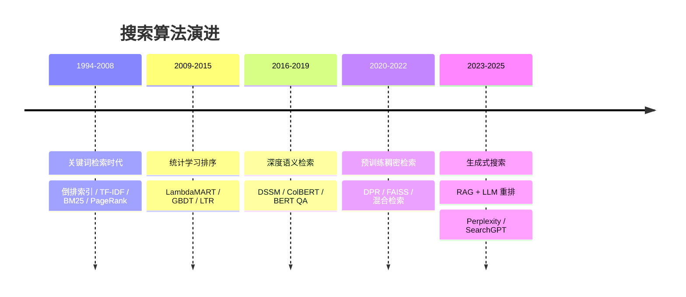

# 搜索算法演进脉络

> 整理时间：2026-03-16 | MelonEggLearn
> 覆盖范围：1990s-2026，从关键词匹配到生成式搜索

---

## 🆚 各代搜索方案创新对比

| 代际 | 之前方案 | 创新点 | 核心突破 |
|------|---------|--------|---------|
| TF-IDF/BM25 | 布尔检索（关键词 AND/OR） | **词频-逆文档频率统计排序** | 可量化的相关性 |
| Learning to Rank | 人工特征 + 排序规则 | **机器学习自动排序** | LambdaMART, NDCG 优化 |
| DSSM 双塔 | 词袋匹配（无语义） | **深度语义匹配** | 同义词/语义相近 |
| BERT 搜索 | 浅层语义（DSSM） | **预训练 + Cross-Encoder** | 深层交互理解 |
| DPR 稠密检索 | TF-IDF 稀疏检索 | **Dense Retrieval + ANN** | 语义泛化 |
| RAG + 生成式 | 检索+重排列表展示 | **检索+LLM 生成答案** | 直接回答问题 |

---

## 📈 搜索技术演进 Mermaid



---

## 📐 核心公式

### 1. BM25

$$
\text{BM25}(q, d) = \sum\_{t \in q} \text{IDF}(t) \cdot \frac{f(t,d) \cdot (k\_1+1)}{f(t,d) + k\_1 \cdot (1-b+b \cdot \frac{|d|}{avgdl})}
$$

**符号说明**：$f(t,d)$ 词 $t$ 在文档 $d$ 中的词频，$|d|$ 文档长度，$avgdl$ 平均文档长度，$k\_1$（通常 1.2-2.0）和 $b$（通常 0.75）为超参。

**直觉**：TF-IDF 的改进版——词频有上界（不会无限增长），长文档有惩罚（避免长文档占优）。至今仍是稀疏检索标杆。

### 2. NDCG（Normalized Discounted Cumulative Gain）

$$
\text{NDCG}@K = \frac{\text{DCG}@K}{\text{IDCG}@K}, \quad \text{DCG}@K = \sum\_{i=1}^K \frac{2^{rel\_i} - 1}{\log\_2(i+1)}
$$

**直觉**：排在前面的相关文档贡献更大（对数衰减位置权重），用理想排序归一化后得到 [0,1] 的评分。

---

## ASCII 演进时间线

```
1994        2000        2009        2013        2016        2019        2020        2023
 │           │           │           │           │           │           │           │
 ●───────────●───────────●───────────●───────────●───────────●───────────●───────────●──▶
 │           │           │           │           │           │           │           │
倒排索引    TF-IDF      BM25       Learning    DSSM        BERT        DPR+FAISS   RAG+
AltaVista  Google     PageRank    to Rank     双塔语义    进入搜索    稠密检索    LLM重排
Yahoo      布尔检索    统计排序   LambdaMART   深度匹配    语义理解    混合检索   生成式搜索

  关键词检索时代          统计学习排序时代      深度语义检索时代    预训练稠密检索    生成式
 [1990s──────2008]     [2009────2015]      [2016────2019]    [2020────2022]   [2023─今]
```

---

## 目录

1. [阶段1：关键词检索时代（1990s-2008）](#阶段1关键词检索时代1990s-2008)
2. [阶段2：统计学习排序时代（2009-2015）](#阶段2统计学习排序时代2009-2015)
3. [阶段3：深度语义检索时代（2016-2019）](#阶段3深度语义检索时代2016-2019)
4. [阶段4：预训练+稠密检索时代（2020-2022）](#阶段4预训练稠密检索时代2020-2022)
5. [阶段5：生成式搜索时代（2023-今）](#阶段5生成式搜索时代2023-今)
6. [演进规律总结](#演进规律总结)
7. [面试高频问题](#面试高频问题)

---

## 阶段1：关键词检索时代（1990s-2008）

### 1.1 背景：解决了什么问题

互联网兴起后，Web 文档数量呈指数增长，人们急需一种能够从海量网页中快速找到相关文档的工具。早期的目录式导航（Yahoo! Directory）无法规模化，必须构建自动化的关键词检索系统。

**核心挑战**：
- 文档规模：从百万到百亿级别的网页索引
- 查询延迟：用户期望毫秒级响应
- 相关性判断：如何判断文档与 query 的相关程度

**解决思路**：以词为单位建立倒排索引，用 TF-IDF 量化词的重要性，用 PageRank 量化页面权威性。

---

### 1.2 核心技术：倒排索引

倒排索引（Inverted Index）是搜索引擎的基础数据结构，将「文档→词」的正向索引翻转为「词→文档列表」。

```
正向索引（Forward Index）：
  doc1 → [搜索, 算法, 引擎, 检索]
  doc2 → [搜索, 引擎, Google, 排序]

倒排索引（Inverted Index）：
  搜索  → [doc1(tf=2), doc2(tf=1)]
  算法  → [doc1(tf=1)]
  引擎  → [doc1(tf=1), doc2(tf=1)]
  Google → [doc2(tf=1)]
  排序  → [doc2(tf=1)]
```

**倒排表结构**：
```
Term   | DocFreq | PostingList
-------|---------|---------------------------------------------------
search |   500K  | (doc_id, tf, positions) × 500K
learn  |   200K  | (doc_id, tf, positions) × 200K
```

**查询处理流程**：
```
Query: "搜索 算法"
  ↓ 分词
[搜索, 算法]
  ↓ 倒排查找
搜索 → PostingList_A
算法 → PostingList_B
  ↓ 合并（AND/OR）
相关文档集合
  ↓ TF-IDF 打分
排序结果
```

---

### 1.3 核心公式：TF-IDF

**词频（Term Frequency）**：
```
TF(t, d) = 词 t 在文档 d 中出现的次数 / 文档 d 的总词数
```

**逆文档频率（Inverse Document Frequency）**：
```
IDF(t) = log( N / df(t) )

其中：
  N    = 文档总数
  df(t) = 包含词 t 的文档数
```

**TF-IDF 综合得分**：
```
┌────────────────────────────────────────────────────────┐
│  TF-IDF(t, d) = TF(t, d) × IDF(t)                     │
│                                                        │
│  文档得分：score(q, d) = Σ TF-IDF(tᵢ, d) × IDF(tᵢ)    │
└────────────────────────────────────────────────────────┘
```

**TF-IDF 向量空间模型**：文档和 query 都表示为 TF-IDF 权重向量，用余弦相似度计算相关性：
```
cosine_sim(q, d) = (q · d) / (|q| × |d|)
```

---

### 1.4 核心技术：PageRank

Google 创始人 Larry Page 和 Sergey Brin 于 1998 年提出，利用网页链接结构评估页面权威性。

**核心思想**：被越多高质量页面链接的页面越权威，像投票一样传递权重。

**PageRank 公式**：
```
┌─────────────────────────────────────────────────────────┐
│  PR(A) = (1 - d) + d × Σ [ PR(Tᵢ) / C(Tᵢ) ]           │
│                          i                             │
│  其中：                                                  │
│    d     = 阻尼系数（damping factor），通常取 0.85       │
│    PR(A) = 页面 A 的 PageRank 值                        │
│    Tᵢ    = 链接到 A 的页面                               │
│    C(Tᵢ) = 页面 Tᵢ 的出链数                             │
│    (1-d) = 随机跳转概率                                  │
└─────────────────────────────────────────────────────────┘
```

**矩阵迭代形式**（Power Iteration）：
```
PR = d × M × PR + (1-d)/N × 1

M 为转移概率矩阵，初始化 PR(i) = 1/N，迭代直至收敛。
```

**直觉解释**：随机游走的网页浏览者，以概率 d 沿链接跳转，以概率 (1-d) 随机访问任意页面，最终停在各页面的稳态概率即为 PageRank。

---

### 1.5 代表系统

| 系统 | 年代 | 核心技术 | 特点 |
|------|------|---------|------|
| AltaVista | 1995 | 倒排索引 + 布尔检索 | 第一个全文索引引擎 |
| Yahoo! | 1995 | 目录导航 | 手工分类，规模受限 |
| Google | 1998 | TF-IDF + PageRank | 利用链接结构革命性创新 |
| Lucene/ES | 2000+ | BM25（后继 TF-IDF） | 开源搜索引擎库，工业广泛使用 |
| 百度 | 2000 | 中文分词 + TF-IDF | 针对中文优化 |

---

### 1.6 局限性

1. **词汇鸿沟（Vocabulary Mismatch）**：query "手机" 无法召回只包含 "智能手机" 的文档
2. **语义盲区**：无法理解同义词、反义词、上下位词关系
3. **词袋假设（BoW）**：忽略词序和上下文，"狗咬人" 与 "人咬狗" 得分相同
4. **链接作弊**：PageRank 被 SEO 黑帽技术（链接农场）攻击
5. **多语言困难**：中文等非空格分隔语言需要额外分词处理

---

### 1.7 面试必考点

- **TF-IDF 的直觉是什么？** 高词频 + 低文档频 = 该词对文档具有强区分力
- **倒排索引如何支持短语查询？** 位置信息（positional index），要求词在文档中相邻出现
- **PageRank 为何使用阻尼系数？** 防止 dangling node（无出链页面）导致权重漏失，同时模拟用户随机跳转行为
- **IDF 为什么取 log？** 平滑极端值，防止 df 极小时 IDF 爆炸
- **余弦相似度 vs 点积**：余弦归一化了向量长度，对长文档友好；点积则偏向长文档

---

## 阶段2：统计学习排序时代（2009-2015）

### 2.1 背景：解决了什么问题

随着搜索引擎竞争加剧，仅靠 TF-IDF + PageRank 已不够。搜索质量需要综合考虑几百个信号（点击率、停留时间、新鲜度、权威性、用户历史等）。手工调权费时费力，而且难以优化全局排序。

**核心需求**：
- 自动从搜索日志数据（query, doc, 相关性标注）中学习排序函数
- 优化列表级别的排序质量（NDCG、MAP 等指标）
- 处理数百维异构特征

**Learning to Rank（LTR）** 应运而生，将搜索排序转化为监督学习问题。

---

### 2.2 核心公式：BM25

BM25（Best Match 25）是对 TF-IDF 的重大改进，引入 TF 饱和机制和文档长度归一化：

```
┌──────────────────────────────────────────────────────────────────────────────┐
│                                                                              │
│  BM25(q, d) = Σᵢ IDF(qᵢ) × TF(qᵢ, d)                                       │
│                                                                              │
│  IDF(qᵢ) = log [ (N - n(qᵢ) + 0.5) / (n(qᵢ) + 0.5) + 1 ]                  │
│                                                                              │
│              f(qᵢ, d) × (k₁ + 1)                                            │
│  TF(qᵢ, d) = ─────────────────────────────────────────                      │
│              f(qᵢ, d) + k₁ × (1 - b + b × |d|/avgdl)                       │
│                                                                              │
│  参数说明：                                                                   │
│    N      = 语料库文档总数                                                    │
│    n(qᵢ)  = 包含词 qᵢ 的文档数                                               │
│    f(qᵢ,d)= 词 qᵢ 在文档 d 中的词频                                          │
│    |d|    = 文档 d 的长度（词数）                                             │
│    avgdl  = 语料库平均文档长度                                                │
│    k₁    ∈ [1.2, 2.0]  控制 TF 饱和速度                                     │
│    b      = 0.75       长度归一化强度                                         │
│                                                                              │
└──────────────────────────────────────────────────────────────────────────────┘
```

**BM25 vs TF-IDF 关键改进**：

```
TF 饱和对比：

TF贡献   TF-IDF：线性增长（无上界）
  ↑     
  │         ╱╱╱╱╱╱╱╱╱╱
  │        ╱            ← TF-IDF（无饱和）
  │       ╱
  │    ╭──────────────  ← BM25（趋于饱和 at k₁+1）
  │   ╱
  │  ╱
  └──────────────────→ 词频 f
```

**b 参数的作用**（长度归一化）：
- `b=1`：完全归一化，按文档长度打折
- `b=0`：不做长度归一化
- `b=0.75`：工业默认，平衡短文档精准性和长文档丰富性

---

### 2.3 排序质量评估：NDCG

**DCG（Discounted Cumulative Gain）**：
```
         K  rel(i)
DCG@K = Σ  ───────
        i=1  log₂(i+1)

其中 rel(i) 为第 i 位文档的相关性分数（0=不相关, 1=弱相关, 2=相关, 3=强相关）
```

**IDCG**（Ideal DCG）：最优排列下的 DCG（相关性从高到低排序）。

**NDCG（Normalized DCG）**：
```
┌─────────────────────────────────────────┐
│  NDCG@K = DCG@K / IDCG@K               │
│                                         │
│  取值范围 [0, 1]，越接近1越好           │
└─────────────────────────────────────────┘
```

**计算示例**：
```
相关性标注：[3, 2, 0, 1, 2]（位置1-5）

DCG@5 = 3/log₂(2) + 2/log₂(3) + 0/log₂(4) + 1/log₂(5) + 2/log₂(6)
      = 3/1 + 2/1.585 + 0 + 1/2.322 + 2/2.585
      = 3 + 1.262 + 0 + 0.431 + 0.774
      = 5.467

最优排列：[3, 2, 2, 1, 0]
IDCG@5 = 3/1 + 2/1.585 + 2/2 + 1/2.322 + 0 = 3 + 1.262 + 1 + 0.431 = 5.693

NDCG@5 = 5.467 / 5.693 = 0.960
```

---

### 2.4 Learning to Rank 三大范式

#### Pointwise（逐点法）

将排序问题转化为**回归/分类**问题，每个 (query, doc) 对独立预测相关性分数。

```
训练样本：(x_{q,d}, y) 其中 y ∈ {0,1,2,3} 或连续值

损失函数（MSE）：L = Σ (f(x_{q,d}) - y)²

代表算法：McRank（微软 2007）、Subset Ranking
优点：实现简单
缺点：未考虑文档之间的相对顺序，无法直接优化 NDCG
```

#### Pairwise（成对法）

将排序问题转化为**二分类**问题，学习文档对的相对顺序。

```
训练样本：(xᵢ, xⱼ, yᵢⱼ) 其中 yᵢⱼ=+1 表示 dᵢ > dⱼ

RankSVM 损失：
  min  ½||w||² + C×Σ ξᵢⱼ
  s.t. w·(xᵢ - xⱼ) ≥ 1 - ξᵢⱼ，∀(i,j): yᵢⱼ=1

RankNet（Burges 2005，Neural Network）：
  Pᵢⱼ = 1 / (1 + exp(-(sᵢ - sⱼ)))
  C = -P̄ᵢⱼ log Pᵢⱼ - (1-P̄ᵢⱼ) log(1-Pᵢⱼ)

代表算法：RankSVM、RankNet、RankBoost
优点：考虑了相对顺序
缺点：训练对数 O(n²)，计算开销大；仍未直接优化列表指标
```

#### Listwise（列表法）

直接对整个文档**排列**建模，优化列表级别指标（NDCG、MAP）。

```
ListNet（曹毅 2007）：
  将排列概率用 Plackett-Luce 模型表示：
  P(π) = Π φ(sπ(j)) / Σ φ(sπ(k))

LambdaRank → LambdaMART：
  ΔCost ∝ |ΔNDCG| × Pᵢⱼ × (1 - Pᵢⱼ)
  
  关键创新：用 |ΔNDCG| 加权成对梯度，
  让模型把精力放在改善 NDCG 影响最大的文档对上。
```

---

### 2.5 核心算法：LambdaMART

LambdaMART = Lambda（梯度）+ MART（Multiple Additive Regression Trees，即 GBDT）

**算法流程**：
```
1. 初始化 F₀(x) = 0
2. 对每轮迭代 m = 1, ..., M：
   a. 计算 λᵢⱼ = ∂C/∂sᵢ = -Σⱼ λᵢⱼ_pair × |ΔNDCG(i,j)|
      λᵢ（文档 i 的伪残差）= Σⱼ≠ᵢ λᵢⱼ
   b. 拟合一棵回归树 hₘ(x) 到 {λᵢ} 上
   c. 用 line search 确定步长 γₘ
   d. Fₘ(x) = Fₘ₋₁(x) + γₘ × hₘ(x)
3. 输出最终模型 F_M(x)
```

**LambdaMART 梯度计算**：
```
λᵢⱼ = σ(sⱼ - sᵢ) × |ΔNDCG(i,j)|

其中 σ(x) = 1/(1 + e^x) 为 sigmoid 函数
|ΔNDCG| = 交换文档 i、j 位置后 NDCG 的绝对变化量
```

---

### 2.6 代表系统

| 系统 | 机构 | 技术 | 时间 |
|------|------|------|------|
| RankNet/LambdaRank | Microsoft Research | Pairwise/Listwise NN | 2005-2006 |
| LambdaMART | Microsoft (Yahoo! LTR Challenge 2010 冠军) | GBDT + Lambda | 2010 |
| AdaRank | 曹毅团队 | Listwise Boosting | 2007 |
| XGBoost+LTR | 各大厂 | GBDT 特征工程 | 2014+ |
| Elasticsearch | Elastic | BM25 + 插件 LTR | 开源主流 |
| 百度凤巢 | 百度 | 广告 + 搜索混排 | 2009+ |

---

### 2.7 局限性

1. **特征工程依赖**：需要人工设计几百个 handcrafted 特征（点击率、停留时间、权威性等）
2. **仍是词袋模型**：底层召回还是 BM25，词汇鸿沟问题未解决
3. **计算复杂**：GBDT 的 O(n log n) 仍然无法实时在十亿级别文档上运行
4. **语义理解缺失**：无法理解 "苹果手机" vs "苹果水果" 的歧义
5. **标注成本高**：Listwise 方法需要大量人工相关性标注

---

### 2.8 面试必考点

- **BM25 相比 TF-IDF 的改进**：TF 饱和（防止高频词权重无限大）+ 文档长度归一化
- **为什么需要 Listwise？**：Pointwise 忽略顺序，Pairwise 忽略列表整体质量，Listwise 直接优化 NDCG
- **LambdaMART 的核心创新**：用 |ΔNDCG| 加权梯度，让优化专注于对 NDCG 影响最大的文档对
- **NDCG 的位置折扣意义**：高质量结果排在前面比排在后面重要，对数折扣模拟用户注意力递减
- **BM25 参数 b=0 和 b=1 的区别**：b=0 不做长度归一化，b=1 完全按文档长度折扣

---

## 阶段3：深度语义检索时代（2016-2019）

### 3.1 背景：解决了什么问题

LTR + BM25 仍然无法解决词汇鸿沟问题：query "notebook" 无法匹配 "laptop" 文档。此外，用户 query 往往短而模糊（平均 2-3 个词），而文档理解需要上下文语境。

**核心突破**：用深度学习将 query 和 document 映射到同一语义空间，通过向量相似度代替词频匹配。

**关键技术演进**：
```
Word2Vec(2013) → DSSM双塔(2013) → CNN/RNN语义(2015-2017) → BERT(2018) → BERT用于搜索(2019)
```

---

### 3.2 核心技术：DSSM 双塔模型

**DSSM（Deep Structured Semantic Model）**，微软 2013 年提出。

**网络结构**：
```
Query 塔                       Document 塔
  ↓                               ↓
word hashing                  word hashing
  ↓                               ↓
[300 → 300 → 128]             [300 → 300 → 128]
  ↓                               ↓
  Q_vec (128维)                D_vec (128维)
           ↘                 ↙
            cosine_similarity
                   ↓
            relevance score
```

**word hashing**：将词映射为 letter-trigram 特征（解决词汇表爆炸问题）：
```
"good" → #good# → {#go, goo, ood, od#}（30k trigrams vs 500k words）
```

**训练目标（负采样 + Softmax）**：
```
P(D⁺|Q) = exp(γ · cos(Q, D⁺)) / [exp(γ · cos(Q, D⁺)) + Σⱼ exp(γ · cos(Q, Dⱼ⁻))]

其中 γ 为温度系数，D⁺ 为正文档，Dⱼ⁻ 为随机负采样文档
```

---

### 3.3 双塔模型架构演进

```
DSSM (2013) → ARC-I/ARC-II (2014) → MatchPyramid (2016) → ESIM (2017) → RE2 (2019)

交互方式对比：

【双塔/表示型（Representation-based）】
  Query ──→ Encoder ──→ q_vec
                              → similarity score
  Doc ───→ Encoder ──→ d_vec

  优点：推理快（doc 向量可预计算）
  缺点：query-doc 早期无交互，丢失细粒度信息

【交互型（Interaction-based）】
  Query: [q₁, q₂, ..., qₙ]
  Doc:   [d₁, d₂, ..., dₘ]
       ↓ 构建 n×m 交互矩阵
  M[i][j] = cos(qᵢ, dⱼ)
       ↓ CNN/RNN 提取匹配模式
  score

  优点：精度高，细粒度交互
  缺点：每次推理都要计算 query-doc 交叉，无法预计算
```

---

### 3.4 CNN/RNN 语义匹配

**Conv-KNRM（2018）**：卷积 + 核函数匹配
```
1. 用 CNN 提取 n-gram 特征：{1-gram, 2-gram, 3-gram}
2. 计算 query n-gram 与 doc n-gram 的核函数得分
3. 聚合多级别匹配信号

核函数：K(x) = exp(-(x-μ)²/2σ²)  ← 高斯核，μ 为相似度中心
```

**DPCNN（2017，百度）**：用于文本分类和排序
```
Region embedding → conv×3 → MaxPool → conv×3 → MaxPool → ... → FC
```

**HiNT（2018）**：层次神经排序（句子级 → 文档级）
```
passage 级匹配 + passage 重要性估计 + 文档级汇聚
```

---

### 3.5 BERT 进入搜索（2018-2019）

Google 2018 年发布 BERT，2019 年用于 Google Search（影响 10% 查询的处理方式）。

**BERT 用于搜索的两种范式**：

```
【Bi-Encoder / 双塔】
  BERT_Q([CLS] query [SEP]) → q_vec
  BERT_D([CLS] doc [SEP])   → d_vec
  score = cos(q_vec, d_vec)

  特点：可离线预计算 doc 向量，适合大规模召回

【Cross-Encoder / 交互式】
  BERT([CLS] query [SEP] doc [SEP]) → [CLS] → Linear → score

  特点：充分利用 query-doc 交叉注意力，精度高
  限制：每次推理都要跑完整 BERT，只能用于精排（top 100-1000）
```

**BERT 在搜索中的 NDCG 提升（MS MARCO 数据集）**：
```
BM25:             MRR@10 ≈ 0.184
BM25 + BERT rerank: MRR@10 ≈ 0.365 (+98%)
```

---

### 3.6 代表系统

| 系统 | 机构 | 技术 | 时间 |
|------|------|------|------|
| DSSM | Microsoft | 双塔语义匹配 | 2013 |
| ARC-I/II | 华为诺亚方舟 | 卷积交互匹配 | 2014 |
| Match-SRNN | MSRA | RNN+交互 | 2016 |
| BERT for Search | Google | Cross-Encoder | 2019 |
| ERNIE | 百度 | 中文预训练+搜索 | 2019 |
| XLNet | Google/CMU | 自回归预训练 | 2019 |

---

### 3.7 局限性

1. **召回仍依赖 BM25**：BERT 只用于精排，底层召回未被革新
2. **推理延迟**：Cross-Encoder BERT 推理耗时 10-100ms，无法用于大规模召回
3. **领域适配**：通用预训练 BERT 在垂直领域（医疗、法律）效果有限
4. **向量静态问题**：双塔模型的文档向量是静态的，无法动态感知 query 上下文
5. **In-batch Negative 问题**：训练时负样本是随机采样，质量低于硬负样本

---

### 3.8 面试必考点

- **双塔 vs Cross-Encoder 的 trade-off**：双塔离线预计算快但精度低；Cross-Encoder 精度高但延迟大，只用于精排
- **DSSM 为什么用 letter-trigram 而不是 word？**：减少词汇表规模（500k→30k），解决 OOV 问题，同时对拼写错误鲁棒
- **BERT 的 [CLS] token 为什么能代表句子语义？**：预训练时 [CLS] 被训练来预测两个句子的关系（NSP任务），包含了句子级别信息
- **负采样策略对双塔模型的影响**：难负样本（hard negative）比随机负样本更能提升模型区分度，BM25 负样本是常用方法
- **为什么 BERT 对搜索提升这么大？**：BERT 的双向注意力机制能理解 query 的上下文意图，而不是词袋匹配

---

## 阶段4：预训练+稠密检索时代（2020-2022）

### 4.1 背景：解决了什么问题

虽然 BERT 用于精排效果好，但搜索系统的"召回瓶颈"仍是 BM25。BM25 无法召回语义相关但词汇不同的文档，导致精排层再好也无济于事（召回率天花板）。

**核心突破**：用 BERT 级别的双塔模型完成大规模向量召回，配合 FAISS/HNSW 做近似最近邻搜索，实现语义级别的端到端检索。

**技术标志**：DPR（Dense Passage Retrieval，Facebook 2020）

---

### 4.2 核心技术：DPR

**DPR（Dense Passage Retrieval）**，Karpukhin et al. 2020。

**架构**：
```
Query  → BERT_Q → [CLS] → q ∈ ℝ⁷⁶⁸
Passage → BERT_P → [CLS] → p ∈ ℝ⁷⁶⁸

相似度：sim(q, p) = q^T p  （点积，等价于 cosine if normalized）
```

**训练目标（In-batch Negative + Hard Negative）**：
```
L = -log [ exp(q·p⁺) / (exp(q·p⁺) + Σⱼ exp(q·pⱼ⁻)) ]

In-batch negative：同 batch 其他 query 对应的正文档作为负样本
Hard negative：BM25 检索到的高分但非相关文档（让模型区分语义 vs 词汇）
```

**DPR vs BM25（NQ 数据集 Top-20 召回率）**：
```
BM25:  59.1%
DPR:   78.4%（+19.3%）
Hybrid: 79.4%（BM25 + DPR 混合，互补效果）
```

---

### 4.3 近似最近邻检索：FAISS & HNSW

**问题规模**：Wikipedia ≈ 2100 万段落 × 768 维 = 暴力 inner product 搜索太慢。

**FAISS（Facebook AI Similarity Search）**：

```
索引类型对比：

Flat (暴力搜索):
  精度: 100%，速度: 慢，内存: 768×4×N bytes

IVF (Inverted File Index，倒排分桶):
  将向量空间分成 K 个 Voronoi 区域（K-means）
  查询时只搜索 nprobe 个最近的桶
  精度: ≈95%，速度: 快 ~10x

IVF+PQ (Product Quantization):
  将 768 维向量分成 M 段，每段用 256 个码本压缩
  768×4 bytes → M bytes（压缩比 768×4/M）
  精度: ≈90%，速度: 快 ~100x，内存: 极小

HNSW (Hierarchical Navigable Small World):
  层级图结构，每层是 NSW 图
  查询复杂度: O(log N)
  精度: >98%，速度: 快，内存: 较大
```

**HNSW 核心原理**：
```
第 L 层（稀疏，长跳）
  ●─────────────●─────●
  第 L-1 层（中等）
  ●──●──────●──●──●──●
  第 0 层（密集，精确匹配）
  ●●●●●●●●●●●●●●●●●●●●

查询：从最高层开始贪心搜索 → 逐层降低 → 第0层得到精确近邻
```

---

### 4.4 ColBERT：多向量交互检索

**ColBERT（Khattab & Zaharia，2020，Stanford）**

**核心思想**：每个词保留独立向量（不压缩到单一 [CLS]），通过 MaxSim 聚合。

```
Query 编码：Q = BERT_Q([q₁, q₂, ..., qₙ]) → {q₁', q₂', ..., qₙ'} ∈ ℝⁿˣ¹²⁸

Doc 编码：D = BERT_D([d₁, d₂, ..., dₘ]) → {d₁', d₂', ..., dₘ'} ∈ ℝᵐˣ¹²⁸

相似度（Late Interaction）：
┌──────────────────────────────────────────────────────┐
│  score(Q, D) = Σᵢ max_j (qᵢ' · dⱼ')                │
│                                                      │
│  即：每个 query token 找文档中最相似的 token          │
│  MaxSim：精准的词对词对齐                             │
└──────────────────────────────────────────────────────┘
```

**ColBERT 的工程权衡**：
```
存储：DPR 每文档 1×768 float，ColBERT 每文档 ~180×128 int8
     存储增大约 30-60倍（通过量化缓解）

速度：需要两阶段检索
  1. ANN 用压缩向量召回候选
  2. 全精度 MaxSim 重排
  
精度：在 MS MARCO 上超过 DPR ~5% MRR@10
```

---

### 4.5 稀疏 vs 稠密混合检索

**为什么需要 Hybrid？**

```
BM25 优势：
  ✓ 精确匹配：query 词在文档中原文出现
  ✓ 零样本泛化：不需要标注数据
  ✓ 高效：倒排索引 O(k) 查询

DPR 优势：
  ✓ 语义匹配：同义词/释义/多跳推理
  ✓ 无词汇鸿沟
  ✓ 上下文理解

两者高度互补，结合后召回率 > 单一方法。
```

**RRF（Reciprocal Rank Fusion）**：
```
RRF_score(d) = Σₖ 1 / (rank_k(d) + 60)

各路检索结果按倒数排名融合，60 是防零常数。
```

**SPLADE（2021）**：语义稀疏检索，兼具 BM25 的效率和 Dense 的语义能力：
```
SPLADE 通过 BERT + MLM head 预测每个词的权重，
输出高度稀疏的词权重向量（90%+ 为零），可以用倒排索引存储：

doc_sparse = max(0, log(1 + ReLU(BERT_MLM(doc))))
```

---

### 4.6 代表系统

| 系统 | 机构 | 核心技术 | 时间 |
|------|------|---------|------|
| DPR | Facebook AI | 稠密双塔 + 负样本训练 | 2020 |
| FAISS | Facebook AI | 向量近似最近邻 | 2017（持续迭代） |
| ColBERT | Stanford | Late Interaction | 2020 |
| ANCE | UMass | 动态 hard negative 挖掘 | 2020 |
| SPLADE | NAVER Labs | 神经稀疏检索 | 2021 |
| BGE | 北航/智源 | 中文通用 Embedding | 2023 |
| ES ANN（KNN search） | Elastic | HNSW 向量检索集成 | 2021 |

---

### 4.7 局限性

1. **训练数据依赖**：稠密检索需要大量 (query, positive_doc, negative_doc) 标注对
2. **领域迁移问题**：在目标域无标注时，DPR 可能不如 BM25（BEIR Benchmark 发现）
3. **存储开销**：ColBERT 等多向量模型存储比 BM25 倒排索引大几十倍
4. **向量漂移**：模型更新后所有文档向量需重建（离线代价大）
5. **负样本选择**：Hard negative 挖掘策略对性能影响极大，工程复杂

---

### 4.8 面试必考点

- **DPR 相比 BERT Cross-Encoder 的核心区别**：DPR 是双塔（双编码器），doc 可预计算；Cross-Encoder 每次推理都要 query+doc 联合输入
- **FAISS IVF 的工作原理**：K-means 将向量空间分桶，查询时只搜索最近的 nprobe 个桶，牺牲少量精度换大倍速提升
- **ColBERT MaxSim 的物理意义**：每个 query token 与文档中最相关的 token 对齐，比单向量更细粒度
- **为什么 BM25+DPR 混合好于单一方法**：BM25 捕获精确词汇匹配，DPR 捕获语义匹配，两者错误模式不重叠
- **In-batch Negative vs Hard Negative**：In-batch 简单高效但负样本质量低；Hard Negative（BM25 返回的假正例）更难区分，训练效果更好
- **HNSW 与 IVF 的区别**：HNSW 图结构，精度高但内存大；IVF 倒排分桶，内存小但精度略低

---

## 阶段5：生成式搜索时代（2023-今）

### 5.1 背景：解决了什么问题

GPT-4、LLaMA 等大语言模型展现出强大的语言理解和生成能力，用户开始期望搜索引擎不仅检索文档，还能直接**生成答案**。传统"蓝链接"搜索无法满足：
- 复杂推理问题（多跳问答）
- 综合多源信息的答案生成
- 对话式连续搜索

**两大技术方向**：
1. **RAG（Retrieval-Augmented Generation）**：检索 + 生成组合
2. **生成式搜索引擎**：Bing + ChatGPT、Perplexity、Google SGE

---

### 5.2 核心技术：RAG 架构

**RAG（Lewis et al., Facebook AI，2020 提出，2022-2023 大规模应用）**

**基础 RAG 架构**：
```
用户 Query
    ↓
[Retriever] 检索相关文档
  BM25 / Dense / Hybrid
    ↓
Top-K 文档 (K=3~10)
    ↓
[Augmented Prompt 构建]
  "根据以下文档：{doc1} {doc2} {doc3}
   回答问题：{query}"
    ↓
[LLM Generator]
  GPT-4 / Claude / LLaMA
    ↓
生成答案 + 引用来源
```

**高级 RAG 架构演进**：

```
Naive RAG（2020-2022）：简单检索→拼接→生成
  问题：低质文档污染上下文，长文档截断，无迭代

Advanced RAG（2022-2023）：
  ├── Pre-retrieval：Query Rewriting / HyDE（假设文档嵌入）
  ├── Retrieval：Hybrid（BM25+Dense）+重排
  └── Post-retrieval：压缩上下文（LLM ContextCompressor）

Modular RAG（2023-2024）：
  ├── Routing：根据 query 类型选检索策略
  ├── Fusion：Multi-query 融合召回
  ├── Self-RAG：LLM 自我决定是否检索
  └── CRAG（Corrective RAG）：检索质量评估→纠错
```

**HyDE（Hypothetical Document Embeddings，2023）**：
```
原始思路：
  query → BERT 向量 → 与文档向量比较（语义差异大）

HyDE 改进：
  query → LLM 生成假设答案 → 假设答案 BERT 向量 → 与文档向量比较
  
直觉：生成的假设文档和真实文档在同一语义空间，检索更准确
```

---

### 5.3 核心技术：LLM 重排

**传统排序**：BM25 → BERT Cross-Encoder → 输出分数

**LLM 重排（2023）**：用 GPT/LLaMA 直接评估文档相关性

```
【Pointwise LLM Reranker】
Prompt: "Given query: {q}, rate the relevance of document: {d} on scale 1-5."
LLM → "4"

【Listwise LLM Reranker（RankGPT，2023）】
Prompt: "Rank the following passages by relevance to query {q}:
  [1] {d1}  [2] {d2}  [3] {d3}..."
LLM → "[2] > [1] > [3]"

【Pairwise LLM Reranker（PRP，2023）】
Prompt: "Which passage is more relevant to {q}: A or B?"
LLM → "A"
```

**性能对比（TREC-DL 2019）**：
```
BM25:                  0.506 nDCG@10
BERT Cross-Encoder:    0.696 nDCG@10
GPT-4 Listwise Rerank: 0.745 nDCG@10
```

**工程挑战**：
- LLM 推理成本（GPT-4 重排 100 文档约 $0.5-1.0/query）
- 延迟（10-30 秒，不可接受）
- 解决方案：小型 LLM 蒸馏（RankVicuna、RankZephyr）

---

### 5.4 对话式搜索：ConvSearch

**对话式搜索**解决多轮信息需求，支持上下文依赖查询。

```
对话历史：
  Turn 1: "Python 有哪些排序算法？"
  Turn 2: "哪个最快？"  ← 依赖 Turn 1 上下文
  Turn 3: "代码怎么写？"

挑战：Turn 2 的 "哪个" 必须解析为 "Python 排序算法中哪个"
```

**Query Rewriting（历史感知查询改写）**：
```
输入：对话历史 H = [q₁, a₁, q₂, a₂, ..., qₙ]
输出：独立可检索查询 q̃ₙ

方法1：T5/LLM 生成改写
  Prompt: "Rewrite the last question to be self-contained:
    History: {H}  Current: {qₙ}"
  → "Python 排序算法中哪个最快？"

方法2：Dense ConvDR
  用对话历史的拼接表示做稠密检索
```

**ConvSearch 系统架构**：
```
用户输入 qₙ
    ↓
[Query Understanding]
  意图识别 + 话题追踪 + 省略恢复
    ↓
[Query Rewriting]
  LLM/T5 生成独立 query
    ↓
[Retrieval + Reranking]
  Hybrid 检索 + LLM 重排
    ↓
[Answer Generation]
  LLM 综合多轮上下文生成答案
    ↓
[Clarification（可选）]
  若 query 模糊，主动追问
```

---

### 5.5 工业生成式搜索系统

| 系统 | 公司 | 技术特点 | 发布时间 |
|------|------|---------|---------|
| Bing Chat / Copilot | Microsoft | GPT-4 + Bing Search + RAG | 2023-02 |
| Bard / Gemini | Google | PaLM/Gemini + Google Search | 2023-03 |
| Perplexity | Perplexity AI | RAG + 引用溯源 + 实时搜索 | 2022-12 |
| Google SGE | Google | Search Generative Experience，AI概览 | 2023-05 |
| 文心一言搜索 | 百度 | ERNIE + 百度搜索 | 2023-03 |
| 秘塔 AI 搜索 | 秘塔科技 | LLM + 中文搜索 | 2024 |

---

### 5.6 前沿方向（2024-2026）

**1. Agentic RAG**：LLM 作为 Agent，自主规划多步检索
```
Query: "比较 A 公司和 B 公司 2023 年财报"
Agent 步骤：
  Step 1: 检索 A 公司 2023 财报
  Step 2: 检索 B 公司 2023 财报
  Step 3: 综合分析 → 生成对比报告
```

**2. GraphRAG（2024）**：知识图谱 + RAG
```
文档 → 实体关系抽取 → 知识图谱
Query → 图遍历 → 相关子图 → LLM 生成答案
优势：多跳推理、结构化知识整合
```

**3. 长上下文 LLM 的冲击**：
```
Gemini 1.5 支持 1M token 上下文
理论上可以把整个知识库塞入上下文！
但实际上：成本高（$10+/次）、"中间丢失"问题（needle in a haystack）
```

**4. 混合检索 + LLM 生成端到端优化**：
```
Retriever ←←←← 反向传播 ←←←← Generator
RLHF 信号驱动 Retriever 更新：
  若生成答案质量高 → 正向强化该检索结果
  若答案错误 → 惩罚导致错误的文档
```

---

### 5.7 局限性

1. **幻觉问题（Hallucination）**：LLM 在检索结果不足时会捏造信息，搜索准确性下降
2. **实时性挑战**：LLM 知识截止日期 vs 实时搜索需求（需要持续爬取 + 索引更新）
3. **引用准确性**：生成答案中的引用来源不总是准确（Perplexity 被指出引用错误）
4. **成本爆炸**：LLM 重排、生成的计算成本远高于传统搜索
5. **长尾问题**：对于小众或专业 query，LLM 生成质量低于专业检索

---

### 5.8 面试必考点

- **RAG 的核心价值**：结合 LLM 的语言能力和检索系统的时效性/事实准确性，解决 LLM 知识截止和幻觉问题
- **HyDE 的核心思想**：用 LLM 生成假设文档，缩小 query 和文档的语义分布差距
- **LLM 重排 vs BERT 重排的权衡**：LLM 精度更高但成本/延迟极高；工业上通常 BERT 精排 + LLM 在高价值 query 上补充
- **ConvSearch 的核心问题**：历史依赖的 query 需要改写为独立查询，才能被检索系统处理
- **RAG 失效的常见原因**：1) 检索召回失败（相关文档不在 top-K）2) 上下文太长 LLM 关注中间段落能力弱 3) 多来源矛盾

---

## 演进规律总结

### 规律一：从精确匹配到语义理解

```
布尔检索 → TF-IDF → BM25 → DSSM → BERT → LLM

每一步都在提升"理解"程度：
  布尔：词是否出现
  TF-IDF：词的重要程度
  BM25：词频饱和+长度归一化
  DSSM：浅层语义向量
  BERT：深度上下文语义
  LLM：语言推理能力
```

### 规律二：检索-排序分离架构持续深化

```
阶段1：倒排索引（检索）+ TF-IDF 打分（排序）
阶段2：倒排索引（检索）+ LTR/LambdaMART（排序）
阶段3：倒排索引（检索）+ BERT Cross-Encoder（精排）
阶段4：BM25+DPR（多路检索）+ BERT 重排
阶段5：混合检索 + LLM 重排 + LLM 生成

架构从"单一模型做所有事"演进为"专业化流水线"
```

### 规律三：效率-精度的持续博弈

```
精度提升：Cross-Encoder > Bi-Encoder > BM25
推理效率：BM25 > Bi-Encoder > Cross-Encoder

每次技术突破都在缩小精度-效率的 gap：
  ColBERT：Late Interaction 在精度和效率间折中
  SPLADE：语义稀疏，兼顾倒排效率和语义质量
  知识蒸馏：将大模型压缩到小模型，保留精度降低延迟
```

### 规律四：训练信号从人工标注到弱监督

```
阶段1-2：人工相关性标注（expensive）
阶段3：点击日志弱监督（clickthrough data）
阶段4：LLM 生成合成训练数据
阶段5：RLHF/用户反馈直接优化生成质量

数据飞轮：更好的模型 → 更好的搜索结果 → 更多点击 → 更好的训练数据
```

### 规律五：检索与生成的融合

```
搜索 1.0：返回文档列表（链接）
搜索 2.0：返回结构化摘要（Featured Snippet）
搜索 3.0：返回生成式答案（RAG）
搜索 4.0（未来）：多轮对话+主动检索+个性化知识图谱
```

### 关键里程碑年份速记

```
1998 → PageRank（Google 创立）
2003 → BM25 标准化
2005 → RankNet/LambdaRank（Pairwise LTR）
2010 → LambdaMART（LTR 工业标准）
2013 → DSSM（深度语义双塔开山之作）
2018 → BERT（NLP革命）
2020 → DPR + ColBERT（稠密检索成熟）
2022 → ChatGPT（生成式AI爆发）
2023 → RAG 大规模应用，生成式搜索元年
2024 → Agentic RAG、GraphRAG
```

---

## 面试高频问题

### Q1：请描述搜索系统的完整架构流程

```
答案框架：
1. Query 理解层：分词 → NER → 意图识别 → Query 改写/扩展
2. 召回层（多路并行）：
   - 倒排索引（BM25）
   - 稠密向量检索（双塔模型 + FAISS）
   - 知识图谱检索
3. 粗排层：轻量级模型（逻辑回归/小 BERT）
4. 精排层：Cross-Encoder / LambdaMART / LLM 重排
5. 重排层：业务规则 + 多样性 + 广告融合
6. 展示层：摘要抽取 / RAG 生成答案

关键点：各层 trade-off 是延迟与精度，越往后精度越高但处理文档越少
```

---

### Q2：BM25 公式中 k₁ 和 b 参数的作用是什么？调大/调小分别有什么效果？

```
答案：
k₁（TF 饱和参数，默认 1.2-2.0）：
  - 控制 TF 贡献的上界：TF 趋于无穷时，BM25_TF 趋于 k₁+1
  - k₁→0：忽略 TF，所有词频等价
  - k₁→∞：类似原始 TF，无饱和（长文档有利）
  - 实践：文档较短的场景（标题搜索）用较小 k₁

b（长度归一化，默认 0.75）：
  - b=0：完全不做长度归一化，长文档天然得分高
  - b=1：完全归一化，按文档长度折扣
  - 实践：文档长度差异大时（网页 vs 标题）b=0.75 是最优选择
```

---

### Q3：DPR 为什么需要 Hard Negative？随机负样本有什么问题？

```
答案：
问题：随机负样本（如随机文档）和正样本差异太大，
     模型只需学到"浅层主题匹配"即可区分，没有挑战性。

Hard Negative（难负样本）：
  - BM25 负样本：与 query 词汇高度匹配但实际不相关（词汇陷阱）
  - In-batch Hard：同 batch 其他 query 的正文档（主题相关但答案不对）

效果：加入 Hard Negative 后 DPR 在 NQ 数据集 Top-20 召回率
     从 ~70% 提升至 78.4%

工业实践：挖掘 hard negative 是稠密检索训练最重要的工程环节之一
```

---

### Q4：ColBERT 的 MaxSim 操作是什么？相比单向量双塔有何优劣？

```
答案：
MaxSim：score(Q,D) = Σᵢ max_j (qᵢ · dⱼ)
每个 query token 向量找文档中最相似的 token 向量，求和

优势：
  1. 细粒度词对词对齐，比单向量保留更多语义信息
  2. 在 MS MARCO 上比 DPR 高 ~5% MRR@10
  3. 延迟低于 Cross-Encoder（文档向量可预计算）

劣势：
  1. 存储：每文档存 ~180 个向量（vs DPR 的 1 个），存储增大 30-60x
  2. 需要两阶段：ANN 初召 + MaxSim 精排
  3. 量化后精度有损失

实践建议：高精度搜索场景（企业搜索、法律检索）可用 ColBERT；
         亿级别索引场景更推荐 DPR + 轻量 reranker。
```

---

### Q5：NDCG 和 MAP 有什么区别？各自适合什么场景？

```
答案：
MAP（Mean Average Precision）：
  AP(q) = Σₖ P(k) × rel(k) / |relevant|
  P(k) = 前k个结果中相关文档数 / k
  MAP = 平均所有 query 的 AP
  假设：所有相关文档都同等重要（二值相关性）

NDCG（Normalized DCG）：
  支持多级相关性（0/1/2/3），对位置折扣
  更符合真实搜索场景（文档相关性有程度之分）

场景选择：
  MAP：文档相关性二值（相关/不相关），信息检索竞赛（TREC）
  NDCG：相关性有多个等级，搜索引擎、推荐系统评估
  MRR：关注第一个相关结果的位置（问答系统、实体搜索）
```

---

### Q6：RAG 系统的常见失效模式有哪些？如何优化？

```
答案：
1. 检索失败（最常见）：相关文档不在 top-K
   优化：增大 K、提升检索模型、Hybrid 检索

2. "中间丢失"（Lost in the Middle）：LLM 关注开头和结尾，忽略中间文档
   优化：相关性最高的放首尾、上下文压缩（Selective Context）

3. 多来源矛盾：不同文档说法冲突
   优化：加入文档权威性评分、让 LLM 显式处理矛盾

4. Chunking 不当：文档切分边界破坏语义
   优化：滑动窗口 chunking、语义分段（按句子/段落）

5. Query 过短/歧义：原始 query 检索效果差
   优化：HyDE、Query Expansion、ConvSearch 改写
```

---

### Q7：什么是稀疏检索和稠密检索？SPLADE 如何兼顾两者？

```
答案：
稀疏检索（Sparse）：
  词频类方法，向量大部分为零（10万+维）
  代表：TF-IDF、BM25、倒排索引
  优：快速、可解释、精确词汇匹配

稠密检索（Dense）：
  深度模型编码，低维稠密向量（768维）
  代表：DPR、ColBERT、BGE
  优：语义理解，无词汇鸿沟
  劣：需要 ANN 索引

SPLADE（Sparse Lexical and Expansion Model）：
  用 BERT + MLM head 预测词汇权重
  doc_vec[w] = max(0, log(1 + ReLU(BERT_MLM(doc)[w])))
  
  输出是高维稀疏向量（>90%为零），可用倒排索引存储！
  同时通过 BERT 实现语义扩展（"dog" → "canine, puppy, pet"）
  
  兼顾：BM25 的检索效率 + 语义理解能力
```

---

### Q8：Learning to Rank 三种范式各有什么问题？LambdaMART 如何解决？

```
答案：
Pointwise：将每个文档独立评分
  问题：忽略文档间相对顺序，同一查询的文档缺乏比较

Pairwise：学习文档对的相对顺序
  问题：训练对 O(n²)，计算量大；无法直接优化 NDCG
  
Listwise：对整个文档列表建模
  问题：NDCG 不可微分，难以直接优化

LambdaMART 的解决方案：
  1. 用 |ΔNDCG| 加权成对梯度：
     λᵢⱼ = σ(sⱼ - sᵢ) × |ΔNDCG(i,j)|
     直觉：交换 i、j 对 NDCG 影响越大，梯度越大
  2. 用 GBDT（MART）拟合这个伪梯度，不需要真正对 NDCG 求导
  
结果：间接优化了 NDCG，工业上 NDCG 提升显著
```

---

### Q9：为什么搜索系统普遍采用"多路召回 + 多级排序"架构？

```
答案：
根本原因：效率-精度权衡

候选文档规模 vs 模型精度：
  全量文档：10亿 → 只能用 BM25（ms 级）
  召回结果：1000  → 可以用轻量模型粗排（10ms）
  粗排结果：100   → 可以用 BERT 精排（100ms）
  精排结果：10    → 可以用 LLM 重排（可选）

多路召回的必要性：
  单一 BM25 召回率 ~60%（NDCG 有上限）
  BM25 + 稠密向量互补，联合召回率 >80%
  
工程实现：
  离线索引：BM25 倒排索引 + ANN 向量索引并行构建
  在线检索：两路并行召回，RRF 或学习型融合
```

---

### Q10：LLM 时代，传统搜索引擎工程师需要掌握哪些新技能？

```
答案：
1. RAG 系统设计：检索链路 + LLM 生成 + 引用溯源
   核心能力：理解各种 RAG 失效模式并设计优化方案

2. Embedding 模型选型与调优：
   BGE/E5/GTE 系列对比，领域 fine-tune 方法
   
3. 向量数据库工程：
   FAISS/Milvus/Qdrant/Elasticsearch ANN 选型
   IVF vs HNSW，量化策略（PQ/SQ）

4. LLM 推理优化：
   vLLM、TensorRT-LLM，量化（INT4/INT8），延迟优化

5. 评估体系建立：
   RAGAS 框架（Faithfulness/Relevance/Context Precision）
   Hallucination 检测，Answer Quality 评估

6. Prompt Engineering for Search：
   Reranking prompt 设计，query 改写 prompt
   Chain-of-Thought 用于复杂查询的多步检索

核心不变的技能：
  系统设计（高并发、低延迟）、检索评估（NDCG/MRR/Recall@K）
  数据工程（负样本挖掘、标注流程）
```

---

> **参考资料**
> - 《Information Retrieval: Implementing and Evaluating Search Engines》
> - DPR: Karpukhin et al., "Dense Passage Retrieval for Open-Domain Question Answering" (2020)
> - ColBERT: Khattab & Zaharia, "ColBERT: Efficient and Effective Passage Search via Contextualized Late Interaction" (2020)
> - LambdaMART: Burges, "From RankNet to LambdaRank to LambdaMART: An Overview" (2010)
> - RAG: Lewis et al., "Retrieval-Augmented Generation for Knowledge-Intensive NLP Tasks" (2020)
> - SPLADE: Formal et al., "SPLADE: Sparse Lexical and Expansion Model for First Stage Ranking" (2021)
> - RankGPT: Sun et al., "Is ChatGPT Good at Search?" (2023)
>
> *整理：MelonEggLearn | 搜广推算法工程师成长笔记*

---

## 搜索系统核心公式

BM25：

$$
\text{BM25}(q,d) = \sum_{t \in q} \text{IDF}(t) \cdot \frac{f(t,d)(k_1+1)}{f(t,d)+k_1(1-b+b \cdot |d|/\text{avgdl})}
$$

$k_1 \in [1.2, 2.0]$，$b=0.75$（标准参数）。

RRF 混合融合：

$$
\text{RRF}(d) = \sum_{r \in R} \frac{1}{k + \text{rank}}_{\text{r(d)}}, \quad k=60
$$

余弦相似度检索：

$$
s(q,d) = \frac{e_q \cdot e_d}{||e_q|| \cdot ||e_d||}
$$

| 年代 | 技术 | Recall@100 | 延迟 |
|------|------|-----------|------|
| 2000s | 倒排+TF-IDF | 精确匹配 | <10ms |
| 2015 | BM25+LTR | 70% | <20ms |
| 2020 | DPR双塔 | 80% | <50ms |
| 2022 | ColBERT晚交互 | 88% | <100ms |
| 2023 | BGE-M3混合 | 92% | <100ms |
