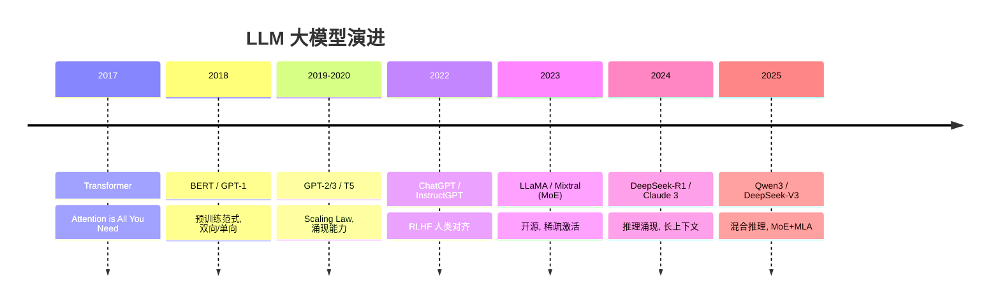

# LLM大模型演进脉络

> 整理：MelonEggLearn | 更新：2026-03-16
> 覆盖：2017年Transformer诞生 → 2025年推理时代

---

## 🆚 各代 LLM 创新对比

| 代际 | 之前方案 | 创新点 | 核心突破 |
|------|---------|--------|---------|
| Transformer | RNN/LSTM（串行计算） | **Self-Attention 并行** | 突破序列长度限制 |
| BERT | Word2Vec（静态 Embedding） | **双向预训练 + MLM** | 上下文感知表示 |
| GPT-3 | BERT（需微调） | **Scaling Law + ICL** | 规模涌现，零/少样本 |
| ChatGPT | GPT-3（无对齐） | **RLHF = SFT + RM + PPO** | 人类偏好对齐 |
| DeepSeek-R1 | ChatGPT（指令遵循） | **GRPO 纯 RL 涌现推理** | 长 CoT，AIME 80% |
| Qwen3 | 固定推理模式 | **Thinking/Non-thinking 混合** | 按需推理 |

---

## 📈 LLM 演进 Mermaid



---

## 📐 核心公式

### 1. Scaled Dot-Product Attention

$$
\text{Attention}(Q,K,V) = \text{softmax}\left(\frac{QK^T}{\sqrt{d\_k}}\right)V
$$

**直觉**：每个 token 对所有其他 token 计算注意力权重，加权求和得到新表示。$\sqrt{d\_k}$ 防止内积过大导致 softmax 饱和。

### 2. Scaling Law（Chinchilla）

$$
L(N, D) = \frac{A}{N^\alpha} + \frac{B}{D^\beta} + E
$$

**符号说明**：$N$ 参数量，$D$ 训练 token 数，$A, B, \alpha, \beta, E$ 为拟合常数。

**直觉**：Loss 随参数量和数据量幂律下降，存在最优比例——Chinchilla 发现应保持 $D \approx 20N$，而 GPT-3 严重"过参数化"。

---

## ASCII 演进时间线

```
2017            2018            2019            2020            2021
 |               |               |               |               |
[Transformer] [BERT/GPT-1]   [GPT-2/XLNet]  [GPT-3/T5]   [InstructGPT]
 Attention      预训练范式       语言模型规模    涌现能力         RLHF萌芽
 is All You     双向/单向       扩展之路        Scaling Law     指令微调
 Need           Encoder/Decoder                                FLAN
 |               |               |               |               |
 +───────────────+───────────────+───────────────+───────────────+

2022            2023            2024            2025
 |               |               |               |
[ChatGPT/RLHF] [LLaMA/LoRA]  [MoE/推测解码]  [o1/DeepSeek-R1]
 Constitutional  开源爆发        高效推理         推理时代
 AI / DPO        量化GPTQ/AWQ   Mixtral          CoT蒸馏
 对齐技术        Qwen/Baichuan  DeepSeek-V2      Test-Time Compute
 |               |               |               |
 +───────────────+───────────────+───────────────+

关键里程碑：
  2017-06  ★ Attention is All You Need（Vaswani et al.，Google Brain）
  2018-10  ★ BERT：双向预训练，NLP各任务SOTA
  2018-06  ★ GPT-1：生成式预训练开山
  2020-05  ★ GPT-3：175B参数，few-shot学习，Scaling Law验证
  2022-01  ★ InstructGPT：RLHF对齐人类意图
  2022-11  ★ ChatGPT发布：LLM进入大众视野
  2023-02  ★ LLaMA开源：开源社区爆发
  2023-05  ★ LoRA/QLoRA：平民化微调
  2023-12  ★ Mixtral 8x7B：MoE架构突破
  2024-05  ★ DeepSeek-V2：MLA注意力，百万上下文
  2025-01  ★ DeepSeek-R1：纯RL推理链，o1级别性能
```

---

## 阶段1：Transformer诞生（2017-2018）

### 1.1 背景与关键突破

**时代背景：**
- 2017年前，NLP主流：RNN/LSTM/GRU序列模型
- RNN致命缺陷：
  - 串行计算，无法并行（训练慢）
  - 长程依赖消失（梯度消失/爆炸）
  - 序列越长，早期信息衰减越严重

**关键突破：Attention is All You Need（2017.06，Google Brain）**
- 彻底抛弃RNN，纯注意力机制处理序列
- 并行计算：所有位置同时计算注意力
- 长程依赖：任意两个位置直接计算相似度，路径长度 O(1)
- 核心创新：Multi-Head Self-Attention + 位置编码

**BERT突破（2018.10，Google）：**
- 首次提出双向预训练范式（Masked Language Model）
- 超越LSTM-based模型，NLP各任务全面SOTA
- 预训练+微调范式成为主流，取代特征工程

### 1.2 核心公式/架构

**Scaled Dot-Product Attention（核心）：**

$$
\text{Attention}(Q, K, V) = \text{softmax}\left(\frac{QK^T}{\sqrt{d_k}}\right)V
$$

- $Q \in \mathbb{R}^{n \times d_k}$：Query矩阵
- $K \in \mathbb{R}^{m \times d_k}$：Key矩阵
- $V \in \mathbb{R}^{m \times d_v}$：Value矩阵
- $\sqrt{d_k}$：缩放因子，防止点积过大导致softmax饱和

**为什么除以 $\sqrt{d_k}$？**
- 假设 $q, k$ 各分量服从 $\mathcal{N}(0,1)$，则 $q \cdot k$ 的方差为 $d_k$
- 不缩放时，$d_k$ 大时点积方差大 → softmax进入梯度极小区
- 除以 $\sqrt{d_k}$ 将方差归一化为1

**Multi-Head Attention：**

$$
\text{MultiHead}(Q,K,V) = \text{Concat}(\text{head}}_{\text{1,...,\text{head}}_h)W^O
$$

$$
\text{head}}_{\text{i = \text{Attention}}(QW_i^Q, KW_i^K, VW_i^V)
$$

- h个头并行，每头维度 $d_k = d_{model}/h$
- 不同头学习不同语义（句法/语义/指代等）

**位置编码（正弦余弦）：**

$$
PE_{(pos,2i)} = \sin\left(\frac{pos}{10000^{2i/d_{model}}}\right)
$$

$$
PE_{(pos,2i+1)} = \cos\left(\frac{pos}{10000^{2i/d_{model}}}\right)
$$

**复杂度分析：**

| 操作 | 时间复杂度 | 空间复杂度 |
|------|-----------|-----------|
| Self-Attention | $O(n^2 d)$ | $O(n^2)$ |
| RNN | $O(nd^2)$ | $O(d)$ |

Self-Attention对长序列O(n²)是后续优化的核心挑战。

**Transformer架构（原始）：**

```
                    ┌──────────────────────┐
                    │      输出概率         │
                    │   Linear + Softmax   │
                    └──────────┬───────────┘
                               │
                    ┌──────────┴───────────┐   N×
                    │  Decoder Block       │
                    │  ┌─────────────────┐ │
                    │  │ Cross-Attention │ │
                    │  └────────┬────────┘ │
                    │  ┌────────┴────────┐ │
                    │  │ Masked MHA      │ │
                    │  └────────┬────────┘ │
                    └──────────┼───────────┘
                               │ (K, V from Encoder)
                    ┌──────────┴───────────┐   N×
                    │  Encoder Block       │
                    │  ┌─────────────────┐ │
                    │  │  Multi-Head     │ │
                    │  │  Self-Attention │ │
                    │  └────────┬────────┘ │
                    │  ┌────────┴────────┐ │
                    │  │    FFN          │ │
                    │  └─────────────────┘ │
                    └──────────────────────┘
                               │
                    ┌──────────┴───────────┐
                    │  Input Embedding     │
                    │  + Position Encoding │
                    └──────────────────────┘
```

**BERT vs GPT-1 架构对比：**

| 维度 | BERT | GPT-1 |
|------|------|-------|
| 架构 | Encoder-only | Decoder-only |
| 注意力 | 双向（全局） | 单向（因果掩码） |
| 预训练目标 | MLM + NSP | CLM（下一词预测） |
| 适合任务 | NLU（分类/NER/QA） | NLG（文本生成） |
| 参数量 | 110M/340M | 117M |
| 下游 | 微调各任务头 | 无条件生成 |

**BERT预训练目标：**

$$
\mathcal{L}_{MLM} = -\mathbb{E}[\log P(x_{mask} | x_{visible})]
$$

- 随机遮盖15%的token（80%替换为[MASK]，10%随机词，10%原词）
- NSP（Next Sentence Prediction）：判断两句是否相邻（后来被证明作用有限）

### 1.3 代表模型

| 模型 | 机构 | 年份 | 参数 | 贡献 |
|------|------|------|------|------|
| Transformer | Google Brain | 2017 | — | 奠定架构基础 |
| GPT-1 | OpenAI | 2018 | 117M | 生成式预训练 |
| BERT-base | Google | 2018 | 110M | 双向预训练SOTA |
| BERT-large | Google | 2018 | 340M | 预训练+微调范式 |
| XLNet | CMU/Google | 2019 | 340M | 排列语言模型 |

### 1.4 工程挑战

- **显存瓶颈**：Self-Attention O(n²)显存，长序列OOM
- **训练不稳定**：深层Transformer梯度消失，需要warmup和精细LR调度
- **预训练成本**：BERT在TPU上训练4天（当时算力匮乏）
- **微调策略**：每个任务需要额外分类头，任务不兼容

### 1.5 面试必考点

**Q1: Transformer为什么比RNN好？**
- 并行计算（RNN串行，Transformer O(1)并行）
- 长程依赖路径短（O(1) vs O(n)）
- 但对长序列显存O(n²)是缺点

**Q2: Self-Attention复杂度是多少？为什么是瓶颈？**
- 时间：O(n²d)，空间：O(n²)
- n是序列长度，n=1024时注意力矩阵已达1M元素
- 长文档/代码是核心瓶颈，催生FlashAttention、稀疏注意力等

**Q3: BERT为什么不能直接用于生成任务？**
- 双向注意力在预训练时看到"未来"token
- 生成时需要自回归，但训练目标不一致
- 直接生成会有训练-推理不一致问题

**Q4: MLM的15%遮盖比例怎么确定的？**
- 经验值：太小学不到足够信息，太大失去上下文信息
- 后续研究（SpanBERT等）探索span-level遮盖效果更好

---

## 阶段2：GPT扩展与涌现能力（2019-2020）

### 2.1 背景与关键突破

**背景：**
- BERT主导NLU，但生成能力受限
- OpenAI坚持Decoder-only路线，持续扩大规模
- 关键洞察：语言模型规模扩大，能力出现质变（涌现）

**GPT-2（2019.02）关键突破：**
- 参数量达1.5B，比GPT-1大10倍
- 无需微调，zero-shot在多任务上接近SOTA
- 提出语言模型作为多任务学习的统一框架
- 因"太危险"初期未完全开放（后来证明是营销）

**GPT-3（2020.05）颠覆性突破：**
- 参数量175B，当时最大语言模型
- Few-shot in-context learning（ICL）：几个例子即可解决新任务
- 不更新参数，纯靠prompt完成各类任务
- Scaling Law验证：更多数据+更大模型→性能可预测提升

### 2.2 核心公式/架构

**CLM预训练目标（因果语言模型）：**

$$
\mathcal{L}_{CLM} = -\sum_{t=1}^{T} \log P(x_t | x_1, ..., x_{t-1}; \theta)
$$

**因果掩码（Causal Mask）：**

$$
M_{ij} =
\begin{cases}
0 & \text{if } i \geq j \\
-\infty & \text{if } i < j
\end{cases}
$$

$$
\text{Attention}(Q,K,V) = \text{softmax}\left(\frac{QK^T + M}{\sqrt{d_k}}\right)V
$$

**Scaling Law（Kaplan et al., 2020）：**

模型损失与计算量、参数量、数据量的幂律关系：

$$
L(N) \approx \left(\frac{N_c}{N}\right)^{\alpha_N}
$$

$$
L(D) \approx \left(\frac{D_c}{D}\right)^{\alpha_D}
$$

$$
L(C) \approx \left(\frac{C_c}{C_{min}}\right)^{\alpha_C}
$$

其中 $N$=参数量，$D$=数据量，$C$=计算量（FLOPs）

**核心结论：**
- 性能随三个因素以幂律提升，且互相独立
- 最优分配：$C_{min} \approx 6ND$（训练一个token需要约6N FLOPs）
- **Chinchilla Scaling Law（2022年修正）**：$N_{opt} \propto C^{0.5}$，数据应与参数等比增长

**GPT-2架构改进（vs GPT-1）：**

```
改进点：
1. Layer Norm 移到每个子层输入（Pre-LN → 更稳定）
2. 最终层额外加 Layer Norm
3. 初始化残差路径权重按 1/√(层数) 缩放
4. 词表扩充到50,257（BPE）
5. 上下文从512→1024 tokens
```

**In-Context Learning（ICL）机制：**

```
Prompt格式（few-shot）：
  翻译：中→英
  例1：你好 → Hello
  例2：谢谢 → Thank you
  目标：再见 → ?

模型无需更新参数，通过注意力机制"学习"示例规律
原理：预训练时见过大量此类格式，ICL本质是隐式梯度下降
```

### 2.3 代表模型

| 模型 | 年份 | 参数 | 关键能力 | 备注 |
|------|------|------|---------|------|
| GPT-2 | 2019 | 1.5B | zero-shot多任务 | 首次zero-shot实用 |
| GPT-3 | 2020 | 175B | few-shot ICL | 验证Scaling Law |
| T5 | 2019 | 11B | Text-to-Text统一框架 | Enc-Dec架构 |
| RoBERTa | 2019 | 355M | BERT改进版 | 去NSP，更多数据 |
| ALBERT | 2019 | 18M~235M | 参数共享 | 轻量级BERT |

### 2.4 工程挑战

- **训练规模**：GPT-3使用数千个A100，训练成本约460万美元
- **数据质量**：WebText（Reddit高赞链接），Common Crawl去重过滤
- **并行策略**：数据并行+模型并行+流水线并行（3D并行）
- **数值稳定**：FP16混合精度，梯度Clip，学习率调度
- **推理成本**：175B模型推理需要多张A100，用户难以访问

### 2.5 面试必考点

**Q1: 什么是Scaling Law？对工程实践有什么指导意义？**
- 损失与N/D/C呈幂律关系，可预测
- 指导意义：给定计算预算，如何最优分配参数量和数据量
- Chinchilla：模型和数据等比扩展（GPT-3数据不足，重新训练Chinchilla证明）

**Q2: In-Context Learning的原理是什么？**
- 不更新参数，通过prompt"提示"模型
- 理论解释1：隐式梯度下降（Meta-learning视角）
- 理论解释2：贝叶斯推断，更新先验到后验
- 实践限制：受上下文窗口限制，对示例顺序敏感

**Q3: GPT-3的few-shot vs fine-tuning哪个更好？**
- 大多数任务：fine-tuning > few-shot
- 优势：数据标注少，无需额外训练
- 劣势：不稳定，对prompt敏感，成本高（每次推理带示例）

**Q4: 为什么GPT用Decoder-only而不是Encoder-Decoder？**
- 统一的生成框架，任何任务都可以转为text-to-text
- 推理时只需KV-cache，效率高
- 涌现能力随规模提升更明显（实验证明）

---

## 阶段3：指令微调时代（2021-2022）

### 3.1 背景与关键突破

**背景问题：**
- GPT-3强大但不好用：需要复杂prompt工程
- Few-shot不稳定：示例顺序、格式敏感
- 不会"听话"：模型擅长补全，不擅长遵循指令
- 核心矛盾：**预训练目标（预测下一词）≠ 用户意图（有用的回答）**

**InstructGPT关键突破（2022.01，OpenAI）：**
- RLHF（从人类反馈中强化学习）三阶段训练
- 用1.3B的InstructGPT > 175B的GPT-3（人类偏好评测）
- "Alignment Tax"首次量化：对齐后能力略下降但更有用
- 为ChatGPT铺路

**FLAN系列突破（2021，Google）：**
- Instruction tuning：在137个任务上微调，提升zero-shot
- T0（BigScience）：类似思路，开源
- 核心发现：任务越多越多样，zero-shot越强

**Chain-of-Thought（CoT，2022.01，Google）：**
- 让模型"展示推理过程"，大幅提升复杂推理
- Few-shot CoT：在示例中加推理步骤
- Zero-shot CoT："Let's think step by step"
- 仅在大模型（>100B）上有效，小模型无效

### 3.2 核心公式/架构

**RLHF三阶段训练：**

```
阶段1: SFT（监督微调）
  数据：人工标注的(prompt, 高质量response)对
  目标：$\mathcal{L}_{SFT} = -\mathbb{E}[\log \pi_{SFT}(y|x)]$

阶段2: RM（奖励模型训练）
  数据：同一prompt的多个response，人工排序
  目标：$\mathcal{L}_{RM} = -\mathbb{E}[\log \sigma(r_\theta(x,y_w) - r_\theta(x,y_l))]$
  其中 $y_w$=偏好response，$y_l$=劣质response

阶段3: PPO强化学习
  目标：最大化期望奖励，同时限制与SFT模型的KL散度
  $\mathcal{L}_{PPO} = \mathbb{E}[r_\theta(x,y) - \beta \cdot KL(\pi_{RL} || \pi_{SFT})]$
  其中 $\beta$ 控制对齐程度（防止reward hacking）
```

**奖励模型架构：**

```
输入：[prompt; response]
→ LM主干（冻结或微调）
→ 最后token的隐状态
→ 线性层 → 标量得分 r
```

**PPO目标函数（clip版本）：**

$$
L^{CLIP}(\theta) = \mathbb{E}_t[\min\left(r_t(\theta)\hat{A}_t, \text{clip}(r_t(\theta), 1-\epsilon, 1+\epsilon)\hat{A}_t\right)]
$$

- $r_t(\theta) = \frac{\pi_\theta(a_t|s_t)}{\pi_{\theta_{old}}(a_t|s_t)}$ 概率比
- $\hat{A}_t$：优势函数估计
- clip防止策略更新太激进

**Chain-of-Thought推理链：**

```
标准Few-shot:
  Q: Roger有5个网球，又买了2罐（每罐3个），共几个？
  A: 11个

CoT Few-shot:
  Q: Roger有5个网球，又买了2罐（每罐3个），共几个？
  A: Roger开始有5个。2罐网球，每罐3个，共6个。5+6=11个。答案：11个

Zero-shot CoT:
  Q: [问题]
  A: Let's think step by step.
```

**指令微调数据格式（Alpaca风格）：**

```json
{
  "instruction": "将以下英文翻译为中文",
  "input": "Hello world",
  "output": "你好，世界"
}
```

```
训练时只对output部分计算loss：
Prompt = [instruction + input]
Target = [output]
Loss = CrossEntropy(output tokens only)
```

### 3.3 代表模型

| 模型 | 年份 | 机构 | 贡献 |
|------|------|------|------|
| InstructGPT | 2022 | OpenAI | RLHF三阶段，对齐范式 |
| FLAN-T5 | 2021 | Google | 137任务指令微调 |
| T0 | 2021 | BigScience | 开源指令微调 |
| Codex | 2021 | OpenAI | 代码预训练，GitHub Copilot |
| ChatGPT | 2022.11 | OpenAI | RLHF+对话，打入大众 |

### 3.4 工程挑战

- **数据标注成本**：RLHF需大量人工排序，成本高昂
- **Reward Hacking**：模型找到奖励漏洞，过度优化RM而非真正有用
- **PPO不稳定**：超参敏感，训练过程难复现
- **KL惩罚系数β**：太大→改变不够，太小→偏离SFT风格
- **标注一致性**：不同标注者对"好回答"标准不一

### 3.5 面试必考点

**Q1: InstructGPT为什么比GPT-3更好用（尽管参数更小）？**
- 预训练目标（预测下一词）≠ 用户意图（有帮助的回答）
- RLHF对齐了模型输出与人类偏好
- 1.3B参数对齐后 > 175B未对齐（对话任务人类评测）

**Q2: SFT微调时为什么只对response计算loss？**
- Prompt是条件输入，不是模型需要"学习生成"的
- 如果对prompt也计算loss，模型会优化生成prompt的能力
- 实践：prompt部分token的loss mask置0

**Q3: Chain-of-Thought为什么只在大模型有效？**
- 复杂推理需要足够的"知识容量"
- 小模型（<100B）没有足够参数存储推理所需知识
- 大模型涌现出step-by-step推理能力（非线性突变）

**Q4: RLHF的Reward Hacking如何缓解？**
- KL散度惩罚（限制离SFT模型的距离）
- 定期更新参考模型
- 多个RM集成取平均
- Constitutional AI（规则约束替代人工）

---

## 阶段4：RLHF与对齐技术（2022-2023）

### 4.1 背景与关键突破

**背景：**
- ChatGPT（2022.11）引爆AI热潮，LLM从研究走向产品
- 对齐问题浮出水面：有害内容、幻觉、越狱攻击
- PPO复杂度高，开源社区复现困难
- 需要更简单、稳定的对齐方法

**ChatGPT突破：**
- GPT-3.5（code-davinci-002）+ RLHF对话微调
- 首次实现流畅、有帮助、安全的大规模对话
- 发布5天100万用户，2个月1亿用户

**Constitutional AI（Anthropic，2022）：**
- 用一组原则（宪法）指导模型自我批评和修正
- 减少人工标注：模型批评→修订→自监督
- CAI = SL-CAI（SFT） + RL-CAI（RLAIF）
- RLAIF：AI反馈替代人类反馈（HH-RLHF的补充）

**DPO（Direct Preference Optimization，2023.05）关键突破：**
- 发现RLHF实际上等价于一个分类问题
- 绕过RM，直接从偏好数据优化策略
- 更简单、更稳定、无需PPO

### 4.2 核心公式/架构

**DPO核心推导：**

RLHF目标函数：

$$
\max_{\pi_\theta} \mathbb{E}_{x \sim D, y \sim \pi_\theta}[r(x,y)] - \beta \cdot KL[\pi_\theta(y|x) || \pi_{ref}(y|x)]
$$

**最优解析解：**

$$
\pi^*(y|x) = \frac{\pi_{ref}(y|x) \exp(r(x,y)/\beta)}{Z(x)}
$$

由此推导奖励可由策略表示：

$$
r(x,y) = \beta \log \frac{\pi^*(y|x)}{\pi_{ref}(y|x)} + \beta \log Z(x)
$$

代入Bradley-Terry偏好模型：

$$
p^*(y_w \succ y_l | x) = \sigma(r^*(x,y_w) - r^*(x,y_l))
$$

**DPO最终目标（无需RM）：**

$$
\mathcal{L}_{DPO}(\pi_\theta; \pi_{ref}) = -\mathbb{E}_{(x,y_w,y_l) \sim D}[\log \sigma\left(\beta \log \frac{\pi_\theta(y_w|x)}{\pi_{ref}(y_w|x)} - \beta \log \frac{\pi_\theta(y_l|x)}{\pi_{ref}(y_l|x)}\right)]
$$

**DPO vs PPO 对比：**

| 维度 | PPO（RLHF） | DPO |
|------|------------|-----|
| 奖励模型 | 需要单独训练RM | 不需要 |
| 训练稳定性 | 不稳定，超参多 | 稳定，类似SFT |
| 实现复杂度 | 高（4个模型同时跑） | 低（2个模型） |
| 性能 | 通常略强 | 接近PPO，差距缩小 |
| 显存占用 | 极大 | 可接受 |
| 适合场景 | 大规模对齐 | 轻量对齐/开源 |

**Constitutional AI（CAI）流程：**

```
Step1: 生成有害回复
  Prompt → LLM → 有害回复 y_harmful

Step2: 自我批评（根据宪法原则）
  "以上回复是否违反'不应鼓励非法行为'？请指出问题"
  → LLM批评 critique

Step3: 修订
  "请根据批评重写回复"
  → LLM → 修订回复 y_revised

Step4: 构建偏好对
  (y_revised, y_harmful) → RLAIF训练数据

宪法原则示例：
  - 不应提供危险信息
  - 应诚实承认不确定性
  - 应尊重人的自主性
```

### 4.3 代表模型

| 模型 | 年份 | 机构 | 方法 | 特点 |
|------|------|------|------|------|
| ChatGPT | 2022.11 | OpenAI | RLHF | 产品级对话AI |
| Claude 1 | 2023.03 | Anthropic | CAI+RLHF | Constitutional AI |
| GPT-4 | 2023.03 | OpenAI | RLHF+RLAIF | 多模态，强大推理 |
| Llama 2-Chat | 2023.07 | Meta | RLHF | 开源对话模型 |
| Zephyr | 2023.10 | HuggingFace | DPO | 7B DPO对齐 |
| Mistral-7B | 2023.09 | Mistral | SFT+DPO | 强7B基座 |

### 4.4 工程挑战

- **4模型同时内存**：PPO需要Actor/Critic/RM/RefModel四个模型
- **训练不稳定**：PPO的clip参数、GAE λ等超参调试困难
- **Reward Model过拟合**：RM打分分布漂移，需要EMA更新
- **越狱攻击**：对齐模型仍可通过adversarial prompt绕过
- **幻觉问题**：RLHF不能完全解决，模型会自信地说错

### 4.5 面试必考点

**Q1: DPO相比RLHF的核心优势是什么？**
- 绕过RM，直接优化偏好
- 实现简单：去掉RM训练和PPO，只需SFT风格训练
- 稳定性高：没有RL训练的不稳定问题
- 缺点：隐式RM，难以调试；对数据质量敏感

**Q2: RLHF中KL散度惩罚的作用是什么？**
- 防止策略偏离参考模型太远（对齐税）
- 防止reward hacking（极端输出）
- β值调节：大→保守，小→激进
- 无KL约束会导致模型输出退化（重复短句得高分等）

**Q3: Constitutional AI和RLHF有什么区别？**
- RLHF：人类标注偏好 → 训练RM → RL优化
- CAI：规则（宪法）+ LLM自我评判 → RLAIF → RL优化
- CAI优势：减少人工，可扩展，规则透明可审查
- RLAIF：AI反馈替代（部分）人类反馈

**Q4: 什么是对齐税（Alignment Tax）？**
- 对齐后模型在某些能力指标（如代码/数学）略有下降
- 因为RLHF偏向"有帮助、无害"，可能损失部分知识密度
- 工程缓解：混合预训练数据和SFT数据训练

---

## 阶段5：高效化时代（2023至今）

### 5.1 背景与关键突破

**背景：**
- LLaMA（Meta，2023.02）开源7B~65B模型，民主化LLM
- 全量微调175B+ 需要数百A100，个人/小机构无法参与
- 需要参数高效微调（PEFT）方法
- 推理成本成为核心瓶颈（Token生成速度、显存）
- MoE架构重回视野，同等效果显著降低计算量

**LoRA关键突破（2021，Microsoft）：**
- 假设权重更新矩阵低秩
- 只训练两个小矩阵 A、B，参数量减少10000倍
- 训练完合并到原模型，推理无额外开销

**QLoRA（2023.05，华盛顿大学）：**
- 4bit量化基座模型 + LoRA微调
- 65B模型可在单张48GB A100上微调
- NF4（Normal Float 4）量化保留信息熵

**量化技术（GPTQ/AWQ）：**
- 将权重从FP16压缩到INT8/INT4
- 推理时显存减半/四分之一，延迟下降
- GPTQ：逐层量化，基于二阶Hessian
- AWQ：保护关键权重（激活值大的），更高精度

**推测解码（Speculative Decoding）：**
- 小模型快速草稿 + 大模型并行验证
- 生成速度提升2-3x，不损失质量

**MoE（专家混合）架构复兴：**
- Mixtral 8x7B（2023.12）：8个专家，每次激活2个
- DeepSeek-V2/V3：MLA注意力 + MoE
- 等效参数增大，实际计算不变

### 5.2 核心公式/架构

**LoRA（Low-Rank Adaptation）：**

预训练权重矩阵 $W_0 \in \mathbb{R}^{d \times k}$，更新：

$$
W = W_0 + \Delta W = W_0 + BA
$$

- $B \in \mathbb{R}^{d \times r}$，$A \in \mathbb{R}^{r \times k}$，秩 $r \ll \min(d,k)$
- 初始化：A ~ 高斯，B = 0（训练开始时 $\Delta W = 0$）
- 缩放：$\Delta W = \frac{\alpha}{r} BA$，$\alpha$ 是超参（通常 = r）

**参数量对比：**

$$
\text{原始参数} = dk
$$

$$
\text{LoRA参数} = r(d+k) \ll dk \quad \text{当 } r \ll \min(d,k)
$$

例：$d=k=4096, r=16$：
- 原始：16M参数
- LoRA：2×4096×16 = 131K参数
- 压缩比：约120:1

**QLoRA流程：**

```
1. 基座模型量化为NF4（4-bit）
   W_fp16 → W_nf4  （显存减少4x）

2. 双量化（Double Quantization）
   量化常数本身也量化（额外节省0.5 bit/参数）

3. 分页优化器（Paged Optimizer）
   梯度检查点内存峰值时分页到CPU

4. LoRA层保持BF16
   只有LoRA矩阵A,B用全精度计算

反量化计算：
   x_fp16 = dequantize(x_nf4, c_fp32)
   y = x_fp16 @ W_fp16  （实际BF16计算）
```

**NF4量化公式（Normalized Float 4）：**

$$
q_i = \frac{1}{2^{b-1}} \cdot \lfloor 2^{b-1} \cdot \text{quantile}\left(\mathcal{N}(0,1), \frac{i}{2^b}\right) \rceil
$$

基于正态分布分位数均匀分布信息量（最优4bit量化for正态分布权重）

**GPTQ量化（逐层最优量化）：**

目标：最小化量化前后输出误差

$$
\min_{\hat{W}} || WX - \hat{W}X ||_2^2
$$

基于Optimal Brain Compression（OBC），利用Hessian矩阵：

$$
H_F = 2XX^T
$$

逐列量化，用逆Hessian传递误差补偿到未量化列：

$$
\delta_F = -\frac{w_q - \hat{w}_q}{[H_F^{-1}]_{qq}} (H_F^{-1})_{:,q}
$$

**AWQ（Activation-aware Weight Quantization）：**

发现：约1%的"重要"权重（对应激活值大的输入通道）需要保护

$$
\text{重要性分数} = s_j = \mathbb{E}[|x_j|]
$$

$$
\hat{W}_{:,j} = W_{:,j} \cdot s_j, \quad \hat{x}_j = x_j / s_j
$$

通过缩放保护重要通道，等效于高精度保留（实际量化仍是INT4）

**推测解码（Speculative Decoding）：**

```
标准自回归生成：
  大模型逐token生成：O(n)次串行前向传播

推测解码：
  Step1: 小草稿模型（Draft）并行生成γ个token候选
  Step2: 大目标模型（Target）一次前向验证所有γ个token
  Step3: 按接受概率决定保留哪些token
  
接受条件：
  token t被接受当且仅当：
  rand() < min(1, p_target(t) / p_draft(t))

期望加速比：
  speedup ≈ (1 + β + β² + ... + βγ) / (1 + γ/c)
  β = 接受率，c = 大小模型速度比
```

**MoE（Mixture of Experts）：**

FFN替换为多个专家FFN + 路由器：

$$
\text{MoE}(x) = \sum_{i=1}^{K} G(x)_i \cdot E_i(x)
$$

**Top-K路由（Mixtral使用Top-2）：**

$$
G(x) = \text{TopK}(\text{softmax}(xW_g), K)
$$

$$
\text{MoE输出} = G_1 E_1(x) + G_2 E_2(x)
$$

**负载均衡损失（防止专家崩溃）：**

$$
\mathcal{L}_{aux} = \alpha \cdot N \cdot \sum_{i=1}^{N} f_i \cdot P_i
$$

- $f_i$：专家i处理的token比例
- $P_i$：路由器分配给专家i的概率均值

**DeepSeek-V2 MLA（Multi-head Latent Attention）：**

将K、V压缩到低维潜在向量，大幅减少KV-Cache：

$$
c_{KV} = W_{DKV} x \quad \text{（低维压缩，维度} d_c \ll h \cdot d_k\text{）}
$$

$$
K = W_{UK} c_{KV}, \quad V = W_{UV} c_{KV}
$$

KV-Cache只存 $c_{KV}$（低维），减少5~13x显存

### 5.3 代表模型

**开源基座模型：**

| 模型 | 年份 | 机构 | 参数 | 关键技术 |
|------|------|------|------|---------|
| LLaMA | 2023.02 | Meta | 7B~65B | 开源，RoPE，RMSNorm |
| LLaMA-2 | 2023.07 | Meta | 7B~70B | GQA，RLHF对话版 |
| LLaMA-3 | 2024.04 | Meta | 8B/70B | 128K上下文，GQA |
| Mistral-7B | 2023.09 | Mistral | 7B | SWA，GQA，强基座 |
| Mixtral 8x7B | 2023.12 | Mistral | 8×7B MoE | Top-2路由，46.7B参数 |

**中文/国产模型：**

| 模型 | 年份 | 机构 | 参数 | 特点 |
|------|------|------|------|------|
| Qwen-7B | 2023.09 | 阿里 | 7B | 中文优化，强代码 |
| Qwen2.5 | 2024 | 阿里 | 0.5B~72B | 多规格，强数学 |
| Baichuan2 | 2023.09 | 百川 | 7B~13B | 中文基准SOTA |
| ChatGLM3 | 2023 | 智谱 | 6B | 中文对话，工具调用 |
| Yi-34B | 2023 | 零一万物 | 34B | 长上下文 |

**DeepSeek系列：**

| 模型 | 年份 | 参数 | 关键技术 | 意义 |
|------|------|------|---------|------|
| DeepSeek-V2 | 2024.05 | 236B MoE | MLA + MoE | 百万Token上下文 |
| DeepSeek-V3 | 2024.12 | 671B MoE | FP8训练，MTP | 媲美GPT-4 |
| DeepSeek-R1 | 2025.01 | 671B MoE | 纯RL推理链 | o1级推理，开源 |

### 5.4 工程挑战

**微调工程：**
- LoRA秩选择：r过小欠拟合，r过大接近全量微调
- 目标模块选择：Q/K/V/O/Gate/Up/Down哪些加LoRA
- 学习率调度：余弦退火，warmup步数
- 数据质量 > 数据量：10K高质量 > 1M低质量

**量化工程：**
- 量化精度权衡：INT4质量损失 > INT8
- 激活量化（A8W8）难于权重量化（W4）
- KV-Cache量化（KV8/KV4）进一步节省显存
- 校准数据集选择影响量化质量

**推理优化：**
- Continuous Batching：动态批处理，提升GPU利用率
- FlashAttention：IO感知注意力计算，节省显存访问
- PagedAttention（vLLM）：KV-Cache内存分页，减少碎片
- TensorRT-LLM / SGLang：生产级推理框架

**分布式训练：**
- 数据并行（DDP）+ 张量并行（TP）+ 流水线并行（PP）
- ZeRO（零冗余优化器）：分片优化器状态/梯度/参数
- 混合精度（BF16）+ 梯度检查点

### 5.5 面试必考点

**Q1: LoRA的核心假设是什么？为什么有效？**
- 假设：LLM微调时权重更新矩阵是低秩的
- 理论支撑：预训练模型内在维度低（Aghajanyan et al.）
- 有效原因：微调只需调整有限方向的知识，不需要全秩更新
- 实践：r=8~64通常已足够，A加减投影层，B加Query/Value

**Q2: QLoRA如何在单卡上微调65B模型？**
- 4bit量化：65B × 2B/param（FP16） → 65B × 0.5B/param（NF4）= ~32GB
- LoRA层（BF16）：额外约1-2GB
- 分页优化器：梯度峰值内存溢出时分页CPU
- 总计：~48GB A100可承载

**Q3: GPTQ和AWQ量化的区别？**
- GPTQ：逐层最优量化，利用Hessian补偿误差；速度慢但精度高
- AWQ：激活感知，保护重要权重通道；速度快，精度接近GPTQ
- 实践：AWQ推理速度更快（better kernel support），GPTQ更成熟

**Q4: MoE模型的专家崩溃问题是什么？如何解决？**
- 问题：路由器总把token发给少数专家，其他专家"饿死"
- 解决：
  1. 辅助负载均衡损失（均匀化专家使用率）
  2. Expert Capacity上限（超出丢弃或路由其他专家）
  3. 随机路由噪声（训练时加Gumbel噪声）
  4. Token选择 vs 专家选择（不同路由策略）

**Q5: 推测解码的适用条件是什么？**
- 需要一个足够好的草稿模型（接受率要高）
- 适合：简单重复任务（代码补全、翻译）接受率高
- 不适合：高创意任务（接受率低，加速不明显）
- 实践变种：Medusa（多头草稿）、Eagle（特征级推测）

---

## 阶段6：推理时代与长上下文（2024-2025）

### 6.1 背景与关键突破

**背景：**
- GPT-4 / Claude 3系列在推理任务（数学/代码）上仍有瓶颈
- OpenAI o1（2024.09）引入Test-Time Compute（推理时算力）
- 发现：让模型"多想一会儿"比直接回答效果好得多
- 长上下文需求（RAG→Native Context）：1M token成为标配

**Test-Time Compute关键突破：**
- o1：内部CoT推理链，通过RL训练"慢思考"能力
- 推理时scaling：更多计算→更好答案（与Scaling Law互补）
- DeepSeek-R1：纯RL训练，无需监督链，自发涌现推理链

**长上下文技术：**
- RoPE位置外推：YaRN/LongRoPE/动态NTK
- Ring Attention：分布式长序列注意力
- 混合检索+全文：RAG + 长上下文协同

### 6.2 核心公式/架构

**RoPE位置外推（NTK-aware）：**

原始RoPE在训练长度外性能下降，NTK方法：

$$
\theta_i' = \theta_i \cdot \left(\frac{L'}{L}\right)^{-\frac{2i}{d}}
$$

YaRN进一步分段：
- 低频维度（位置相关）：插值缩放
- 高频维度（局部语义）：保持原值

**o1/R1推理流程：**

```
标准SFT回答：
  Q → 模型 → A

o1推理：
  Q → [内部CoT推理链（不展示）] → A
         ↑
    RL训练：正确答案奖励+1，错误-1
    Process Reward Model（PRM）：步骤级奖励

DeepSeek-R1-Zero（纯RL）：
  1. 初始化：DeepSeek-V3-Base
  2. RL训练：GRPO（Group Relative Policy Optimization）
     不需要PRM，直接用格式+正确性奖励
  3. 涌现：自发出现"aha moment"、自我验证、回溯
```

**GRPO（Group Relative Policy Optimization）：**

$$
\mathcal{L}_{GRPO} = -\mathbb{E}[\sum_{i=1}^{G} \frac{r_i - \bar{r}}{\sigma_r} \cdot \log \pi_\theta(o_i|q) - \beta \cdot KL(\pi_\theta || \pi_{ref})]
$$

- 对同一问题生成G个输出，相对排名作为奖励
- 避免了PRM需要大量步骤标注的问题

### 6.3 代表模型

| 模型 | 年份 | 机构 | 关键能力 |
|------|------|------|---------|
| GPT-4o | 2024 | OpenAI | 多模态，实时语音 |
| Claude 3.5 Sonnet | 2024 | Anthropic | 代码/分析强 |
| Gemini 1.5 Pro | 2024 | Google | 1M Token上下文 |
| o1 / o3 | 2024 | OpenAI | 推理链，数学/代码 |
| DeepSeek-R1 | 2025 | DeepSeek | 开源o1级推理 |
| Qwen2.5-Max | 2025 | 阿里 | 中文推理SOTA |

---

## 演进规律总结

### 核心演进主线

```
预训练语言模型
  └→ 规模扩展（Scaling Law）
       └→ 对齐人类意图（RLHF/DPO）
            └→ 高效部署（量化/LoRA）
                 └→ 推理能力（CoT/RL）
                      └→ 长上下文/多模态
```

### 七大技术演进规律

**规律1：规模定律（Scaling Law）驱动**
- 参数量、数据量、计算量以幂律驱动性能
- 但涌现能力是非线性的质变（emergent abilities）
- 近期：Test-Time Compute是第四个维度的Scaling

**规律2：架构从多样到收敛**
- 2017-2021：Encoder-only / Decoder-only / Encoder-Decoder并存
- 2022至今：Decoder-only主导（LLM统一范式）
- 子模块：MHA → GQA/MQA（推理优化）→ MLA（DeepSeek）

**规律3：训练从预训练到对齐到强化**
- 第一阶段：预训练（CLM/MLM，无监督）
- 第二阶段：指令微调SFT（有监督，有标签）
- 第三阶段：RLHF/DPO（偏好学习）
- 第四阶段：RL推理（过程奖励，自我博弈）

**规律4：效率从模型到推理全链条优化**

```
训练效率：Flash Attention → ZeRO → FP8训练
参数效率：LoRA → QLoRA → DoRA → LoRA+
推理效率：量化(INT8/INT4) → KV-Cache → 推测解码 → MoE
显存效率：GQA/MQA → MLA → PagedAttention
```

**规律5：开源追赶闭源，中文模型追赶英文**
- 2023：LLaMA开源 → 6个月追赶GPT-3.5水平
- 2024：Qwen/DeepSeek → 接近GPT-4水平
- 2025：DeepSeek-R1 → 开源达到o1水平

**规律6：数据比算法更关键**
- "Data is the new oil" 在LLM时代尤为真实
- 数据质量 > 数据量（10K高质量 > 1M低质量）
- 合成数据（Self-Instruct/Orca/Alpaca）弥补数据稀缺
- 数据飞轮：更好模型→更好合成数据→更好模型

**规律7：推理时算力成新战场**
- 训练时Scaling遇到瓶颈（数据/算力上限）
- Test-Time Compute：推理时多想→提升质量
- Best-of-N / MCTS / Process Reward Model
- o1/R1证明：推理链质量 > 模型规模（在推理任务上）

### 关键技术节点对比

| 节点 | 核心问题 | 解决方案 | 影响 |
|------|---------|---------|------|
| Transformer | 序列建模效率 | 注意力机制替代RNN | 奠基 |
| BERT | 预训练范式 | MLM双向预训练 | NLU SOTA |
| GPT-3 | 通用能力 | 175B Scaling | ICL涌现 |
| InstructGPT | 对齐 | RLHF三阶段 | 有用AI |
| ChatGPT | 产品化 | 对话RLHF | 破圈 |
| LLaMA | 开源 | 开放权重 | 生态爆发 |
| LoRA | 微调成本 | 低秩分解 | 平民微调 |
| Mixtral | 推理成本 | MoE架构 | 高效大模型 |
| DeepSeek-R1 | 推理能力 | 纯RL | 开源o1 |

---

## 面试高频问题

### Q1: Transformer的时间复杂度是多少？有哪些优化方法？

**答：**
- Self-Attention：$O(n^2 d)$ 时间，$O(n^2)$ 空间（n=序列长度）
- 长序列瓶颈：n=4096时注意力矩阵16M元素

**优化方向：**
1. **FlashAttention（IO感知）**：分块计算，减少HBM读写次数，速度2-4x，显存O(n)
2. **稀疏注意力**：局部窗口（Longformer）+ 全局token（BigBird），O(n)
3. **线性注意力**：近似kernel化，$O(nd^2)$（Performer/Hyper）
4. **GQA/MQA**：减少KV头数，降低KV-Cache显存和带宽

---

### Q2: LoRA为什么有效？r值怎么选？

**答：**
- 核心假设：微调权重更新 $\Delta W$ 是低秩矩阵（实验支撑）
- 有效性：微调只需调整少数"方向"，不需要全秩变化
- r值选择：
  - r=4~16：轻量任务（分类/格式）
  - r=32~64：复杂任务（指令/推理）
  - r=128+：接近全量微调效果
- 实践建议：先用r=16，insufficient时翻倍

**LoRA加在哪些权重？**
- 通常：Q, V（最重要）
- 更好：Q, K, V, O（注意力全加）
- 最好：+ FFN的Gate/Up/Down（任务需要更多知识时）

---

### Q3: RLHF和DPO各有什么优缺点？实际怎么选？

**答：**

| 维度 | RLHF(PPO) | DPO |
|------|-----------|-----|
| 复杂度 | 高（4个模型） | 低（2个模型） |
| 稳定性 | 不稳定 | 稳定 |
| 性能上限 | 更高 | 略低 |
| 数据要求 | 排序数据 | 偏好对 |

**实际选择：**
- 资源有限/快速迭代：DPO（更简单，90%效果）
- 生产大模型/性能优先：PPO（更强，OpenAI用）
- 折中：SimPO/IPO（DPO变体，更稳定）

---

### Q4: 什么是涌现能力（Emergent Abilities）？

**答：**
- 定义：模型规模达到某个阈值时，突然出现的能力（小模型没有）
- 例子：
  - 100B以上：Chain-of-Thought推理
  - 50B以上：算术计算
  - 多语言：跨语言迁移
- 争议：Wei et al.认为是真涌现；Schaeffer et al.认为是度量指标非线性
- 工程意义：不要期待小模型有大模型的能力（CoT无效等）

---

### Q5: 描述KV-Cache的工作原理和优化方法

**答：**

**工作原理：**
```
自回归生成第t个token时：
  需要计算 Attention(q_t, K_{1:t}, V_{1:t})
  K_{1:t-1}, V_{1:t-1} 在之前步骤已计算
  → 缓存K/V，只计算新token的k_t, v_t
  
显存：2 × n_layers × n_heads × d_head × seq_len × bytes_per_param
```

**优化方法：**
1. **GQA/MQA**：减少KV头数（LLaMA2：32Q→8KV）
2. **KV Cache量化**：INT8/INT4压缩（精度略损）
3. **PagedAttention（vLLM）**：分页管理，减少碎片
4. **MLA（DeepSeek）**：低维潜在压缩，减少5-13x
5. **Sliding Window**：只保留最近W个token的KV

---

### Q6: 解释Scaling Law及其工程指导意义

**答：**

**Kaplan Scaling Law（2020）：**

$$
L(N,D) \approx \left(\frac{N_c}{N}\right)^{\alpha_N} + \left(\frac{D_c}{D}\right)^{\alpha_D}
$$

**Chinchilla Law（2022修正）：**
- 最优：$N_{opt} \approx C^{0.5}$，$D_{opt} \approx C^{0.5}$
- 即：训练token数应约等于20×参数量
- GPT-3（175B）只训练300B token → 数据不足
- Chinchilla（70B）训练1.4T token → 更优

**工程意义：**
1. 给定算力预算 $C$，如何分配 $N$（参数）vs $D$（数据）
2. 预测：更大模型 = 更可预测的改进
3. 数据瓶颈正在到来（互联网数据接近用尽）
4. 合成数据（Self-play/蒸馏）是下一个数据来源

---

### Q7: 什么是幻觉（Hallucination）？有哪些缓解方法？

**答：**

**定义：** 模型生成与事实不符但听起来合理的内容

**原因：**
1. 预训练数据噪声/错误
2. RLHF偏向自信流畅的回答（即使不确定）
3. 知识截止日期（training cutoff）
4. 长尾知识覆盖不足

**缓解方法：**
1. **RAG（检索增强）**：实时检索最新事实
2. **工具调用（Function Calling）**：搜索/计算器/API
3. **RLHF改进**：奖励"我不知道"的诚实回答
4. **Chain-of-Thought**：让模型展示推理，便于验证
5. **DoLa（解码对比）**：对比不同层预测，减少事实错误
6. **SFT加入不确定性表达**：显式训练"我不确定"

---

### Q8: MoE模型推理时的显存和计算特点？

**答：**

**参数 vs 激活参数：**
- Mixtral 8x7B：总参数46.7B，但每次推理只激活2×7B=14B
- 推理计算量 ≈ 14B稠密模型，显存需要存全部46.7B

**推理特点：**
- 延迟：与激活参数量相当的稠密模型相似
- 显存：需要存全部专家权重（46.7B × 2B = ~93GB）
- 分布式推理：专家可以分布在不同GPU（Expert Parallelism）
- 专家路由开销：<1%计算量，可忽略

**实践：**
- 小batch（在线推理）：MoE比稠密模型快（激活参数少）
- 大batch（离线推理）：稠密模型GPU利用率更高

---

### Q9: 预训练和微调的数据配比策略？

**答：**

**预训练数据配比（LLaMA-3为例）：**
```
通用文本：50%（Common Crawl过滤）
代码：    30%（GitHub/Stack）
数学：    10%（ArXiv/数学题）
多语言：  10%（多语言数据）
```

**SFT数据原则：**
- 质量 > 数量（10K Alpaca GPT-4 > 52K GPT-3.5）
- 多样性：覆盖场景 > 单一场景堆数量
- 混合通用数据防止灾难性遗忘（通用:领域 ≈ 3:1 ~ 10:1）

**领域微调策略：**
1. Continue pre-train（CPT）：领域文本继续预训练
2. SFT：指令格式领域数据微调
3. 两阶段：CPT → SFT（先注入知识，再对齐格式）

---

### Q10: 解释DeepSeek-R1的训练方法和核心创新

**答：**

**核心创新：纯RL训练出推理能力（无需监督链）**

**训练流程：**
```
Stage 1: DeepSeek-R1-Zero
  - 基座：DeepSeek-V3-Base
  - 方法：GRPO（无PRM）
  - 奖励：格式奖励（<think>标签）+ 正确性奖励
  - 结果：自发涌现推理链、自我验证、"aha moment"

Stage 2: DeepSeek-R1
  - 加入少量高质量CoT冷启动数据（解决可读性）
  - 多阶段RL训练
  - 拒绝采样SFT防止语言混合问题
```

**关键发现：**
1. RL可以直接训练出推理能力，无需人工标注推理链
2. 推理链越长，数学/代码正确率越高（正相关）
3. 蒸馏：R1-671B → Qwen/LLaMA 1.5B~70B，小模型也有强推理

**与o1的区别：**
- o1：封闭，训练细节未知，推理链不展示
- R1：开源，推理链可见，蒸馏版本可部署

---

## 2025-2026 关键趋势

### 趋势1：后ScalingLaw时代

MoE架构普及：DeepSeek-V3 671B（激活37B）成本比dense 70B还低。

推理时Compute（Inference-Time Compute）：o1/o3系列证明"让模型多想"有时比"更大模型"更有效。

### 趋势2：RLVR成为主流

DeepSeek-R1（2025-01）用RLVR在数学推理上超过o1，开源社区大量复现（GRPO、DAPO）。

关键发现：Aha Moment——模型在RL训练中自发学会反思（"Wait, let me reconsider..."），Long CoT是RL优化的自然结果，非人工设计。

局限：RLVR对有标准答案任务效果好，对主观任务效果不明。

### 趋势3：Agent工程化成熟

A2A（Agent-to-Agent）协议：Google推出，多Agent通信标准化。
MCP（Model Context Protocol）：Anthropic推出，工具调用标准化。
Agentic RAG：Agent自主决定何时检索、检索什么、是否信任检索结果。

### 趋势4：LLM成本急剧下降

| 时间 | GPT-4级别成本（/1M tokens）|
|------|--------------------------|
| 2023 Q1 | $60 |
| 2023 Q4 | $30 |
| 2024 Q2 | $10 |
| 2025 Q1 | $2（DeepSeek-V3）|

---

*文档结束 | MelonEggLearn | 2026-03-16*

---
## 2025-2026 最新趋势（深化补充）

### 趋势补充：多模态统一的工程进展

2025年多模态不再是"加个视觉编码器"：
- **统一 tokenizer**：图片/音频/视频都转为离散 token，与文本共享一个 vocabulary
- **GPT-4o 路线**：端到端多模态，语音直接输入不经过 ASR → 保留语气/情感信息
- **工程挑战**：不同模态的 token 数量差异巨大（1张图 ≈ 576 tokens，1秒音频 ≈ 50 tokens）

### 趋势补充：Test-Time Compute Scaling

核心思想：与其训练更大的模型，不如让中等模型在推理时"想更久"。

| 方法 | 额外推理开销 | 效果 |
|------|-----------|------|
| Best-of-N（采样N次取最好）| N× 成本 | +5-15% 准确率 |
| CoT + Majority Vote | 5-10× 成本 | +10-20% |
| o1/R1 内部搜索 | 10-100× tokens | +20-40%（数学/代码）|
| Verifier-guided Search | 5-20× 成本 | +15-25% |

**关键洞察**：对于需要推理的任务，花 10× 推理成本比训练 10× 大模型更划算。

### 趋势补充：LLM 成本下降详细时间线

| 时间 | GPT-4 级别成本（/1M tokens）| 代表模型 | 驱动因素 |
|------|--------------------------|---------|---------|
| 2023 Q1 | $60 | GPT-4 | 首发定价 |
| 2023 Q4 | $30 | GPT-4 Turbo | 128K context |
| 2024 Q2 | $10 | GPT-4o | 多模态统一 |
| 2024 Q4 | $5 | Claude 3.5 Sonnet | 竞争加剧 |
| 2025 Q1 | $2 | DeepSeek-V3 | MoE + 开源竞争 |
| 2025 Q4 | $0.5-1 | 预计 | 量化+推理优化 |

18个月内成本下降 60-120×，接近 Moore's Law 的 2× 速度。
